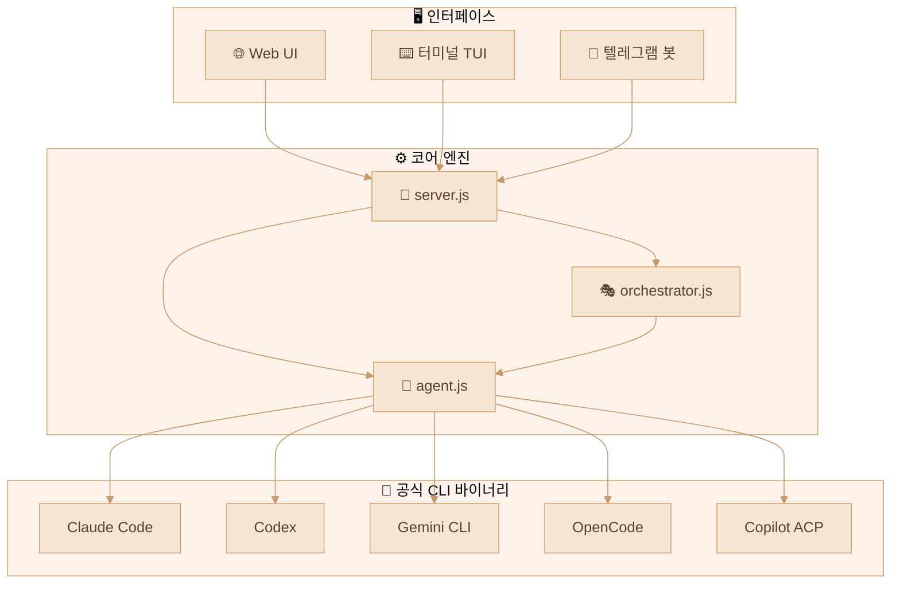
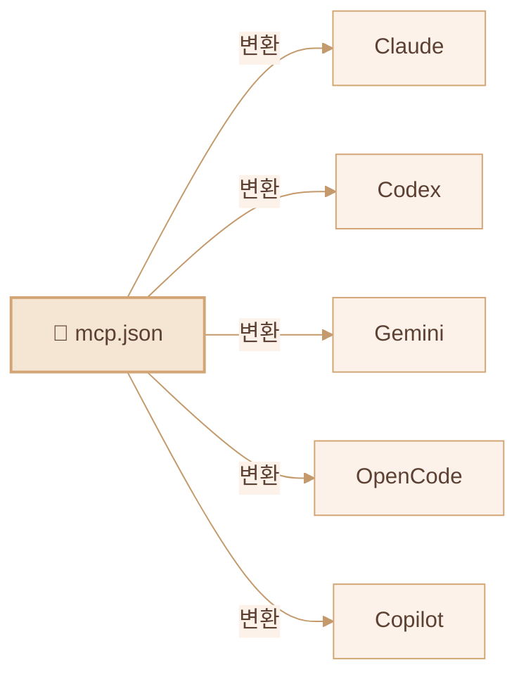

<div align="center">

# 🦞 CLI-CLAW

### 통합 AI 에이전트 오케스트레이션 플랫폼

*하나의 인터페이스. 5개 CLI. API 차단 제로.*

[](#-테스트)
[](https://nodejs.org)
[](LICENSE)

[English](README.md) / **한국어** / [中文](README.zh-CN.md)

</div>

---

## 🌟 왜 CLI-CLAW인가?

> 🛡️ **모든 상호작용이 공식 CLI 바이너리를 통해 이루어집니다** — `claude`, `codex`, `gemini`, `opencode`, `copilot --acp`.
>
> API 래퍼가 아닙니다. 리버스 엔지니어링도 아닙니다. **벤더가 배포하는 동일한 바이너리입니다.**
>
> **계정이 안전합니다. 차단 걱정 없습니다.**

---

## ✨ 핵심 강점

| | 강점 | 설명 |
|--|------|------|
| 🔒 | **CLI 네이티브 = 차단 불가** | 공식 CLI 바이너리를 직접 스폰 — 차단 위험 제로 |
| 🔄 | **5개 CLI, 1개 인터페이스** | Claude · Codex · Gemini · OpenCode · Copilot — `/cli` 한 줄로 전환 |
| ⚡ | **자동 폴백** | `claude → codex → gemini` — 실패 시 자동 이어받기 |
| 🎭 | **오케스트레이션 v2** | 역할 기반 서브에이전트 + 5단계 파이프라인 + 게이트 리뷰 |
| 🔌 | **MCP 전역 동기화** | `mcp.json` 하나 → 5개 CLI 설정에 자동 동기화 |
| 📦 | **100+ 스킬** | 플러그인 시스템, 2×3 분류 (Active / Reference) |
| 🧠 | **영속 메모리** | 자동 요약 + 장기 기억 + 프롬프트 주입 |
| 📱 | **텔레그램 봇** | 양방향 포워딩 + origin 기반 라우팅 |
| 🌐 | **브라우저 자동화** | Chrome CDP + Vision Click (AI 원커맨드 클릭) |

---

## 🏗️ 아키텍처



---

## 🚀 빠른 시작

```bash
npm install -g cli-claw
cli-claw serve        # → http://localhost:3457
cli-claw chat         # 터미널 TUI
```

---

## 📋 기능 현황

### ✅ 구현됨

| 기능 | 설명 | 복잡도 |
|------|------|:------:|
| **멀티-CLI 엔진** | Claude, Codex, Gemini, OpenCode, Copilot 통합 | ⭐⭐⭐⭐ |
| **Copilot ACP** | JSON-RPC 2.0 over stdio, 실시간 스트리밍 | ⭐⭐⭐⭐ |
| **오케스트레이션 v2** | 트리아지 → 역할 분배 → 5단계 파이프라인 | ⭐⭐⭐⭐⭐ |
| **MCP 동기화** | `mcp.json` → 5개 CLI 포맷 자동 변환 | ⭐⭐⭐⭐ |
| **스킬 시스템** | 100+ 내장 스킬, 2×3 분류 | ⭐⭐⭐ |
| **CLI 레지스트리** | 단일 소스 — 파일 1개로 전체 반영 | ⭐⭐⭐ |
| **슬래시 커맨드** | CLI / Web / Telegram 통합 자동완성 | ⭐⭐⭐ |
| **텔레그램 봇** | 양방향 포워딩, origin 라우팅 | ⭐⭐⭐⭐ |
| **영속 메모리** | MEMORY.md + 일일 로그 + 프롬프트 주입 | ⭐⭐⭐ |
| **브라우저 자동화** | Chrome CDP + Vision Click | ⭐⭐⭐⭐ |
| **65개 단위 테스트** | `node:test` — 외부 의존성 0개 | ⭐⭐ |

### 🔜 예정

| 기능 | 설명 |
|------|------|
| **Vector DB 메모리** | 임베딩 기반 의미 검색 |
| **비전 멀티프로바이더** | Claude, Gemini로 확장 |
| **음성 STT** | 텔레그램 음성→텍스트 |
| **스킬 마켓플레이스** | 커뮤니티 공유 + 버전 관리 |

---

## 🔌 MCP — Model Context Protocol



> MCP 서버를 한 번만 설치하면 **5개 CLI 전체**에서 즉시 사용 가능합니다.

---

## 🎭 오케스트레이션

| Phase | 이름 | 설명 |
|:-----:|------|------|
| 1 | 기획 | 작업 분해 + 에이전트 할당 |
| 2 | 기획검증 | 실행 가능성 점검 |
| 3 | 개발 | 병렬 에이전트 실행 |
| 4 | 디버깅 | 오류 해결 + 테스트 수정 |
| 5 | 통합검증 | E2E 검증 + 병합 |

---

## ⌨️ CLI 명령어

```bash
cli-claw serve                      # 서버 시작
cli-claw chat                       # 터미널 TUI
cli-claw init                       # 초기화 마법사
cli-claw doctor                     # 진단 (11체크)
cli-claw mcp install <pkg>          # MCP 설치+동기화
cli-claw skill install <name>       # 스킬 설치
cli-claw memory search <query>      # 메모리 검색
cli-claw browser vision-click "로그인"  # AI 비전 클릭
cli-claw employee reset             # 직원 초기화
```

---

## 🤖 지원 모델

> 상세 모델 목록은 [English README](README.md#-supported-models)를 참조하세요.

**주요 모델:** Claude Sonnet 4.6 · Opus 4.6 · Codex 5.3 · Gemini 3.0 Pro · Copilot (🆓 무료 포함)

> 🔧 `src/cli-registry.js` **1개 파일**만 수정하면 전체 자동 반영

---

## 📜 라이선스

ISC
