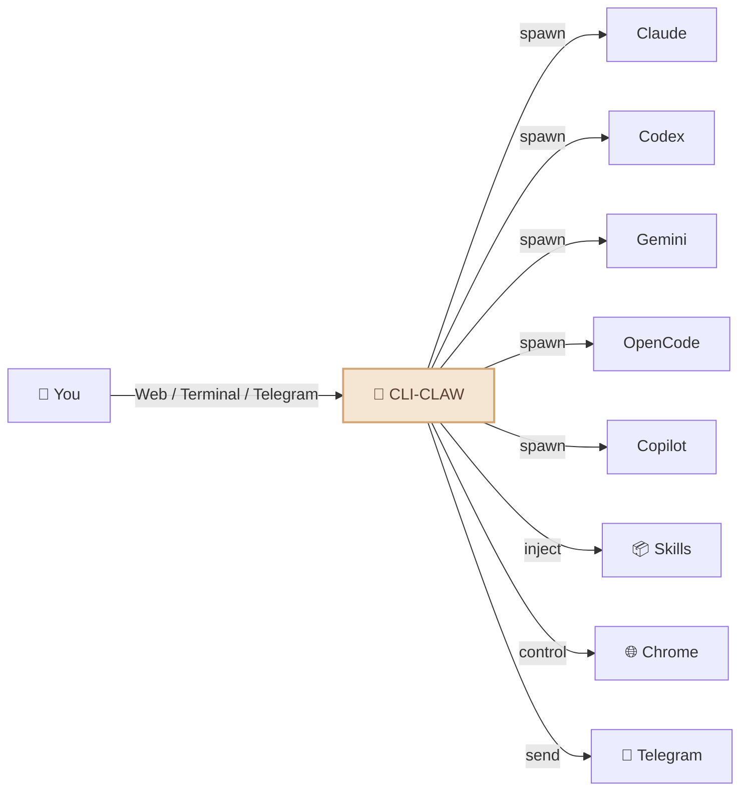
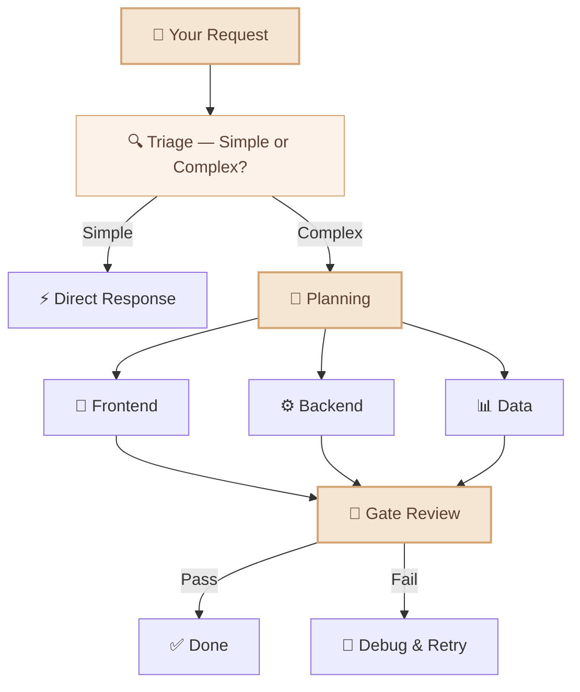
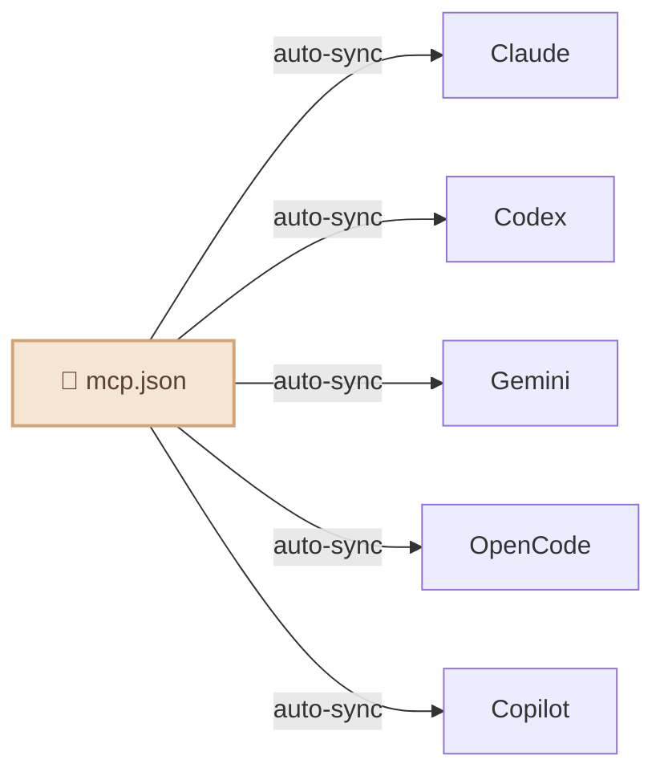

<div align="center">

# 🦞 CLI-CLAW

### Unified AI Agent Orchestration Platform

*One interface. Five CLIs. Zero API bans.*

[](#-tests)
[](https://typescriptlang.org)
[](https://nodejs.org)
[](LICENSE)

**English** / [한국어](README.ko.md) / [中文](README.zh-CN.md)


</div>

---

## Why CLI-CLAW?

Most AI coding tools hit the same wall: **API key bans, rate limits, TOS violations.**

CLI-CLAW takes a different approach — every interaction goes through **official CLI binaries** that vendors ship themselves. Not wrappers. Not proxied APIs. Your account stays safe.

### How is this different?

| | CLI-CLAW | API Wrappers | Other Orchestrators |
|--|----------|-------------|---------------------|
| **TOS Compliance** | ✅ Uses official CLI binaries | ❌ Direct API calls risk bans | ⚠️ Varies |
| **Multi-Model** | 5 CLIs unified | Usually 1 provider | 1-2 providers |
| **Auto Fallback** | `claude → codex → gemini` | Manual switch | ❌ |
| **MCP Sync** | Install once → 5 CLIs | Per-tool setup | ❌ |
| **Skill Ecosystem** | 107 built-in skills | Plugins vary | Limited |
| **Cost** | Free tier via Copilot/OpenCode | API costs | API costs |


---

## What it does



- 🔄 **5 CLIs, 1 interface** — Claude · Codex · Gemini · OpenCode · Copilot. Switch with `/cli`.
- ⚡ **Auto fallback** — `claude → codex → gemini`. If one fails, the next picks up automatically.
- 🎭 **Multi-agent orchestration** — Split complex tasks across role-based sub-agents with a 5-phase pipeline.
- 🔌 **MCP sync** — Install an MCP server once, available to all 5 CLIs instantly.
- 📦 **107 skills** — Built-in plugin system with two tiers (see [Skill System](#-skill-system) below).
- 🧠 **Persistent memory** — Auto-summarize conversations, long-term recall, prompt injection.
- 📱 **Telegram bot** — Chat, receive photos/documents/voice, control agents from your phone.
- 🌐 **Browser automation** — Chrome CDP + AI-powered Vision Click.
- 🔍 **Web search** — Real-time web search via MCP tools (Context7, etc.)
- 🌍 **i18n** — Korean / English, everywhere (UI, API, CLI, Telegram).

---

## Quick Start

```bash
# Install (sets up everything: 5 CLIs, MCP, 105+ skills)
npm install -g cli-claw

# Authenticate whichever CLIs you want (even 1 is enough)
claude auth          # Anthropic
codex login          # OpenAI
gemini               # Google (first run)

# Go
cli-claw doctor      # Check what's installed (12 checks)
cli-claw serve       # Web UI → http://localhost:3457
cli-claw chat        # Or use terminal TUI
```

> 💡 **You don't need all 5.** Even one CLI is enough to start. Copilot and OpenCode have free tiers.

---

## 📦 Skill System

CLI-CLAW comes with **105+ built-in skills** organized into two tiers:

| Tier | Count | How it works |
|------|:-----:|--------------|
| **Active Skills** | 17 | Auto-injected into every AI prompt. Always available. |
| **Reference Skills** | 90 | AI reads them on-demand when you ask for a relevant task. |

### Active Skills (always on)

These are injected into the system prompt automatically:

| Skill | What it does |
|-------|-------------|
| `browser` | Chrome automation — snapshot, click, navigate, screenshot |
| `github` | Issues, PRs, CI, code review via `gh` CLI |
| `notion` | Create/manage Notion pages and databases |
| `memory` | Persistent long-term memory across sessions |
| `telegram-send` | Send photos, documents, voice messages to Telegram |
| `vision-click` | Screenshot → AI finds coordinates → clicks (one command) |
| `imagegen` | Generate/edit images via OpenAI Image API |
| `pdf` / `docx` / `xlsx` | Read, create, edit office documents |
| `screen-capture` | macOS screenshot and camera capture |
| `openai-docs` | Up-to-date OpenAI API documentation |
| `dev` / `dev-frontend` / `dev-backend` / `dev-data` / `dev-testing` | Development guidelines for sub-agents |

### Reference Skills (on-demand)

88+ more skills ready to use. When you ask for something relevant, the AI reads the skill guide and follows it:

```bash
# Examples of reference skills:
spotify-player     # Control Spotify playback
weather            # Get weather forecasts
deep-research      # Multi-step web research
tts                # Text-to-speech
video-downloader   # Download videos
apple-reminders    # Manage Apple Reminders
1password          # 1Password CLI integration
terraform          # Infrastructure as code
postgres           # PostgreSQL operations
jupyter-notebook   # Run Jupyter notebooks
sentry             # Error monitoring
# ... and 77 more
```

To permanently activate a reference skill:

```bash
cli-claw skill install <name>    # Move from reference → active
```

---

## 📱 Telegram Integration

CLI-CLAW isn't just a chat bot — it's a full **bidirectional bridge**:

```
📱 Telegram ←→ 🦞 CLI-CLAW ←→ 🤖 AI Agents
```

**What you can do from Telegram:**
- 💬 Chat with any of the 5 AI CLIs
- 📸 Receive screenshots, generated images, documents
- 🎤 Send voice messages (transcribed automatically)
- 📎 Send files for the AI to process
- ⚡ Run slash commands (`/cli`, `/model`, `/status`, etc.)
- 🔄 Switch CLIs and models on the fly

**What CLI-CLAW sends to Telegram:**
- AI responses with full markdown formatting
- Generated images, PDFs, documents
- Heartbeat job results (scheduled tasks)
- Browser screenshots


---

## 🎭 Orchestration

For complex tasks, CLI-CLAW splits the work across specialized sub-agents:



The AI **decides by itself** whether a task needs orchestration or a direct response. No configuration needed.

---

## 🔌 MCP — One Config, Five CLIs

```bash
cli-claw mcp install @anthropic/context7    # Install once
# → Automatically syncs to Claude, Codex, Gemini, OpenCode, Copilot
```



No more editing 5 different config files. Install an MCP server once → all CLIs get it.

---

## ⌨️ CLI Commands

```bash
cli-claw serve                         # Start server
cli-claw chat                          # Terminal TUI
cli-claw doctor                        # Diagnostics (12 checks)
cli-claw skill install <name>          # Install a skill
cli-claw mcp install <package>         # Install MCP → syncs to all 5 CLIs
cli-claw memory search <query>         # Search memory
cli-claw browser start                 # Launch Chrome (CDP)
cli-claw browser vision-click "Login"  # AI-powered click
cli-claw reset                         # Full reset
```

---

## 🤖 Models

Each CLI comes with preconfigured presets, but you can type **any model ID** directly.

<details>
<summary>View all presets</summary>

| CLI | Default | Notable Models |
|-----|---------|----------------|
| **Claude** | `claude-sonnet-4-6` | opus-4-6, haiku-4-5, extended thinking variants |
| **Codex** | `gpt-5.3-codex` | spark, 5.2, 5.1-max, 5.1-mini |
| **Gemini** | `gemini-2.5-pro` | 3.0-pro-preview, 3-flash-preview, 2.5-flash |
| **OpenCode** | `claude-opus-4-6-thinking` | 🆓 big-pickle, GLM-5, MiniMax, Kimi, GPT-5-Nano |
| **Copilot** | `gpt-4.1` 🆓 | 🆓 gpt-5-mini, claude-sonnet-4.6, opus-4.6 |

</details>

> 🔧 To add models: edit `src/cli/registry.ts` — one file, auto-propagates everywhere.

---

## 🛠️ Development

```bash
# Build (TypeScript → JavaScript)
npm run build          # tsc → dist/

# Run from source (development)
npm run dev            # tsx server.ts (hot-reload friendly)
npx tsx bin/cli-claw.ts serve   # Run CLI directly from .ts

# Run from build (production)
node dist/bin/cli-claw.js serve

# ⚠️ node cannot run .ts files directly:
# node bin/cli-claw.ts   ← This does NOT work
```

**Project structure:**

```
src/
├── agent/          # AI agent lifecycle & spawning
├── browser/        # Chrome CDP automation
├── cli/            # CLI registry & model presets
├── core/           # DB, config, logging
├── http/           # Express server & middleware
├── memory/         # Persistent memory system
├── orchestrator/   # Multi-agent orchestration pipeline
├── prompt/         # Prompt injection & AGENTS.md generation
├── routes/         # REST API endpoints (40+)
├── security/       # Input sanitization & guardrails
└── telegram/       # Telegram bot integration
```

> 🔧 **TypeScript** with `strict: true`, `NodeNext` module resolution, targeting ES2022.

---

## 🧪 Tests

```bash
npm test    # 252 pass, 1 skipped, zero external dependencies
```

- All tests run via `tsx --test` (native Node.js test runner + TypeScript).
- CI hardening note: `src/core/db.ts` now creates the parent directory of `DB_PATH` before opening SQLite, preventing `better-sqlite3` path errors in clean test/CI environments.

---

## 📖 Documentation

| Document | What's inside |
|----------|---------------|
| [ARCHITECTURE.md](docs/ARCHITECTURE.md) | System design, module graph, full feature inventory, REST API (40+ endpoints) |
| [TESTS.md](TESTS.md) | Test coverage, tier model, Phase 20 test plan |

---

## License

ISC
