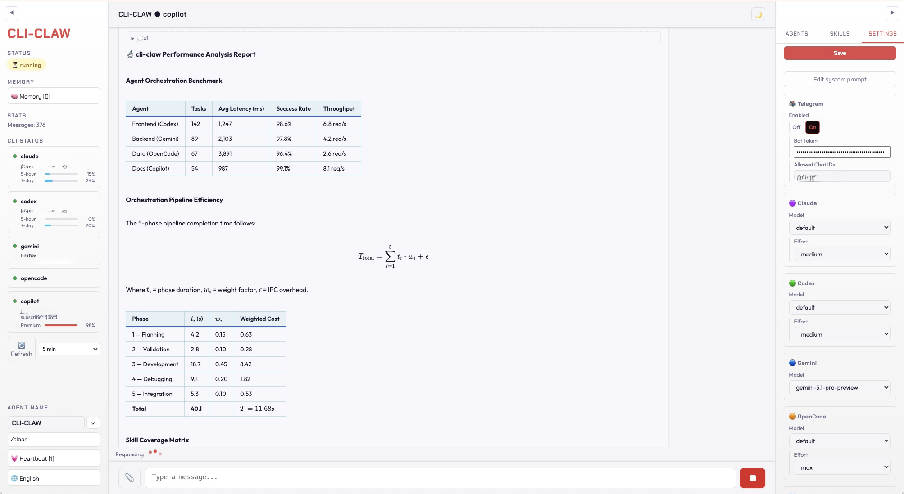
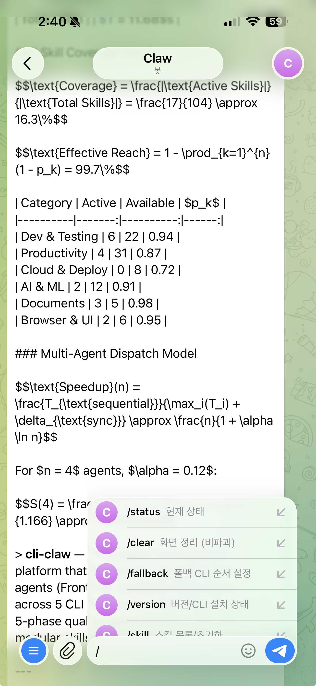

<div align="center">

# 🦞 CLI-CLAW

### Unified AI Agent Orchestration Platform

*One interface. Five CLIs. Zero API bans.*

[](#-tests)
[](https://nodejs.org)
[](LICENSE)

**English** / [한국어](README.ko.md) / [中文](README.zh-CN.md)

<!-- 📸 TODO: Web UI screenshot -->
<!--  -->

</div>

---

## Why CLI-CLAW?

Most AI coding tools hit the same wall: **API key bans, rate limits, TOS violations.**

CLI-CLAW takes a different approach — every interaction goes through **official CLI binaries** that vendors ship themselves. Not wrappers. Not proxied APIs. Your account stays safe.

<!-- 📸 TODO: Terminal TUI screenshot -->
<!--  -->

---

## What it does

- 🔄 **5 CLIs, 1 interface** — Claude · Codex · Gemini · OpenCode · Copilot. Switch with `/cli`.
- ⚡ **Auto fallback** — `claude → codex → gemini`. If one fails, the next picks up.
- 🎭 **Multi-agent orchestration** — Split complex tasks across role-based sub-agents with a 5-phase pipeline.
- 🔌 **MCP sync** — Install an MCP server once, available to all 5 CLIs instantly.
- 📦 **100+ skills** — Built-in plugin system. Active skills inject into prompts, reference skills on demand.
- 🧠 **Persistent memory** — Auto-summarize conversations, long-term recall, prompt injection.
- 📱 **Telegram bot** — Control your agents from your phone.
- 🌐 **Browser automation** — Chrome CDP + AI-powered Vision Click.
- 🌍 **i18n** — Korean / English, everywhere (UI, API, CLI, Telegram).

<!-- 📸 TODO: Orchestration screenshot -->
<!--  -->

---

## Quick Start

```bash
# Install (sets up everything: 5 CLIs, MCP, 100+ skills)
npm install -g cli-claw

# Authenticate whichever CLIs you want (even 1 is enough)
claude auth          # Anthropic
codex login          # OpenAI
gemini               # Google (first run)

# Go
cli-claw doctor      # Check what's installed
cli-claw serve       # Web UI → http://localhost:3457
cli-claw chat        # Or use terminal TUI
```

<!-- 📸 TODO: Telegram Bot screenshot -->
<!--  -->

---

## CLI Commands

```bash
cli-claw serve                         # Start server
cli-claw chat                          # Terminal TUI
cli-claw doctor                        # Diagnostics (12 checks)
cli-claw skill install <name>          # Install a skill
cli-claw mcp install <package>         # Install MCP → syncs to all 5 CLIs
cli-claw memory search <query>         # Search memory
cli-claw browser start                 # Launch Chrome (CDP)
cli-claw browser vision-click "Login"  # AI-powered click
cli-claw reset                         # Full reset
```

---

## Models

Each CLI comes with preconfigured presets, but you can type **any model ID** directly.

<details>
<summary>View all presets</summary>

| CLI | Default | Notable Models |
|-----|---------|----------------|
| **Claude** | `claude-sonnet-4-6` | opus-4-6, haiku-4-5, extended thinking variants |
| **Codex** | `gpt-5.3-codex` | spark, 5.2, 5.1-max, 5.1-mini |
| **Gemini** | `gemini-2.5-pro` | 3.0-pro-preview, 3-flash-preview, 2.5-flash |
| **OpenCode** | `claude-opus-4-6-thinking` | 🆓 big-pickle, GLM-5, MiniMax, Kimi, GPT-5-Nano |
| **Copilot** | `gpt-4.1` 🆓 | 🆓 gpt-5-mini, claude-sonnet-4.6, opus-4.6 |

</details>

> 🔧 To add models to the presets: edit `src/cli-registry.js` — one file, auto-propagates everywhere.

---

## Tests

```bash
npm test    # 216 tests, ~260ms, zero external dependencies
```

---

## Documentation

| Document | What's inside |
|----------|---------------|
| [ARCHITECTURE.md](docs/ARCHITECTURE.md) | System design, module dependencies, architectural patterns, file structure |
| [TESTS.md](TESTS.md) | Full test inventory, coverage details, Phase 20 test plan |
| [REST API](docs/ARCHITECTURE.md#rest-api) | 40+ endpoints reference |

For function-level reference, see [`devlog/str_func.md`](devlog/str_func.md).

---

## License

ISC
