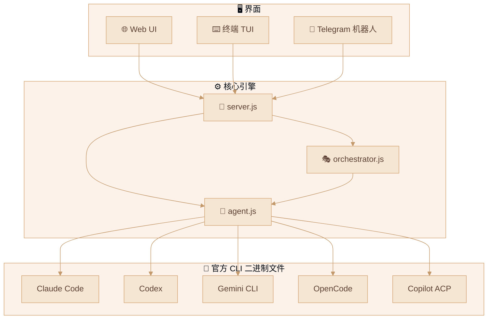
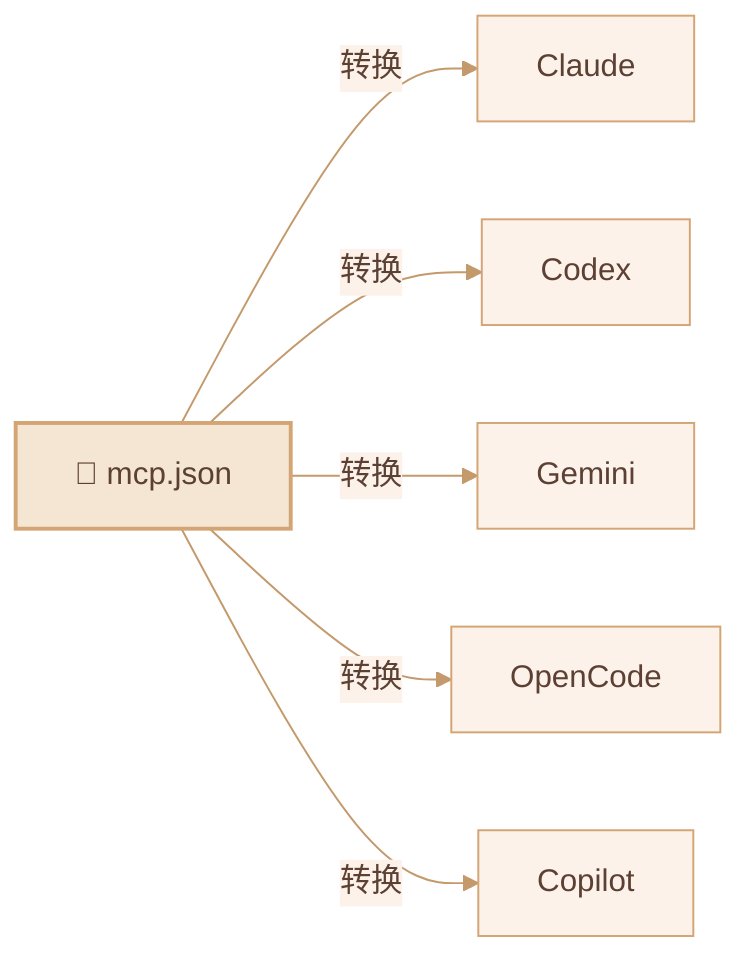

<div align="center">

# 🦞 CLI-CLAW

### 统一 AI 代理编排平台

*一个界面。五个 CLI。零 API 封禁。*

[](#-测试)
[](https://nodejs.org)
[](LICENSE)

[English](README.md) / [한국어](README.ko.md) / **中文**

</div>

---

## 🌟 为什么选择 CLI-CLAW？

> 🛡️ **所有交互都通过官方 CLI 二进制文件进行** — `claude`、`codex`、`gemini`、`opencode`、`copilot --acp`。
>
> 不是 API 包装器。不是逆向工程。**与供应商发布的完全相同的二进制文件。**
>
> **您的账户始终安全。不存在封号风险。**

---

## ✨ 核心优势

| | 优势 | 描述 |
|--|------|------|
| 🔒 | **CLI 原生 = 防封禁** | 直接调用官方 CLI 二进制文件 — 封号风险为零 |
| 🔄 | **5 CLI，1 界面** | Claude · Codex · Gemini · OpenCode · Copilot — `/cli` 一键切换 |
| ⚡ | **自动回退** | `claude → codex → gemini` — 失败自动接续 |
| 🎭 | **编排 v2** | 基于角色的子代理 + 5 阶段流水线 + 门控审查 |
| 🔌 | **MCP 全局同步** | 一个 `mcp.json` → 自动同步到 5 个 CLI 配置 |
| 📦 | **100+ 技能** | 插件系统，2×3 分类（活跃 / 参考） |
| 🧠 | **持久记忆** | 自动摘要 + 长期记忆 + 提示注入 |
| 📱 | **Telegram 机器人** | 双向转发 + 来源路由 |
| 🌐 | **浏览器自动化** | Chrome CDP + Vision Click（AI 一键点击） |

---

## 🏗️ 架构



---

## 🚀 快速开始

```bash
npm install -g cli-claw
cli-claw serve        # → http://localhost:3457
cli-claw chat         # 终端 TUI
```

---

## 📋 功能状态

### ✅ 已实现

| 功能 | 描述 | 复杂度 |
|------|------|:------:|
| **多 CLI 引擎** | Claude, Codex, Gemini, OpenCode, Copilot 统一调用 | ⭐⭐⭐⭐ |
| **Copilot ACP** | JSON-RPC 2.0 over stdio，实时流式传输 | ⭐⭐⭐⭐ |
| **编排 v2** | 分诊 → 角色分配 → 5 阶段流水线 | ⭐⭐⭐⭐⭐ |
| **MCP 同步** | `mcp.json` → 5 CLI 格式自动转换 | ⭐⭐⭐⭐ |
| **技能系统** | 100+ 内置技能，2×3 分类 | ⭐⭐⭐ |
| **CLI 注册表** | 单一来源 — 修改 1 个文件全局生效 | ⭐⭐⭐ |
| **斜杠命令** | CLI / Web / Telegram 统一自动完成 | ⭐⭐⭐ |
| **Telegram 机器人** | 双向转发，来源路由 | ⭐⭐⭐⭐ |
| **持久记忆** | MEMORY.md + 每日日志 + 提示注入 | ⭐⭐⭐ |
| **浏览器自动化** | Chrome CDP + Vision Click | ⭐⭐⭐⭐ |
| **65 单元测试** | `node:test` — 零外部依赖 | ⭐⭐ |

### 🔜 计划中

| 功能 | 描述 |
|------|------|
| **Vector DB 记忆** | 基于嵌入的语义搜索 |
| **Vision 多提供商** | 扩展到 Claude、Gemini |
| **语音 STT** | Telegram 语音转文字 |
| **技能市场** | 社区共享 + 版本管理 |

---

## 🔌 MCP — 模型上下文协议



> 安装一次 MCP 服务器 → **所有五个 CLI** 立即可用。

---

## 🎭 编排流水线

| 阶段 | 名称 | 描述 |
|:----:|------|------|
| 1 | 规划 | 任务分解 + 代理分配 |
| 2 | 规划验证 | 可行性检查 |
| 3 | 开发 | 并行代理执行 |
| 4 | 调试 | 错误修复 + 测试修复 |
| 5 | 集成验证 | E2E 验证 + 合并 |

---

## ⌨️ CLI 命令

```bash
cli-claw serve                      # 启动服务器
cli-claw chat                       # 终端 TUI
cli-claw init                       # 初始化向导
cli-claw doctor                     # 诊断（11项检查）
cli-claw mcp install <pkg>          # MCP 安装+同步
cli-claw skill install <name>       # 技能安装
cli-claw memory search <query>      # 记忆搜索
cli-claw browser vision-click "登录"  # AI 视觉点击
cli-claw employee reset             # 员工初始化
```

---

## 🤖 支持的模型

> 详细模型列表请参阅 [English README](README.md#-supported-models)。

**主要模型：** Claude Sonnet 4.6 · Opus 4.6 · Codex 5.3 · Gemini 3.0 Pro · Copilot（🆓 含免费）

> 🔧 `src/cli-registry.js` **修改 1 个文件**即可全局自动生效

---

## 📜 许可证

ISC
