<div align="center">

# 🦞 CLI-CLAW

### 统一 AI 代理编排平台

*一个界面，五个 CLI，封号？不存在的。*

[](#-测试)
[](https://typescriptlang.org)
[](https://nodejs.org)
[](LICENSE)

[English](README.md) / [한국어](README.ko.md) / **中文**


</div>

---

## 为什么选择 CLI-CLAW？

大多数 AI 编程工具最终都撞上同一堵墙：**API 密钥封禁、速率限制、违反服务条款。**

CLI-CLAW 从根本上换了思路——所有交互都走厂商自己发的**官方 CLI 二进制文件**。不是包装器，不是代理 API。账户安全，没得商量。

### 有什么不同？

| | CLI-CLAW | API 包装器 | 其他编排工具 |
|--|----------|-----------|-------------|
| **TOS 合规** | ✅ 使用官方 CLI 二进制文件 | ❌ 直接调 API = 封号风险 | ⚠️ 各不相同 |
| **多模型** | 5 个 CLI 统一 | 通常 1 个提供商 | 1-2 个 |
| **自动回退** | `claude → codex → gemini` | 手动切换 | ❌ |
| **MCP 同步** | 安装一次 → 5 个 CLI | 每个工具单独配 | ❌ |
| **技能生态** | 105+ 个内置技能 | 插件不一 | 有限 |
| **成本** | Copilot/OpenCode 有免费层 | API 费用 | API 费用 |


---

## 功能亮点

```mermaid
graph LR
    YOU["👤 用户"] -->|Web / 终端 / Telegram| CLAW["🦞 CLI-CLAW"]
    CLAW -->|spawn| C["Claude"]
    CLAW -->|spawn| X["Codex"]
    CLAW -->|spawn| G["Gemini"]
    CLAW -->|spawn| O["OpenCode"]
    CLAW -->|spawn| P["Copilot"]
    CLAW -->|inject| SK["📦 技能"]
    CLAW -->|control| BR["🌐 Chrome"]
    CLAW -->|send| TG["📱 Telegram"]
    
    style CLAW fill:#f5e6d3,stroke:#d4a574,stroke-width:2px,color:#5c4033
```



- 🔄 **五大 CLI，一个界面** — Claude · Codex · Gemini · OpenCode · Copilot。用 `/cli` 一键切换。
- ⚡ **自动回退** — `claude → codex → gemini`。一个挂了，下一个自动顶上。
- 🎭 **多代理编排** — 复杂任务拆分给角色型子代理，走 5 阶段流水线处理。
- 🔌 **MCP 同步** — 安装一次 MCP 服务器，五个 CLI 立即可用。
- 📦 **105+ 个技能** — 内置插件系统，两个层级（见下方[技能系统](#-技能系统)）。
- 🧠 **持久记忆** — 自动总结对话，长期记忆，提示注入。
- 📱 **Telegram 机器人** — 聊天、接收照片/文档/语音，用手机控制代理。
- 🌐 **浏览器自动化** — Chrome CDP + AI 驱动的 Vision Click。
- 🔍 **网络搜索** — 通过 MCP 工具实时网络搜索（Context7 等）。
- 🌍 **多语言** — 韩语 / 英语，无处不在（UI、API、CLI、Telegram）。

---

## 快速开始

```bash
# 安装（自动设置一切：5 个 CLI、MCP、105+ 个技能）
npm install -g cli-claw

# 认证你要用的 CLI（有一个就够）
claude auth          # Anthropic
codex login          # OpenAI
gemini               # Google（首次运行）

# 开始
cli-claw doctor      # 检查安装状态（12 项检查）
cli-claw serve       # Web UI → http://localhost:3457
cli-claw chat        # 或使用终端 TUI
```

> 💡 **不需要全部 5 个。** 有一个就能用。Copilot 和 OpenCode 有免费层。

---

## 📦 技能系统

CLI-CLAW 自带 **105+ 个内置技能**，分为两个层级：

| 层级 | 数量 | 工作方式 |
|------|:----:|----------|
| **活跃技能** | 17 | 自动注入每次 AI 提示。始终可用。 |
| **参考技能** | 88+ | 当你请求相关任务时，AI 按需读取并使用。 |

### 活跃技能（始终开启）

自动注入系统提示：

| 技能 | 功能 |
|------|------|
| `browser` | Chrome 自动化 — 快照、点击、导航、截图 |
| `github` | 问题、PR、CI、代码审查（使用 `gh` CLI） |
| `notion` | 创建/管理 Notion 页面和数据库 |
| `memory` | 跨会话持久长期记忆 |
| `telegram-send` | 向 Telegram 发送照片、文档、语音消息 |
| `vision-click` | 截图 → AI 找坐标 → 点击（一条命令） |
| `imagegen` | 通过 OpenAI Image API 生成/编辑图像 |
| `pdf` / `docx` / `xlsx` | 读取、创建、编辑办公文档 |
| `screen-capture` | macOS 截图和摄像头捕获 |
| `openai-docs` | 最新 OpenAI API 文档 |
| `dev` / `dev-frontend` / `dev-backend` / `dev-data` / `dev-testing` | 子代理开发指南 |

### 参考技能（按需使用）

90 个技能随时待命。当你请求相关任务时，AI 会读取技能指南并遵循：

```bash
# 参考技能示例：
spotify-player     # 控制 Spotify 播放
weather            # 获取天气预报
deep-research      # 多步骤网络研究
tts                # 文字转语音
video-downloader   # 下载视频
apple-reminders    # 管理 Apple 提醒事项
1password          # 1Password CLI 集成
terraform          # 基础设施即代码
postgres           # PostgreSQL 操作
jupyter-notebook   # 运行 Jupyter 笔记本
sentry             # 错误监控
# ... 还有 77 个
```

永久激活参考技能：

```bash
cli-claw skill install <name>    # 从 reference → active
```

---

## 📱 Telegram 集成

CLI-CLAW 不只是聊天机器人 — 它是完整的**双向桥接**：

```
📱 Telegram ←→ 🦞 CLI-CLAW ←→ 🤖 AI 代理
```

**在 Telegram 中可以做的事：**
- 💬 与 5 个 AI CLI 中的任何一个对话
- 📸 接收截图、生成的图像、文档
- 🎤 发送语音消息（自动转文字）
- 📎 发送文件让 AI 处理
- ⚡ 运行斜杠命令（`/cli`、`/model`、`/status` 等）
- 🔄 实时切换 CLI 和模型

**CLI-CLAW 发送到 Telegram 的内容：**
- 完整 markdown 格式的 AI 响应
- 生成的图像、PDF、文档
- 心跳任务结果（定时执行）
- 浏览器截图


---

## 🎭 编排

复杂任务会分配给专业化的子代理：

```mermaid
graph TD
    USER["👤 用户请求"] --> TRIAGE["🔍 分诊 — 简单还是复杂？"]
    
    TRIAGE -->|简单| DIRECT["⚡ 直接响应"]
    TRIAGE -->|复杂| PLAN["📝 规划"]
    
    PLAN --> FE["🎨 前端"]
    PLAN --> BE["⚙️ 后端"]  
    PLAN --> DATA["📊 数据"]
    
    FE --> GATE["🚪 门控审查"]
    BE --> GATE
    DATA --> GATE
    
    GATE -->|通过| NEXT["✅ 完成"]
    GATE -->|失败| RETRY["🔄 调试 & 重试"]

    style USER fill:#f5e6d3,stroke:#d4a574,stroke-width:2px,color:#5c4033
    style TRIAGE fill:#fdf2e9,stroke:#d4a574,color:#5c4033
    style PLAN fill:#f5e6d3,stroke:#d4a574,stroke-width:2px,color:#5c4033
    style GATE fill:#f5e6d3,stroke:#d4a574,stroke-width:2px,color:#5c4033
```



AI **自行判断**是否需要编排。无需配置。

---

## 🔌 MCP — 一次配置，五个 CLI

```bash
cli-claw mcp install @anthropic/context7    # 安装一次
# → 自动同步到 Claude、Codex、Gemini、OpenCode、Copilot
```



```mermaid
graph LR
    MJ["📄 mcp.json"] -->|自动同步| CL["Claude"]
    MJ -->|自动同步| CX["Codex"]
    MJ -->|自动同步| GM["Gemini"]
    MJ -->|自动同步| OC["OpenCode"]
    MJ -->|自动同步| CP["Copilot"]
    
    style MJ fill:#f5e6d3,stroke:#d4a574,stroke-width:2px,color:#5c4033
```

不用再编辑 5 个不同的配置文件。安装一次 MCP 服务器 → 所有 CLI 自动获取。

---

## ⌨️ CLI 命令

```bash
cli-claw serve                         # 启动服务器
cli-claw chat                          # 终端 TUI
cli-claw doctor                        # 诊断（12 项检查）
cli-claw skill install <name>          # 安装技能
cli-claw mcp install <package>         # 安装 MCP → 同步全部 5 CLI
cli-claw memory search <query>         # 搜索记忆
cli-claw browser start                 # 启动 Chrome（CDP）
cli-claw browser vision-click "登录"    # AI 智能点击
cli-claw reset                         # 全面重置
```

---

## 🤖 模型

每个 CLI 都有预配置的快捷选项，但你也可以直接输入**任何模型 ID**。

<details>
<summary>查看全部预设</summary>

| CLI | 默认值 | 主要模型 |
|-----|--------|----------|
| **Claude** | `claude-sonnet-4-6` | opus-4-6、haiku-4-5、扩展思考变体 |
| **Codex** | `gpt-5.3-codex` | spark、5.2、5.1-max、5.1-mini |
| **Gemini** | `gemini-2.5-pro` | 3.0-pro-preview、3-flash-preview、2.5-flash |
| **OpenCode** | `claude-opus-4-6-thinking` | 🆓 big-pickle、GLM-5、MiniMax、Kimi、GPT-5-Nano |
| **Copilot** | `gpt-4.1` 🆓 | 🆓 gpt-5-mini、claude-sonnet-4.6、opus-4.6 |

</details>

> 🔧 想添加模型：修改 `src/cli/registry.ts` — 一个文件，全局自动生效。

---

## 🛠️ 开发

```bash
# 构建（TypeScript → JavaScript）
npm run build          # tsc → dist/

# 从源码运行（开发）
npm run dev            # tsx server.ts
npx tsx bin/cli-claw.ts serve   # 直接运行 .ts 文件

# 从构建产物运行（生产）
node dist/bin/cli-claw.js serve

# ⚠️ node 不能直接运行 .ts 文件：
# node bin/cli-claw.ts   ← 这样不行
```

**项目结构：**

```
src/
├── agent/          # AI 代理生命周期 & 生成
├── browser/        # Chrome CDP 自动化
├── cli/            # CLI 注册表 & 模型预设
├── core/           # DB、配置、日志
├── http/           # Express 服务器 & 中间件
├── memory/         # 持久记忆系统
├── orchestrator/   # 多代理编排流水线
├── prompt/         # 提示注入 & AGENTS.md 生成
├── routes/         # REST API 端点（40+）
├── security/       # 输入验证 & 安全护栏
└── telegram/       # Telegram 机器人集成
```

> 🔧 **TypeScript** — `strict: true`、`NodeNext` 模块解析、ES2022 目标。

---

## 🧪 测试

```bash
npm test    # 252 pass、1 skipped、零外部依赖
```

- 使用 `tsx --test` 运行（Node.js 原生测试运行器 + TypeScript）。

---

## 📖 文档

| 文档 | 内容 |
|------|------|
| [ARCHITECTURE.md](docs/ARCHITECTURE.md) | 系统设计、模块图、完整功能清单、REST API（40+ 端点） |
| [TESTS.md](TESTS.md) | 测试覆盖率、层级模型、Phase 20 测试计划 |

---

## 许可证

ISC
