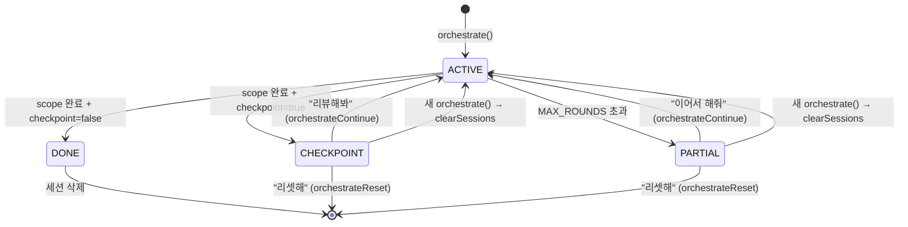

# Orchestration v3: Phase Range + Checkpoint + Reset

## 메타
- Date: 2026-02-26
- Status: Phase 1 (기획)
- 기반 커밋: `8054549` (pipeline.ts 롤백 완료 상태)

---

## 1. 현재 문제 분석

### 1.1 Phase Profile 끝점 지정 불가

```typescript
// pipeline.ts:47-53 (현재)
const rawStart = Number(st.start_phase);
const startPhase = Number.isFinite(rawStart) ? Math.max(minPhase, Math.min(maxPhase, rawStart)) : minPhase;
const profile = fullProfile.filter((p: number) => p >= startPhase);
// ← end_phase 없음. start만 지정 가능.
```

backend role + `start_phase: 3` → profile `[3,4,5]` → 간단한 수정도 3라운드 강제.

### 1.2 세션 정리 누락 (2곳)

```typescript
// pipeline.ts:365-376 — MAX_ROUNDS partial 경로
if (round === MAX_ROUNDS) {
    // ... partial report ...
    // ← clearAllEmployeeSessions 없음! 세션 잔존
}

// pipeline.ts:277-287 — late-subtask 분기 (동일 구조)
if (round === MAX_ROUNDS) {
    // ← 여기도 없음
}
```

### 1.3 유저 주도 흐름 부재

- "개발만 하고 보고해" → 불가능 (자동 다음 phase)
- "리셋해" → 불가능 (해당 함수 없음)
- parseVerdicts 실패 시 로그 없이 무시 (L338-348)

---

## 2. 상태 머신



세션 정리 규칙:

| 종료 상태 | 세션 | 이유 |
|-----------|------|------|
| `done` | **삭제** | 완전 종료 |
| `checkpoint` | **보존** | 유저 결정 대기 |
| `partial` | **보존** | 이어서 해줘 대비 |
| `reset` | **삭제** | 명시적 초기화 |
| 새 `orchestrate()` | **삭제** | L228에서 항상 clear |

---

## 3. 변경 상세 (파일별)

### 3.1 pipeline.ts `initAgentPhases` (L40-74)

현재:
```typescript
// L47-53
const rawStart = Number(st.start_phase);
const startPhase = ...
const profile = fullProfile.filter((p: number) => p >= startPhase);
const effectiveProfile = profile.length > 0 ? profile : [fullProfile[fullProfile.length - 1]!];
```

변경:
```diff
 const rawStart = Number(st.start_phase);
+const rawEnd = Number(st.end_phase);
 const startPhase: number = Number.isFinite(rawStart)
     ? Math.max(minPhase, Math.min(maxPhase, rawStart))
     : minPhase;
-const profile = fullProfile.filter((p: number) => p >= startPhase);
-const effectiveProfile = profile.length > 0 ? profile : [fullProfile[fullProfile.length - 1]!];
+const endPhase: number = Number.isFinite(rawEnd)
+    ? Math.max(startPhase, Math.min(maxPhase, rawEnd))
+    : maxPhase;
+const profile = fullProfile.filter((p: number) => p >= startPhase && p <= endPhase);
+// sparse fallback: 빈 profile이면 startPhase 이상 가장 가까운 phase 사용
+const effectiveProfile = profile.length > 0
+    ? profile
+    : [fullProfile.find((p: number) => p >= startPhase) || fullProfile[fullProfile.length - 1]!];
+if (profile.length === 0) {
+    console.warn(`[jaw:phase] ${st.agent}: no phases in [${startPhase},${endPhase}], fallback to [${effectiveProfile[0]}]`);
+}
```

return 객체 (L61-72):
```diff
 return {
     agent: st.agent,
     task: st.task,
     role,
     parallel: st.parallel === true,
+    checkpoint: st.checkpoint === true,
     verification: st.verification || null,
     phaseProfile: effectiveProfile,
     currentPhaseIdx: 0,
     currentPhase: effectiveProfile[0],
     completed: false,
     history: [] as Record<string, any>[],
 };
```

### 3.2 pipeline.ts 메인 라운드 루프 (L338-376)

#### L338-348: verdict 실패 로깅
```diff
 if (verdicts?.verdicts) {
     for (const v of verdicts.verdicts) {
         ...
     }
+} else {
+    console.warn(`[jaw:review] verdict parse failed — skipping phase advance (round ${round})`);
 }
```

#### L351-361: 완료 판정 — allDone verdict + checkpoint 분기
```diff
-// 5. 완료 판정 (agentPhases 기준 우선, allDone은 보조)
-const allDone = agentPhases.every((ap: Record<string, any>) => ap.completed);
+// 5. 완료 판정
+const allDone = agentPhases.every((ap: Record<string, any>) => ap.completed)
+    || verdicts?.allDone === true;
 if (allDone) {
+    // allDone verdict인 경우 전원 completed 마킹
+    agentPhases.forEach((ap: Record<string, any>) => { ap.completed = true; });
+    updateMatrix(worklog.path, agentPhases);
+
+    const hasCheckpoint = agentPhases.some((ap: Record<string, any>) => ap.checkpoint);
+    if (hasCheckpoint) {
+        // CHECKPOINT: 세션 보존, 유저에게 보고
+        const summary = stripSubtaskJSON(rawText) || '요청된 scope 완료';
+        appendToWorklog(worklog.path, 'Final Summary', summary);
+        updateWorklogStatus(worklog.path, 'checkpoint', round);
+        insertMessage.run('assistant', summary + '\n\n다음 지시를 기다립니다. "리뷰해봐", "이어서 해줘", "리셋해"', 'orchestrator', '');
+        broadcast('orchestrate_done', { text: summary, worklog: worklog.path, origin, checkpoint: true });
+        break;
+    }
     const summary = stripSubtaskJSON(rawText) || '모든 작업 완료';
     ...
     clearAllEmployeeSessions.run();
     ...
 }
```

#### L365-376: partial 경로 — 세션 보존 (clearSessions 안 함)
```diff
 if (round === MAX_ROUNDS) {
     ...
     updateWorklogStatus(worklog.path, 'partial', round);
-    // ← clearAllEmployeeSessions 없음 (현재: 세션 잔존 — 버그)
+    // partial: 세션 보존 (이어서 해줘 대비)
+    // 새 orchestrate() 진입 시 L228에서 자동 정리됨
     insertMessage.run('assistant', partial, 'orchestrator', '');
     broadcast('orchestrate_done', { text: partial, worklog: worklog.path, origin });
 }
```

### 3.3 pipeline.ts late-subtask 분기 (L250-288)

L331-376과 **동일한 구조**가 L250-288에 복제되어 있음. 같은 변경 적용:
- L255: verdict 실패 로깅 추가
- L266: `verdicts?.allDone` + checkpoint 분기 추가
- L277-287: partial 세션 보존 (현재 clearSessions 없음 → 의도된 보존으로 명시)

### 3.4 pipeline.ts `phaseReview` 프롬프트 (L200-215)

```diff
 ### 판정 규칙
 - **PASS**: ...
 - **FAIL**: ...
 
+### allDone 조기 완료 규칙
+- 커밋+테스트+푸시 완료 → 남은 phase 있어도 allDone: true 가능
+- 판단 기준: 사용자의 원래 요청이 충족되었는가?
+- Phase 3에서 빌드/테스트/커밋 모두 완료 → Phase 4-5 불필요 → allDone: true
+
 JSON으로 출력:
```

### 3.5 pipeline.ts `orchestrateReset` [NEW] (L378 뒤)

```typescript
export async function orchestrateReset(meta: Record<string, any> = {}) {
    const origin = meta.origin || 'web';
    clearAllEmployeeSessions.run();
    const latest = readLatestWorklog();
    if (!latest) {
        broadcast('orchestrate_done', { text: '리셋할 worklog가 없습니다.', origin });
        return;
    }
    updateWorklogStatus(latest.path, 'reset', 0);
    appendToWorklog(latest.path, 'Final Summary', '유저 요청으로 페이즈 리셋됨.');
    broadcast('orchestrate_done', { text: '페이즈 리셋 완료. 새로 시작하려면 작업을 요청하세요.', origin });
}
```

### 3.6 pipeline.ts `orchestrateContinue` 수정 (L382-407)

현재 `orchestrateContinue`는 세션을 clear하고 새 `orchestrate()`를 호출 → 세션 복원 안 됨.

```diff
 export async function orchestrateContinue(meta: Record<string, any> = {}) {
     const origin = (meta as Record<string, any>).origin || 'web';
     const latest = readLatestWorklog();
-    if (!latest) {
+    if (!latest || latest.content.includes('Status: done') || latest.content.includes('Status: reset')) {
         broadcast('orchestrate_done', { text: '이어갈 worklog가 없습니다.', origin });
         return;
     }
 
     const pending = parseWorklogPending(latest.content);
     ...
-    return orchestrate(resumePrompt, meta);
+    // 핵심: clearSessions 안 함 — 기존 세션 복원
+    return orchestrate(resumePrompt, { ...meta, _skipClear: true });
 }
```

`orchestrate()` L228도 수정:
```diff
 export async function orchestrate(prompt: string, meta: Record<string, any> = {}) {
-    clearAllEmployeeSessions.run();
+    if (!meta._skipClear) clearAllEmployeeSessions.run();
     clearPromptCache();
```

### 3.7 parser.ts `isResetIntent` [NEW] (L9 뒤)

```typescript
const RESET_PATTERNS = [
    /^리셋/i, /^초기화/i, /^페이즈?\s*리셋/i,
    /^phase\s*reset/i, /^reset$/i,
];

export function isResetIntent(text: string) {
    const t = String(text || '').trim();
    if (!t) return false;
    return RESET_PATTERNS.some(re => re.test(t));
}
```

pipeline.ts L21에 import 추가:
```diff
 import {
-    isContinueIntent, needsOrchestration,
+    isContinueIntent, isResetIntent, needsOrchestration,
     parseSubtasks, parseDirectAnswer, stripSubtaskJSON, parseVerdicts,
 } from './parser.js';
-export { isContinueIntent, needsOrchestration, parseSubtasks, parseDirectAnswer, stripSubtaskJSON };
+export { isContinueIntent, isResetIntent, needsOrchestration, parseSubtasks, parseDirectAnswer, stripSubtaskJSON };
```

### 3.8 server.ts `/api/orchestrate/reset` 엔드포인트 (L410 뒤)

```typescript
app.post('/api/orchestrate/reset', (req, res) => {
    orchestrateReset({ origin: 'web' });
    res.json({ ok: true });
});
```

import에 `orchestrateReset` 추가.

### 3.9 distribute.ts `buildPlanPrompt` (L221 subtask JSON)

```diff
     {
       "agent": "ExactAgentName",
       "role": "frontend|backend|data|docs",
       "task": "...",
       "start_phase": 3,
+      "end_phase": 3,
+      "checkpoint": true,
       "parallel": false,
```

L157-160에 가이드 추가:
```diff
 #### start_phase Selection
 - You completed planning → start_phase = 3
 - Code exists, only tests needed → start_phase = 4
 - Analysis required from scratch → start_phase = 1
+
+#### end_phase Selection (optional, default: role의 마지막 phase)
+- 간단한 수정/버그픽스 → end_phase: 3
+- 테스트까지 → end_phase: 4
+- 전체 → end_phase: 5 또는 생략
+- docs role은 [1,3,5]만 존재. end_phase: 2는 3으로 보정됨.
+
+#### checkpoint (optional, default: false)
+- true: scope 완료 후 유저에게 보고하고 대기
+- false: 자동으로 done 처리
```

---

## 4. 시퀀스 다이어그램

```mermaid
sequenceDiagram
    participant U as 유저
    participant O as Orchestrator
    participant A as Agent
    participant DB as Sessions
    participant W as Worklog

    rect rgb(40, 40, 60)
    Note over U,W: 시나리오 1: checkpoint → continue → done
    U->>O: "개발만 하고 보고해"
    O->>DB: clearSessions (L228)
    O->>A: Phase 3 (start=3 end=3 checkpoint=true)
    A->>O: 커밋 완료
    O->>W: status: checkpoint
    Note over DB: 세션 보존
    O->>U: "Phase 3 완료. 다음 지시?"
    U->>O: "리뷰도 해봐"
    O->>A: Phase 4부터 (세션 복원, _skipClear)
    A->>O: 리뷰 완료
    O->>W: status: done
    O->>DB: clearSessions
    O->>U: "전체 완료"
    end

    rect rgb(60, 40, 40)
    Note over U,W: 시나리오 2: checkpoint → reset
    U->>O: "테스트만 해봐"
    O->>A: Phase 4
    O->>W: status: checkpoint
    O->>U: "테스트 완료"
    U->>O: "다른데서 리뷰했으니 리셋해"
    O->>DB: clearSessions (orchestrateReset)
    O->>W: status: reset
    O->>U: "리셋 완료"
    end

    rect rgb(40, 60, 40)
    Note over U,W: 시나리오 3: checkpoint → 새 작업
    U->>O: "Phase 3만 해"
    O->>W: status: checkpoint
    O->>U: "완료"
    U->>O: "다른 작업 해줘" (새 orchestrate)
    O->>DB: clearSessions (L228 자동)
    Note over DB: 이전 세션 자동 정리
    O->>A: 새 작업 시작
    end
```



---

## 5. 엣지 케이스

| # | 케이스 | 입력 | 결과 |
|---|--------|------|------|
| 1 | end_phase 생략 | `{start:3}` | `endPhase=maxPhase` → 기존 동작 |
| 2 | start=3 end=3 | backend `[1..5]` | profile `[3]`, 1라운드 |
| 3 | start > end | `{start:5, end:3}` | `endPhase=max(5,3)=5` → `[5]` |
| 4 | docs sparse start=2 end=2 | `[1,3,5]` | filter=[], fallback `[3]` |
| 5 | docs sparse start=2 end=4 | `[1,3,5]` | filter=`[3]` |
| 6 | checkpoint 후 새 작업 | status=checkpoint | L228 clearSessions → 안전 |
| 7 | partial 후 새 작업 | status=partial | L228 clearSessions → 안전 |
| 8 | reset 후 이어서 해줘 | status=reset | orchestrateContinue에서 거부 |
| 9 | done 후 이어서 해줘 | status=done | orchestrateContinue에서 거부 |

---

## 6. 테스트 계획

### tests/unit/orchestration-v3.test.ts [NEW]

```
# Phase Range (initAgentPhases 직접 테스트)
EP-001: end_phase 생략 → maxPhase
EP-002: start=3 end=3 → profile [3]
EP-003: start > end → end 보정
EP-004: docs start=2 end=2 → sparse fallback [3]
EP-005: docs start=2 end=4 → [3]
EP-006: end_phase=99 → clamp to maxPhase
EP-007: checkpoint=true 저장 확인
EP-008: checkpoint 생략 → false

# Intent Detection (parser.ts)
RS-001: isResetIntent("리셋") → true
RS-002: isResetIntent("리셋해줘") → false (정확 매칭 아님)
RS-003: isResetIntent("phase reset") → true
RS-004: isResetIntent("안녕") → false
```

### 빌드 검증
```bash
npx tsc --noEmit
npm test
```

---

## 7. 변경 요약

| 파일 | 위치 | 변경 | 라인 |
|------|------|------|------|
| pipeline.ts | L47-55 | end_phase + sparse fallback | +12 |
| pipeline.ts | L65 | checkpoint 필드 추가 | +1 |
| pipeline.ts | L338-348 | verdict 실패 로깅 | +2 |
| pipeline.ts | L351-361 | allDone verdict + checkpoint 분기 | +12 |
| pipeline.ts | L228 | _skipClear 조건 | +1 |
| pipeline.ts | L378+ | orchestrateReset [NEW] | +12 |
| pipeline.ts | L382-407 | orchestrateContinue 수정 | +3 |
| pipeline.ts | L200-215 | review prompt allDone 규칙 | +5 |
| parser.ts | L9+ | isResetIntent [NEW] | +8 |
| distribute.ts | L157, L221 | end_phase/checkpoint 가이드 | +12 |
| server.ts | L410+ | /api/orchestrate/reset | +4 |
| tests/ | [NEW] | orchestration-v3.test.ts | ~60 |

총: ~130줄 추가/수정. 기존 export/import 깨뜨리지 않음. end_phase/checkpoint 생략 시 기존 동작 100% 동일.
