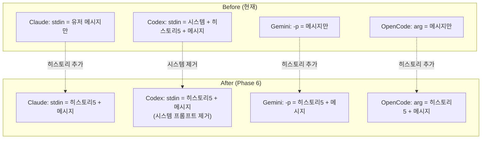

# (fin) Phase 6: Prompt Injection Normalization + Log Cleanup

> 상태: ✅ 구현 완료 | 날짜: 2026-02-24
> 범위: CLI별 프롬프트 삽입 정규화 — 히스토리 통합 + 시스템 프롬프트 중복 제거 + NDJSON 로그 정리
> 선행조건: Phase 5 (Stabilization)
> 참고: `devlog/str_func/prompt_flow.md` — 현재 프롬프트 흐름 전체 문서

---

## 문제 진단

### 현재 상태 (agent.js:206-227)

```js
const skipStdin = cli === 'gemini' || cli === 'opencode' || (cli === 'codex' && isResume);

if (!skipStdin) {
    if (cli === 'claude') {
        stdinContent = prompt;  // ← 유저 메시지만
    } else {
        // Codex 신규 세션
        stdinContent = `[Claw Platform Context]\n${sp}`;        // ← 시스템 프롬프트 (중복!)
        if (!isResume && !forceNew) {
            const recent = getRecentMessages.all(5).reverse();  // ← 히스토리 5개
            stdinContent += `\n\n[Recent History]\n${history}`;
        }
        stdinContent += `\n\n[User Message]\n${prompt}`;
    }
}
```

### 문제점 3가지

| #   | 문제                                           | 영향                                                                               |
| --- | ---------------------------------------------- | ---------------------------------------------------------------------------------- |
| P1  | **히스토리 주입이 Codex 신규 세션에만 적용**   | Claude/Gemini/OpenCode 신규 세션은 히스토리 없이 시작 → 첫 메시지에서 맥락 단절    |
| P2  | **Codex stdin 시스템 프롬프트 100% 중복**      | AGENTS.md는 매 API call마다 `developer` role로 자동 주입 (검증). stdin은 완전 중복 |
| P3  | **CLI별 삽입 로직이 하나의 if-else에 혼재**    | 새 CLI 추가 시 분기 복잡도 증가, 테스트 어려움                                     |
| P4  | **NDJSON console.log가 JSON 전문 그대로 출력** | `[claw:raw]` + `[claw:event]` 중복, 읽을 수 없는 로그, 디버깅 불가                 |

### API 구조 검증 (2026-02-24)

모든 LLM API에서 **system instruction은 대화 히스토리와 완전 분리**됨을 확인:

```text
┌─ Anthropic Messages API ──────────────────────────┐
│ system: "..." ← --append-system-prompt (매 call)  │
│ messages: [{user}, {assistant}, {user}, ...]       │
│           ↑ compact 대상    ↑ system은 대상 아님   │
└───────────────────────────────────────────────────┘

┌─ OpenAI Responses API ────────────────────────────┐
│ instructions: "..." ← AGENTS.md (매 call)         │
│ previous_response_id: "..." ← 대화 체이닝         │
│           ↑ compact 대상    ↑ instructions는 별도  │
└───────────────────────────────────────────────────┘

┌─ Google Gemini API ───────────────────────────────┐
│ system_instruction: "..." ← GEMINI_SYSTEM_MD      │
│ contents: [{user}, {model}, {user}, ...]           │
│           ↑ compact 대상    ↑ system은 대상 아님   │
└───────────────────────────────────────────────────┘
```

**결론**: 시스템 프롬프트는 모든 CLI에서 **매 API call마다 원본 그대로 전송**되고, **compact/요약 대상이 아님**. stdin으로 중복 전송하는 것은 첫 턴에만 user 메시지로 들어가고 compact 시 사라질 수 있어서 오히려 **더 약한 보호**.

> 출처: [Codex prompt.md](https://github.com/openai/codex/blob/main/codex-rs/core/prompt.md), [Claude CLI docs](https://docs.anthropic.com/en/docs/claude-code/cli-usage), [Gemini CLI docs](https://geminicli.com)

---

## 목표

1. **모든 CLI 신규 세션에 히스토리 5개 주입** (resume에는 불필요)
2. **시스템 프롬프트는 각 CLI의 네이티브 채널에만 전달** (중복 제거)
3. **삽입 로직을 CLI별 전략 패턴으로 분리** (가독성 + 확장성)
4. **NDJSON 로그 정리** — JSON 껍데기를 벗기고 type별 한 줄 요약 로그로 변환

---

## 설계

### 개선 후 CLI별 삽입 매트릭스

| CLI          | 시스템 프롬프트                    | role        | 매 턴 포함 | 히스토리 (new only) | resume                  |
| ------------ | ---------------------------------- | ----------- | ---------- | ------------------- | ----------------------- |
| **Claude**   | `--append-system-prompt`           | `system`    | ✅          | ✅ stdin에 추가      | `--resume` (히스토리 ❌) |
| **Codex**    | `.codex/AGENTS.md`                 | `developer` | ✅          | ✅ stdin에 추가      | resume arg (히스토리 ❌) |
| **Gemini**   | `GEMINI_SYSTEM_MD` env             | `system`    | ✅          | ✅ `-p` 인자 앞에    | `--resume` (히스토리 ❌) |
| **OpenCode** | ❌ 네이티브 채널 없음 (코드 미구현) | —           | —          | ✅ 위치 인자 앞에    | `-s` (히스토리 ❌)       |

> ⚠️ **OpenCode 참고**: 문서상 `AGENTS.md` + custom agent 지원이 확인됐으나, 현재 `agent.js`에 OpenCode용 system prompt 주입 코드가 없음. Phase 6에서 구현 필요.

### 히스토리 포맷 (Cleaned NDJSON Trace)

DB `messages.trace`에 저장된 cleaned NDJSON 로그를 최신순으로 주입:

```text
[Recent Context]
[user] dcinside 국내야구 갤러리에 글하나써줘
[main] cmd: /bin/zsh -lc 'cli-claw memory list' → exit 0
  MEMORY.md                      0.1 KB  2026-02-23
[main] reasoning: Planning detailed procedure saving
[main] agent: `projects/dcinside.md`로 새 메모리 파일을 만들고...
[main] tokens: in=1,515,404 out=12,555

[user] 다시 스냅샷 테스트해봐 수정했어
[main] agent: 수정한 상태 기준으로 브라우저 스냅샷을 다시...
---
[Current Message]
{프롬프트}
```

> **상한**: 전체 히스토리 블록 **총 8,000자**. 최신순부터 채우고 초과 시 오래된 세션 절단.

---

## 파일별 상세 변경

### [MODIFY] `src/agent.js`

#### 변경 1: DB 스키마 변경 — trace 컬럼 추가

```sql
ALTER TABLE messages ADD COLUMN trace TEXT DEFAULT NULL;
```

- `content` = 기존대로 agent_message 텍스트만 (채팅 UI 표시용)
- `trace` = cleaned NDJSON 로그 전체 (reasoning + cmd + output + agent 포함)

#### 변경 2: `ctx.traceLog` 누적 — `logEventSummary()`에서

```js
// logEventSummary에서 console.log와 동시에 ctx.traceLog에도 push
export function logEventSummary(agentLabel, cli, event, ctx) {
    // ... type별 분기 ...
    const line = `[${agentLabel}] cmd: ${cmd} → exit ${item.exit_code}`;
    console.log(line);
    if (ctx?.traceLog) ctx.traceLog.push(line);  // ← 누적
    if (outPreview && ctx?.traceLog) ctx.traceLog.push(`  ${outPreview}`);
}
```

#### 변경 3: agent.js에서 trace 저장

```js
// ctx 초기화 시 traceLog 추가
const ctx = { fullText: '', traceLog: [], ... };

// child.on('close') 에서 DB 저장 시 trace 포함
const traceText = ctx.traceLog.join('\n');
insertMessage.run('assistant', finalContent, cli, model, traceText);
```

> **⚠️ 호환성 주의**: `insertMessage`는 현재 4인자 (`role, content, cli, model`). 5인자로 변경 시 아래 **7개 호출부** 모두 수정 필요:
>
> | 파일 | 라인 | 현재 호출 |
> |------|------|----------|
> | `agent.js` | L49 | `insertMessage.run('user', newPrompt, source, '')` |
> | `agent.js` | L71 | `insertMessage.run('user', combined, source, '')` |
> | `agent.js` | L203 | `insertMessage.run('user', prompt, cli, model)` |
> | `agent.js` | L279 | `insertMessage.run('assistant', finalContent, cli, model)` ← trace 추가 대상 |
> | `telegram.js` | L236 | `insertMessage.run('user', displayMsg, 'telegram', '')` |
> | `orchestrator.js` | L110 | `insertMessage.run('assistant', stripped, 'orchestrator', '')` |
> | `orchestrator.js` | L125 | `insertMessage.run('assistant', fallback, 'orchestrator', '')` |
>
> **전략**: trace는 5번째 인자로 추가하되 **DEFAULT NULL**이므로, 기존 4인자 호출은 `null`을 명시적으로 추가하거나, prepared statement를 2개 유지 (`insertMessage` / `insertMessageWithTrace`).

#### 변경 4: 히스토리 빌더 — trace 기반, 8000자 상한

```js
function buildHistoryBlock(maxSessions = 5, maxTotalChars = 8000) {
    // DB에서 최근 N개 가져옴 (DESC → 최신이 [0])
    const recent = getRecentMessages.all(maxSessions * 2);
    if (recent.length === 0) return '';

    // 최신순부터 채워서 8000자 초과 시 오래된 것을 버림
    const blocks = [];
    let charCount = 0;

    for (const m of recent) {  // recent[0] = 가장 최신
        const entry = m.role === 'assistant' && m.trace
            ? m.trace
            : `[user] ${m.content}`;
        
        if (charCount + entry.length > maxTotalChars) break;
        blocks.push(entry);
        charCount += entry.length;
    }

    // 시간순으로 뒤집어서 출력 (오래된 → 최신 순서로 표시)
    return blocks.length
        ? `\n\n[Recent Context]\n${blocks.reverse().join('\n\n')}`
        : '';
}
```

> **핵심**: `getRecentMessages.all()`이 DESC 순으로 반환하므로 최신부터 채우고, 출력 시 `.reverse()`로 시간순 정렬. 이전 코드의 `.reverse()` 후 forward-iterate는 오래된 것부터 채워서 최신이 잘리는 버그가 있었음.

#### 변경 2: stdin 조립 정규화

```diff
- const skipStdin = cli === 'gemini' || cli === 'opencode' || (cli === 'codex' && isResume);
- if (!skipStdin) {
-     if (cli === 'claude') {
-         stdinContent = prompt;
-     } else {
-         const sp = customSysPrompt || getSystemPrompt();
-         stdinContent = `[Claw Platform Context]\n${sp}`;
-         if (!isResume && !forceNew) { ... }
-         stdinContent += `\n\n[User Message]\n${prompt}`;
-     }
- }

+ // 히스토리: resume만 제외 (resume은 이미 대화 맥락 있음)
+ // forceNew(메모리 플러시)도 신규 세션이므로 히스토리 주입 대상
+ // ⚠️ 주의: buildHistoryBlock()은 insertMessage(유저) 이전에 호출해야 함
+ //   → 현재 agent.js:203이 먼저 user를 DB에 저장 후 spawn → 순서 조정 필요
+ //   → buildHistoryBlock() → insertMessage('user') → spawn 순서로 변경
+ const historyBlock = !isResume ? buildHistoryBlock() : '';
+ // (위의 buildHistoryBlock 호출 후 user 메시지 DB 저장)
+
+ // CLI별 stdin/전달 분기
+ switch (cli) {
+     case 'claude':
+         // 시스템 → --append-system-prompt (이미 args에 포함)
+         // stdin → 히스토리 + 유저 메시지
+         child.stdin.write(historyBlock + '\n\n' + prompt);
+         break;
+
+     case 'codex':
+         if (!isResume) {
+             // 시스템 → .codex/AGENTS.md (regenerateB에서 저장)
+             // stdin → 히스토리 + 유저 메시지만 (시스템 프롬프트 제거!)
+             child.stdin.write(historyBlock + '\n\n[User Message]\n' + prompt);
+         }
+         // resume: skipStdin (codex resume는 args로 전달)
+         break;
+
+     case 'gemini':
+         // 시스템 → GEMINI_SYSTEM_MD env (이미 설정됨)
+         // -p 인자에 히스토리 + 메시지 결합
+         // (gemini는 stdin 사용 안함 — args에서 -p 수정 필요)
+         break;
+
+     case 'opencode':
+         // 시스템 → 없음 (제약)
+         // 위치 인자에 히스토리 + 메시지 결합
+         break;
+ }
+ child.stdin.end();
```

#### 변경 3: Gemini/OpenCode args에 히스토리 반영

```js
// buildArgs 수정 — Gemini
case 'gemini': {
    // 히스토리를 prompt 앞에 prepend
    const fullPrompt = historyBlock
        ? `${historyBlock}\n\n---\n${prompt}`
        : (prompt || '');
    return ['-p', fullPrompt,
        ...(model && model !== 'default' ? ['-m', model] : []),
        '-y', '-o', 'stream-json'];
}

// buildArgs 수정 — OpenCode
case 'opencode': {
    const fullPrompt = historyBlock
        ? `${historyBlock}\n\n---\n${prompt}`
        : (prompt || '');
    return ['run',
        ...(model && model !== 'default' ? ['-m', model] : []),
        ...(effort ? ['--variant', effort] : []),
        '--format', 'json',
        fullPrompt];
}
```

> ⚠️ **주의**: `buildArgs`에 `historyBlock`을 전달해야 하므로 함수 시그니처 변경 필요
> `buildArgs(cli, model, effort, prompt, sysPrompt)` → `buildArgs(cli, model, effort, prompt, sysPrompt, historyBlock)`

#### 변경 4: Codex 시스템 프롬프트 stdin 제거 확인

`.codex/AGENTS.md`에 이미 전체 시스템 프롬프트가 저장되어 있으므로 (`regenerateB()`),
stdin에서 `[Claw Platform Context]` 섹션을 **제거**한다.

```text
Before (Codex stdin):
  [Claw Platform Context]     ← 제거 (AGENTS.md와 중복)
  {getSystemPrompt() 전체}    ← 제거
  [Recent History]             ← 유지
  [User Message]               ← 유지

After (Codex stdin):
  [Recent Context — 5 messages]  ← 히스토리
  [User Message]                 ← 유저 메시지
```

---

## P4: NDJSON Console Log Cleanup

### 현재 문제

`agent.js`에서 NDJSON 이벤트를 두 줄로 중복 출력:

```js
// agent.js:243-244 — 제거 대상
console.log(`[claw:event:${agentLabel}] ${cli} type=${event.type}`);  // 요약만
console.log(`[claw:raw:${agentLabel}] ${line.slice(0, 300)}`);       // JSON 전문
```

결과: 로그가 JSON 떡칠, 의미 있는 정보 파악 불가.

### 해결: type별 한 줄 요약 로그

#### [MODIFY] `src/events.js` — `logEventSummary()` 추가

```js
export function logEventSummary(agentLabel, cli, event) {
    const item = event.item || {};

    // Codex 이벤트
    if (cli === 'codex') {
        if (event.type === 'item.started' && item.type === 'command_execution') {
            console.log(`[${agentLabel}] cmd: ${item.command || ''}`);
            return;
        }
        if (event.type === 'item.completed') {
            switch (item.type) {
                case 'reasoning':
                    console.log(`[${agentLabel}] reasoning: ${item.text || ''}`);
                    return;
                case 'agent_message':
                    console.log(`[${agentLabel}] agent: ${(item.text || '').slice(0, 200)}`);
                    return;
                case 'command_execution': {
                    const cmd = (item.command || '').slice(0, 100);
                    const out = (item.aggregated_output || '').trim();
                    const outPreview = out.length > 200
                        ? out.slice(0, 200) + '…'
                        : out;
                    console.log(`[${agentLabel}] cmd: ${cmd} → exit ${item.exit_code}`);
                    if (outPreview) console.log(`  ${outPreview.replace(/\n/g, '\n  ')}`);
                    return;
                }
                case 'web_search':
                    console.log(`[${agentLabel}] search: ${item.query || item.action?.query || ''}`);
                    return;
            }
        }
        if (event.type === 'turn.completed' && event.usage) {
            const u = event.usage;
            console.log(`[${agentLabel}] tokens: in=${u.input_tokens?.toLocaleString()} (cached=${u.cached_input_tokens?.toLocaleString()}) out=${u.output_tokens?.toLocaleString()}`);
            return;
        }
    }

    // Claude 이벤트
    if (cli === 'claude') {
        if (event.type === 'assistant' && event.message?.content) {
            for (const b of event.message.content) {
                if (b.type === 'tool_use') console.log(`[${agentLabel}] tool: ${b.name}`);
                if (b.type === 'thinking') console.log(`[${agentLabel}] thinking: ${(b.thinking || '').slice(0, 100)}`);
            }
            return;
        }
        if (event.type === 'result') {
            console.log(`[${agentLabel}] result: $${event.total_cost_usd?.toFixed(4)} / ${event.num_turns} turns / ${((event.duration_ms || 0) / 1000).toFixed(1)}s`);
            return;
        }
    }

    // Gemini / OpenCode — 기존 간단 로그 유지
    if (event.type !== 'system')
        console.log(`[${agentLabel}] ${cli}:${event.type}`);
}
```

#### [MODIFY] `src/agent.js` — raw/event 로그 제거

```diff
  for (const line of lines) {
      if (!line.trim()) continue;
      try {
          const event = JSON.parse(line);
-         console.log(`[claw:event:${agentLabel}] ${cli} type=${event.type}`);
-         console.log(`[claw:raw:${agentLabel}] ${line.slice(0, 300)}`);
+         logEventSummary(agentLabel, cli, event);
          if (!ctx.sessionId) ctx.sessionId = extractSessionId(cli, event);
          extractFromEvent(cli, event, ctx, agentLabel);
      } catch { /* non-JSON line */ }
  }
```

### Before → After 예시

**Before** (현재):
```
[claw:event:planning] codex type=item.completed
[claw:raw:planning] {"type":"item.completed","item":{"id":"item_5","type":"command_execution","command":"/bin/zsh -lc 'cli-claw memory list'","aggregated_output":"  MEMORY.md   0.1 KB  2026-02-23\n","exit_code":0,"status":"completed"}}
[claw:event:planning] codex type=item.completed
[claw:raw:planning] {"type":"item.completed","item":{"id":"item_7","type":"reasoning","text":"**Planning detailed procedure saving**"}}
[claw:event:planning] codex type=item.completed
[claw:raw:planning] {"type":"item.completed","item":{"id":"item_8","type":"agent_message","text":"`projects/dcinside.md`로 새 메모리 파일을 만들고..."}}
```

**After** (Phase 6):
```
[planning] cmd: /bin/zsh -lc 'cli-claw memory list' → exit 0
  MEMORY.md                      0.1 KB  2026-02-23
[planning] reasoning: Planning detailed procedure saving
[planning] agent: `projects/dcinside.md`로 새 메모리 파일을 만들고, 이번에 실제 성공한 방식을 절차로 저장하겠습니다.
```

---

> DB trace 저장은 변경 1~3에서 구현됨. 별도 Option B 불필요.

---

## 리스크

| #   | 리스크                                        | 확률 | 영향 | 대응                                                    |
| --- | --------------------------------------------- | ---- | ---- | ------------------------------------------------------- |
| R1  | Claude stdin 히스토리가 세션 내 메시지와 중복 | 보통 | 보통 | resume일 때는 히스토리 주입 안함 (이미 세션 안에 있음)  |
| R2  | Codex AGENTS.md 제거 후 시스템 프롬프트 누락  | 낮음 | 높음 | AGENTS.md는 유지, stdin 중복만 제거                     |
| R3  | Gemini `-p` 인자 길이 제한                    | 낮음 | 보통 | 8000자 상한으로 제한됨                                  |
| R4  | OpenCode 위치 인자 길이 제한                  | 낮음 | 보통 | 동일                                                    |
| R5  | trace 기반 히스토리가 너무 클 수 있음         | 보통 | 낮음 | 8000자 총 상한 + 최신순 절단으로 자연 제한              |
| R6  | 로그 정리 후 디버깅 정보 부족                 | 낮음 | 보통 | raw JSON은 `DEBUG=1` 환경변수 시에만 출력하는 옵션 추가 |

---

## 검증

### curl 스크립트

```bash
# 1. 서버 시작 후 메시지 몇 개 보내기
# ⚠️ API: POST /api/message, body: { "prompt": "..." }
curl -s -X POST http://localhost:3457/api/message \
  -H 'Content-Type: application/json' \
  -d '{"prompt":"hello test 1"}' | jq .

curl -s -X POST http://localhost:3457/api/message \
  -H 'Content-Type: application/json' \
  -d '{"prompt":"이전 대화 이어서 진행"}' | jq .

# 2. 각 CLI로 전환 후 새 메시지 보내기 — 로그에서 히스토리 주입 확인
curl -s -X PUT http://localhost:3457/api/settings \
  -H 'Content-Type: application/json' \
  -d '{"cli":"claude"}' | jq .

# 3. 검증 포인트:
# - Codex 로그에서 '[Claw Platform Context]' 가 사라졌는지 확인
# - 모든 CLI 로그에서 '[Recent Context' 가 나타나는지 확인
# - /api/messages 응답에 trace 컬럼이 기본 제외되는지 확인
```

> **⚠️ trace 노출 방지**: 현재 `/api/messages`는 `SELECT *`로 반환 (`db.js:62`).
> trace 컬럼 추가 후 기본 응답에서 **제외 필요** — `getMessages` 쿼리를 `SELECT id, role, content, cli, model, created_at FROM messages`로 변경하거나, `?includeTrace=1` 쿼리 파라미터로 opt-in.

### 수동 검증

1. **각 CLI × 3가지 시나리오** 테스트:
   - 신규 세션: 히스토리 5개 포함되는지 확인 (서버 로그)
   - resume 세션: 히스토리 미포함 확인
   - forceNew (memory flush): 히스토리 **포함** 확인 (신규 세션이므로)

2. **Codex 중복 제거 확인**:
   - `.codex/AGENTS.md` 파일 존재 확인
   - stdin에 시스템 프롬프트가 더 이상 포함되지 않는지 로그 확인

3. **토큰 비교** (선택):
   - 변경 전/후 Codex 첫 메시지의 토큰 사용량 비교 → 시스템 프롬프트 분량만큼 절약되면 성공

---

## 난이도 / 공수

| 항목                                      | 난이도 | 공수            |
| ----------------------------------------- | ------ | --------------- |
| DB `trace` 컬럼 + `insertMessage` 수정    | 🟡      | 20m             |
| `logEventSummary()` + `ctx.traceLog` 누적 | 🟡      | 30m             |
| `buildHistoryBlock()` trace 기반 8000자   | 🟡      | 20m             |
| Claude stdin 히스토리 추가                | 🟢      | 15m             |
| Codex stdin 시스템 프롬프트 제거          | 🟡      | 20m (회귀 주의) |
| Gemini/OpenCode args 히스토리 반영        | 🟡      | 20m             |
| agent.js raw/event 로그 제거              | 🟢      | 10m             |
| 로그 확인 + 4 CLI 수동 테스트             | 🟡      | 40m             |
| prompt_flow.md 동기화                     | 🟢      | 15m             |
| **합계**                                  |        | **~3.2h**       |

---

## 개선 전/후 비교



**핵심 원칙**: 시스템 프롬프트는 각 CLI의 **네이티브 채널**에만, 히스토리는 **모든 CLI 신규 세션**에 통일.
