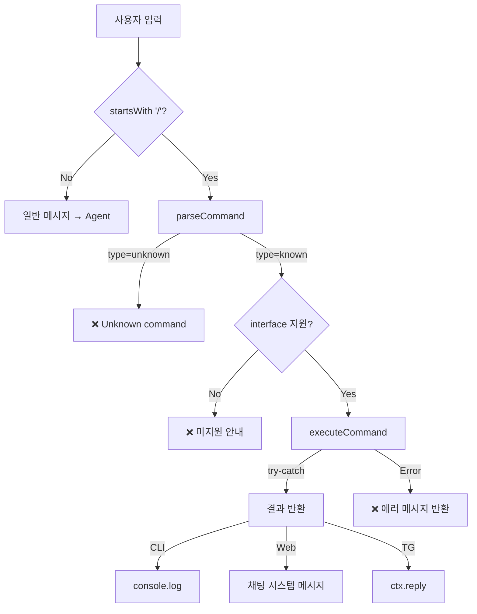

# (fin) Slash Commands — 상세 구현 계획

> 상태: ✅ 구현 완료 (Phase 1–5) | 원본 계획 문서 (v3)

## 0. OpenClaw 참고

> 파일: `openclaw-ref/ui/src/ui/chat/slash-commands.ts` (85줄)

OpenClaw은 `SLASH_COMMANDS` 배열로 커맨드 레지스트리를 관리:

```ts
type SlashCommandDef = {
  name: string;
  description: string;
  args?: string;            // "<name>" 같은 인자 힌트
  icon?: IconName;          // UI 아이콘
  category?: SlashCommandCategory;  // "session" | "model" | "agents" | "tools"
};
```

**등록된 커맨드 (14개):**

| 카테고리 | 커맨드     | 설명           | 인자                       |
| -------- | ---------- | -------------- | -------------------------- |
| session  | `/help`    | 커맨드 목록    | —                          |
| session  | `/status`  | 현재 상태      | —                          |
| session  | `/reset`   | 세션 리셋      | —                          |
| session  | `/compact` | 컨텍스트 압축  | —                          |
| session  | `/stop`    | 실행 중지      | —                          |
| model    | `/model`   | 모델 변경      | `<name>`                   |
| model    | `/think`   | 사고 레벨 설정 | `<off\|low\|medium\|high>` |
| model    | `/verbose` | 상세 모드 토글 | `<on\|off\|full>`          |
| tools    | `/export`  | HTML 내보내기  | —                          |
| tools    | `/skill`   | 스킬 실행      | `<name>`                   |
| tools    | `/usage`   | 토큰 사용량    | —                          |
| agents   | `/agents`  | 에이전트 목록  | —                          |
| agents   | `/kill`    | 에이전트 종료  | `<id\|all>`                |
| agents   | `/steer`   | 에이전트 지시  | `<id> <msg>`               |

**자동완성 함수:**
```ts
export function getSlashCommandCompletions(filter: string): SlashCommandDef[] {
  const commands = filter
    ? SLASH_COMMANDS.filter(cmd => cmd.name.startsWith(filter.toLowerCase()))
    : SLASH_COMMANDS;
  return commands.toSorted((a, b) => CATEGORY_ORDER.indexOf(a.category) - CATEGORY_ORDER.indexOf(b.category));
}
```

### 우리 구현에 반영할 점

| OpenClaw 방식         | CLI-Claw 반영                                |
| --------------------- | -------------------------------------------- |
| ✅ **카테고리 그룹핑** | → `category` 필드 추가 (session/model/tools) |
| ✅ **아이콘**          | → `emoji` 필드로 대체 (터미널 호환)          |
| ✅ **인자 힌트**       | → `args` 필드 추가 ("&lt;name&gt;" 등)       |
| ✅ **필터형 자동완성** | → `getCompletions(partial)` 동일 구현        |
| ❌ TypeScript          | → JS로 구현 (cli-claw은 순수 JS)             |
| ❌ UI 전용             | → **3개 인터페이스** 지원 (CLI + Web + TG)   |
| ❌ 서버 연동 없음      | → `POST /api/command` API 추가               |

### 0.1 Grammy 공식 문서 (Context7 조사)

> 출처: [grammyjs/website](https://github.com/grammyjs/website)

**1. `bot.api.setMyCommands()` — Telegram 커맨드 제안 UI**

Telegram은 채팅 입력창 옆 `/` 버튼을 누르면 등록된 커맨드 목록을 보여줌.
이걸 써야 UX가 완성됨:

```js
await bot.api.setMyCommands([
    { command: 'help', description: '커맨드 목록' },
    { command: 'status', description: '서버 상태' },
    { command: 'model', description: '모델 변경/확인' },
    { command: 'clear', description: '대화 초기화' },
    // ... telegram interfaces만 필터
]);
```

→ 봇 시작 시 COMMANDS 배열에서 `interfaces.includes('telegram')` 인 것만
자동으로 등록. `initTelegram()` 끝에 호출.

**2. `ctx.match` — 커맨드 인자 접근**

```js
// `/model gemini-2.5-flash` → ctx.match = 'gemini-2.5-flash'
bot.command('model', (ctx) => {
    const args = ctx.match;  // 인자 문자열 (빈 문자열 가능)
});
```

→ Grammy의 `bot.command` 사용 시 `ctx.match`로 인자 바로 접근 가능.
하지만 우리는 공통 레지스트리로 가므로 `on('text')` + `parseCommand` 방식이 더 유연.

**3. `CommandGroup` 플러그인 — 조건부 커맨드**

```js
const { CommandGroup } = require('@grammyjs/commands');
const loggedInCmds = new CommandGroup();
loggedInCmds.command('logout', 'End session', (ctx) => { ... });
```

→ 상태별 커맨드 분기 가능. 지금은 불필요하지만 향후 인증 기능 추가 시 참고.

**4. 설계 선택: `bot.command` vs `on('text')` 통합**

| 방식                          | 장점                                 | 단점                        |
| ----------------------------- | ------------------------------------ | --------------------------- |
| `bot.command` 개별 등록       | Grammy 네이티브, `ctx.match` 지원    | 공통 레지스트리와 이중 관리 |
| `on('text')` + `parseCommand` | 단일 레지스트리, 3개 인터페이스 통일 | `ctx.match` 직접 구현 필요  |

→ **선택: `on('text')` + `parseCommand`**. 이유:
- `/start`, `/id`만 `bot.command` 유지 (Grammy BotFather 등록 필수)
- 나머지는 `on('text')`에서 디스패치 → 공통 핸들러 사용
- `setMyCommands`로 Telegram UI 제안은 별도 등록 (핸들러와 분리)

### 0.2 Commander.js 패턴 참고 (Context7 조사)

> 출처: [tj/commander.js](https://github.com/tj/commander.js)

**Auto-help 패턴:**
```js
// Commander는 subcommand 있으면 자동으로 help 커맨드 추가
// → 우리도 /help에서 카테고리별 그룹핑 + 인자 힌트 표시
program.helpCommand('assist [command]', 'show assistance');
```

반영할 점:
- `/help [command]` — 특정 커맨드의 상세 도움말 표시 (인자 포함)
  - `/help` → 전체 목록
  - `/help model` → `/model` 상세 사용법 + 예시

## 1. 현황 분석

### 현재 지원 중인 커맨드

| 커맨드                 | 위치              | 인터페이스 | 처리 방식           |
| ---------------------- | ----------------- | ---------- | ------------------- |
| `/quit` `/q` `/exit`   | `chat.js:84,274`  | CLI only   | 프로세스 종료       |
| `/clear`               | `chat.js:281`     | CLI only   | `console.clear()`   |
| `/file <path>`         | `chat.js:86,288`  | CLI only   | 파일→agent 프롬프트 |
| `/mcp [sync\|install]` | `chat.js:96,303`  | CLI only   | `fetch /api/mcp/*`  |
| `/start`               | `telegram.js:150` | TG only    | 봇 인사말           |
| `/id`                  | `telegram.js:151` | TG only    | Chat ID 출력        |

### 문제점

1. **CLI 커맨드 하드코딩** — `/mcp`만 별도 분기, 확장 어려움
2. **자동완성 없음** — raw stdin 모드라 readline completer 미사용, `/` 쳐도 힌트 없음
3. **Web Slash 부분 미지원** — 현재 `/clear`만 `public/js/features/chat.js`에서 특례 처리되고, 그 외 `/...`는 일반 프롬프트로 전송됨
4. **Telegram 무시** — `text.startsWith('/') return;` (line 224) — 모든 `/`를 무시
5. **중복 코드** — simple mode와 default mode에 `/mcp` 로직 2벌 (line 96~127, 302~336)

---

## 2. 커맨드 정의

### 2.1 공통 커맨드 (모든 인터페이스)

| 커맨드     | 인자            | 동작                                   | 구현 난이도 |
| ---------- | --------------- | -------------------------------------- | ----------- |
| `/help`    | —               | 커맨드 목록 + 설명                     | 🟢 쉬움      |
| `/status`  | —               | CLI, 모델, 세션, uptime                | 🟢 쉬움      |
| `/model`   | `[name]`        | 현재 모델 확인 / 변경                  | 🟡 보통      |
| `/cli`     | `[name]`        | 현재 CLI 확인 / 변경 (`opencode` 포함) | 🟡 보통      |
| `/skill`   | `[list\|reset]` | 스킬 목록 / 초기화                     | 🟡 보통      |
| `/clear`   | —               | 화면/입력 영역 정리 (비파괴)           | 🟢 쉬움      |
| `/reset`   | `[confirm]`     | 세션/메시지 리셋 (파괴적)              | 🟡 보통      |
| `/version` | —               | CLI/서버 버전 정보                     | 🟢 쉬움      |

### 2.2 인터페이스 특화

| 커맨드                   | 인터페이스              | 동작                 | 구현 난이도 |
| ------------------------ | ----------------------- | -------------------- | ----------- |
| `/quit` `/q` `/exit`     | CLI only                | 프로세스 종료        | 🟢 기존      |
| `/file <path>`           | CLI only                | 파일 첨부            | 🟢 기존      |
| `/mcp [sync\|install]`   | CLI + Web               | MCP 관리             | 🟢 기존 이전 |
| `/memory [query]`        | CLI only (Phase 1)      | 메모리 검색/목록     | 🟡 보통      |
| `/browser [status]`      | CLI + Web + TG          | 브라우저 상태/탭     | 🟡 보통      |
| `/prompt`                | CLI + Web               | 시스템 프롬프트 정보 | 🟢 쉬움      |
| `/id`                    | TG only                 | Chat ID 확인         | 🟢 기존      |
| `/memory [query] (확장)` | Web + TG (Phase 2 선택) | 보안 보강 후 확장    | 🟠 중간      |

---

## 3. 아키텍처

### 3.1 커맨드 레지스트리 (`src/commands.js`)

```js
// 커맨드 정의
export const COMMANDS = [
    {
        name: 'help',
        aliases: ['h'],
        desc: '커맨드 목록',
        args: '[command]',
        category: 'session',
        emoji: '❓',
        interfaces: ['cli', 'web', 'telegram'],
        handler: async (args, ctx) => {
            // 특정 커맨드 도움말
            if (args[0]) {
                const target = COMMANDS.find(c => c.name === args[0]);
                if (!target) return { ok: false, text: `알 수 없는 커맨드: /${args[0]}` };
                return { ok: true, text: `/${target.name} ${target.args || ''} — ${target.desc}` };
            }
            // 전체 목록 (카테고리 그룹핑)
            const list = COMMANDS
                .filter(c => c.interfaces.includes(ctx.interface))
                .map(c => `/${c.name} — ${c.desc}`)
                .join('\n');
            return { ok: true, text: list };
        }
    },
    {
        name: 'quit',
        aliases: ['q', 'exit'],
        desc: '프로세스 종료',
        interfaces: ['cli'],
        handler: async () => ({ ok: true, code: 'exit', text: 'Bye!' })
    },
    // ... 각 커맨드
];

// 파서
export function parseCommand(text) {
    if (!text.startsWith('/')) return null;
    const [rawName = '', ...args] = text.slice(1).trim().split(/\s+/);
    const name = rawName.toLowerCase();
    const cmd = COMMANDS.find(
        c => c.name === name || (c.aliases || []).includes(name)
    );
    if (!cmd) return { type: 'unknown', name, args };
    return { type: 'known', cmd, args, name };
}

// 실행기 — 에러 핸들링 포함
export async function executeCommand(parsed, ctx) {
    if (!parsed) return null;
    if (parsed.type === 'unknown') {
        return {
            ok: false,
            code: 'unknown_command',
            text: `알 수 없는 커맨드: /${parsed.name}\n/help로 사용 가능한 커맨드를 확인하세요.`
        };
    }
    if (!parsed.cmd.interfaces.includes(ctx.interface)) {
        return { ok: false, text: `❌ /${parsed.cmd.name}은(는) ${ctx.interface}에서 사용할 수 없습니다.` };
    }
    try {
        return await parsed.cmd.handler(parsed.args, ctx);
    } catch (err) {
        return { ok: false, text: `❌ /${parsed.cmd.name} 실행 오류: ${err.message}` };
    }
}

// 자동완성 (CLI용)
export function getCompletions(partial, iface = 'cli') {
    const prefix = partial.startsWith('/') ? partial : '/' + partial;
    return COMMANDS
        .filter(c => c.interfaces.includes(iface))
        .map(c => '/' + c.name)
        .filter(n => n.startsWith(prefix));
}
```

### 3.2 ctx 설계

> **핵심 원칙**: handler는 `ctx`를 통해 환경 의존성을 주입받는다.

| 필드                   | CLI                         | Web (server.js)                  | Telegram                    |
| ---------------------- | --------------------------- | -------------------------------- | --------------------------- |
| `ctx.interface`        | `'cli'`                     | `'web'`                          | `'telegram'`                |
| `ctx.getSession()`     | API 어댑터                  | `getSession()` 직접 호출         | API 어댑터                  |
| `ctx.getSettings()`    | API 어댑터                  | `() => settings`                 | API 어댑터                  |
| `ctx.updateSettings()` | API 어댑터                  | `updateSettingsAndSession()`     | API 어댑터                  |
| `ctx.getRuntime()`     | API 어댑터 (`/api/runtime`) | `getRuntimeSnapshot()` 직접 호출 | API 어댑터 (`/api/runtime`) |
| `ctx.getSkills()`      | API 어댑터                  | `getMergedSkills()` 직접 호출    | API 어댑터                  |

**서버 내부에서는 HTTP self-request 금지** — `POST /api/command` 핸들러에서
handler가 `/api/session` 등을 호출할 때, `fetch(localhost)` 대신
서버 모듈(`getSession()` 등)을 직접 호출하도록 `ctx`에 함수를 주입:

```js
// server.js 내 ctx 구성
const ctx = {
    interface: 'web',
    getSession,
    getSettings: () => settings,
    updateSettings: updateSettingsAndSession,
    getRuntime: getRuntimeSnapshot,
    getSkills: getMergedSkills,
};
```

**응답 계약 (중요):**
- `handler`는 `ctx.reply()` 같은 출력 함수를 직접 호출하지 않는다.
- 모든 handler는 `{ ok, text, code? }`를 반환한다.
- 출력(콘솔, Web 메시지, Telegram reply)은 인터페이스 어댑터에서 1회만 처리한다.

### 3.3 데이터 흐름



---

## 4. 파일별 상세 변경

### [NEW] `src/commands.js` (120줄 예상)

핵심 파일. 모든 인터페이스에서 공유하는 커맨드 레지스트리.

**핸들러별 구현 상세:**

#### `/help`
```js
// filter by ctx.interface → formatted list
// CLI: ANSI colored, Web: plain text, TG: mono
```

#### `/status`
```js
// ctx.getSession() + ctx.getRuntime() + ctx.getSkills() 조합
// runtime은 신규 /api/runtime에서 제공:
//   { uptimeSec, activeAgent, queuePending }
// 에이전트 실행 중이면 ● running, 아니면 ○ idle
```

#### `/model [name]`
```js
// 인자 없으면: 현재 모델 출력
// 인자 있으면: active CLI의 perCli 모델만 갱신
// 1) const s = await ctx.getSettings()
// 2) const cli = s.cli
// 3) const nextPerCli = {
//      ...s.perCli,
//      [cli]: { ...(s.perCli?.[cli] || {}), model: name }
//    }
// 4) await ctx.updateSettings({ perCli: nextPerCli })
// 유효성:
//   - 하드코딩 prefix(claude/gpt/gemini) 금지
//   - 빈 문자열/개행 포함/비정상 길이만 거부
//   - opencode 모델 문자열도 그대로 허용 (회귀 방지)
// ⚠️ 변경 후 안내: "다음 메시지부터 새 모델 적용. 실행 중인 에이전트는 현재 모델 유지."
```

#### `/cli [name]`
```js
// 인자 없으면: 현재 CLI 출력
// 인자 있으면: PUT /api/settings { cli: name } → 변경 + 에이전트 재시작 필요 안내
// 허용 CLI는 하드코딩하지 않고 Object.keys(settings.perCli) 기준으로 동적 계산
// (예: claude, codex, gemini, opencode)
```

#### `/skill [list|reset]`
```js
// list: GET /api/skills → active + ref 카운트
// reset:
//   - Phase 1: CLI에서만 기존 execSync 경로 유지 (실동작 확인됨)
//   - Web/TG: "CLI에서 실행하세요" 안내 반환
//   - Phase 2(선택): /api/skills/reset 추가 후 비동기 서버 처리로 전환
```

#### `/clear` — **비파괴 유지 (기존 의미 유지)**
```js
// 공통: 화면/입력 영역만 정리 (DB/세션 변경 없음)
// CLI: console.clear() + setupScrollRegion()
// Web: chat area 임시 정리 (DOM clear)
// TG: 화면 개념이 없으므로 안내 메시지 반환 (no-op)
```

#### `/reset [confirm]` — **파괴적 리셋 전용**
```js
// DB/세션 리셋은 /reset으로 분리
// 안전장치: /reset confirm 형태일 때만 POST /api/clear 호출
// confirm 없으면 안내:
//   "정말 초기화하려면 /reset confirm 입력"
// 결과: clear messages + reset session + broadcast('clear')
```

#### `/version`
```js
// package.json version + /api/cli-status 결과 출력
// 현재 detectAllCli()는 설치 경로/가용성 제공 (버전 문자열은 기본 미포함)
```

#### `/memory [query]`
```js
// 새 cli-claw memory 시스템 사용 (~/.cli-claw/memory/)
// 인자 없으면: GET /api/claw-memory/list → 파일 목록 + 크기
// 인자 있으면: GET /api/claw-memory/search?q=<query> → grep 결과
// MEMORY.md는 시스템 프롬프트에 자동 주입되므로 별도 로딩 불필요
//
// 보안 정책:
// - Phase 1: CLI only로 제한
// - 서버/라이브러리 보강 전에는 Web/TG 비활성
// - memory.search 구현을 shell 문자열 execSync에서
//   execFile/spawn + argv 방식으로 교체 후 확장
```

#### `/browser [status|tabs]`
```js
// 인자 없으면: GET /api/browser/status → running/tabs/cdpUrl
// tabs: GET /api/browser/tabs → 탭 목록 (title + url)
// Phase 7에서 구현한 /api/browser/* 엔드포인트 활용
```

#### `/mcp [sync|install]`
```js
// 기존 chat.js 로직 그대로 이전
// sync → POST /api/mcp/sync
// install → POST /api/mcp/install
// (없으면) GET /api/mcp → 서버 목록
```

### [MODIFY] `server.js`

API 엔드포인트 추가:

```js
import { parseCommand, executeCommand, COMMANDS } from './src/commands.js';

function getRuntimeSnapshot() {
    return {
        uptimeSec: Math.floor(process.uptime()),
        activeAgent: !!activeProcess,
        queuePending: messageQueue.length,
    };
}

app.get('/api/runtime', (_, res) => {
    res.json(getRuntimeSnapshot());
});

app.post('/api/command', async (req, res) => {
    const text = (req.body?.text || '').trim();
    const parsed = parseCommand(text);
    if (!parsed) return res.status(400).json({ ok: false, code: 'not_command', text: '슬래시 커맨드가 아닙니다.' });
    const ctx = {
        interface: 'web',
        getSession,
        getSettings: () => settings,
        updateSettings: updateSettingsAndSession,
        getRuntime: getRuntimeSnapshot,
        getSkills: getMergedSkills,
    };
    const result = await executeCommand(parsed, ctx);
    res.json(result);
});

app.get('/api/commands', (req, res) => {
    res.json(COMMANDS.map(c => ({ name: c.name, desc: c.desc, interfaces: c.interfaces })));
});
```

### [MODIFY] `bin/commands/chat.js`

**변경 1: 커맨드 디스패치 통합** (중복 제거)

```diff
- // Phase 12.1: /mcp command (60줄 하드코딩)
+ const parsed = parseCommand(text);
+ if (parsed) {             // known + unknown 모두 포함
+     void runSlashCommand(parsed);
+     return;
+ }
+
+ async function runSlashCommand(parsed) {
+     const ctx = makeCliCommandCtx(apiUrl);
+     const result = await executeCommand(parsed, ctx);
+     if (result?.text) console.log(result.text);
+     if (result?.code === 'exit') process.exit(0);
+     inputActive = true;
+     showPrompt();
+ }
```

> `process.stdin.on('data')` 콜백은 sync 유지, 비동기 처리는 별도 함수로 분리해
> raw 입력 루프와 충돌을 방지한다.

**변경 2: `/` 입력 시 커맨드 힌트** (raw stdin에서 completer 구현)

```js
// raw stdin 모드에서 `/` 입력 감지
if (inputBuf === '/') {
    // 커맨드 목록을 dim으로 프롬프트 위에 출력
    const hints = COMMANDS
        .filter(c => c.interfaces.includes('cli'))
        .map(c => `/${c.name}`)
        .join('  ');
    process.stdout.write(`\r  ${c.dim}${hints}${c.reset}\n`);
    redrawPromptLine();
}
```

> ⚠️ **주의**: raw stdin 모드에서는 `readline` completer를 쓸 수 없음.
> `/` 입력 시 힌트를 dim으로 출력하고, 탭완성 대신 힌트 표시 방식 채택.

### [MODIFY] `public/index.html` + `public/js/features/chat.js` + `public/js/main.js` + `public/css/chat.css`

**커맨드 드롭다운 UI (DOM 추가는 index, 동작은 모듈 JS):**

```html
<div id="cmd-dropdown" class="cmd-dropdown" style="display:none">
    <!-- JS가 동적으로 채움 -->
</div>
```

```js
// public/js/features/chat.js
// 1) sendMessage() 초반에 slash 인터셉트
if (text.startsWith('/')) {
    const result = await executeWebCommand(text);
    if (result?.text) addSystemMsg(result.text);
    input.value = '';
    return;
}

// 2) chatInput input 이벤트에서 dropdown filter
// public/js/main.js에서 이벤트 바인딩
document.getElementById('chatInput').addEventListener('input', onSlashInput);

// 3) /clear 특례 분기를 제거하고 커맨드 디스패치로 단일화
// (기존 if (text === '/clear') ... 삭제)
```

> ⚠️ 현재 Web 앱은 모듈 구조이므로 `index.html` inline script 방식은 사용하지 않음.

**CSS:**
```css
.cmd-dropdown {
    position: absolute;
    bottom: 100%;
    left: 0; right: 0;
    background: var(--surface-1);
    border: 1px solid var(--border);
    border-radius: 8px;
    margin-bottom: 4px;
    max-height: 300px;
    overflow-y: auto;
    z-index: 100;
}
.cmd-item {
    padding: 8px 16px;
    cursor: pointer;
    display: flex;
    gap: 12px;
}
.cmd-item:hover, .cmd-item.selected {
    background: var(--surface-2);
}
.cmd-name { color: var(--accent); font-weight: 600; }
.cmd-desc { color: var(--text-dim); }
```

### [MODIFY] `src/telegram.js`

**변경 1: import + `setMyCommands` 등록**

```js
import { parseCommand, executeCommand, COMMANDS } from './commands.js';

function syncTelegramCommands(bot) {
    return bot.api.setMyCommands(
        COMMANDS
            .filter(c => c.interfaces.includes('telegram'))
            .map(c => ({ command: c.name, description: c.desc }))
    );
}

// initTelegram() 내부
void syncTelegramCommands(bot).catch((e) => {
    console.warn('[tg:commands] failed:', e.message);
});
```

> 출처: Grammy 공식 — `bot.api.setMyCommands()`로 Telegram 커맨드 제안 UI 등록
> 봇 시작할 때마다 최신 커맨드 목록이 반영됨

**변경 2: `/` 무시 → 커맨드 디스패치**

```diff
- bot.on('message:text', async (ctx) => {
-     const text = ctx.message.text;
-     if (text.startsWith('/')) return;  // ← 모든 / 무시
+ bot.on('message:text', async (ctx) => {
+     const text = ctx.message.text;
+     
+     // Slash command dispatch
+     if (text.startsWith('/')) {
+         const parsed = parseCommand(text);
+         if (!parsed) return;  // not-command 가드
+         const tgCtx = {
+             interface: 'telegram',
+             ...makeTelegramCommandCtx(),  // API adapter 묶음
+         };
+         const result = await executeCommand(parsed, tgCtx);
+         if (result?.text) await ctx.reply(result.text); // 기본 plain text
+         return;
+     }
```

- 기존 `bot.command('start')`, `bot.command('id')` → 유지 (BotFather 필수 커맨드)
- 나머지 커맨드는 `on('text')` → `parseCommand()` 디스패치
- `setMyCommands`로 Telegram UI에 커맨드 목록 자동 등록
- Grammy `ctx.match`는 사용하지 않음 (공통 레지스트리 우선)
- handler는 Telegram reply를 직접 호출하지 않고 결과만 반환 (중복 응답 방지)
- HTML 모드가 필요하면 반드시 escape 후 사용:
  - `ctx.reply(escapeTelegramHtml(result.text), { parse_mode: 'HTML' })`

**변경 3: Grammy `bot.command` 마이그레이션 경로**

```
Phase 1: bot.command('start','id') 유지 + on('text') 디스패치 병행
Phase 2: (선택) /start, /id를 COMMANDS로 이전, bot.command 제거
         → bot.on('message:text')가 모든 / 처리
```

---

## 5. UX 시나리오

### 시나리오 1: CLI에서 `/` 입력

```
❯ /
  /help  /status  /model  /cli  /skill  /clear  /reset  /mcp  /memory  /browser  /prompt  /quit

❯ /model
  현재 모델: claude-sonnet-4-20250514

❯ /model gemini-2.5-flash
  ✅ 모델 변경: gemini-2.5-flash

❯ /clear
  ✅ 화면을 정리했습니다. (대화 기록은 유지됨)

❯ /reset confirm
  ✅ 세션/대화가 초기화되었습니다.

❯ /status
  🦞 cli-claw v0.1.0
  CLI:     Codex
  Model:   claude-sonnet-4-20250514
  Uptime:  2h 34m
  Agent:   ○ idle
  Skills:  12 active, 43 ref
```

### 시나리오 2: Web UI에서 `/` 입력

```
+---------------------------------------+
|  /help      커맨드 목록               |
|  /status    서버 상태                 |
|  /model     모델 변경/확인            |
|  /cli       CLI 변경                  |
|  /skill     스킬 관리                 |
|  /clear     화면 정리                 |
|  /reset     대화 초기화               |
|  /memory    메모리 검색               |
+---------------------------------------+
| /                              [Send] |
+---------------------------------------+
```

`/model`을 클릭하면 입력창에 `/model ` 자동 채움.  
`/clear`는 즉시 실행, `/reset`은 `/reset confirm` 안내 후 재입력.

### 시나리오 3: Telegram에서 `/status`

```
User: /status
Bot:  🦞 cli-claw v0.1.0
      CLI: Codex
      Model: claude-sonnet-4-20250514
      Agent: ○ idle
      Skills: 12 active
```

### 시나리오 4: 미지원 커맨드

```
[Telegram] User: /mcp sync
[Bot]      ❌ /mcp은(는) Telegram에서 사용할 수 없습니다.
```

### 시나리오 5: 존재하지 않는 커맨드

```
[CLI] ❯ /foo
      알 수 없는 커맨드: /foo
      /help로 사용 가능한 커맨드를 확인하세요.
```

---

## 6. 평가

### 구현 난이도

| 항목                                  | 난이도 | 공수     | 비고                                             |
| ------------------------------------- | ------ | -------- | ------------------------------------------------ |
| `src/commands.js` 레지스트리          | 🟡      | 1.5h     | 에러 핸들링 + ctx 설계 포함                      |
| `chat.js` 디스패치 + 힌트             | 🟡      | 2.5h     | raw stdin 호환 + 기존 코드 제거                  |
| `server.js` API + ctx 주입            | 🟢      | 30m      | 직접 모듈 호출 ctx 구성                          |
| Web 모듈 통합 (`chat.js/main.js/css`) | 🟡      | 2.5h     | `index.html` DOM + 모듈 이벤트 바인딩            |
| `telegram.js` 디스패치                | 🟢      | 45m      | plain text 기본, 필요 시 escape 후 HTML          |
| `src/memory.js` 보안 보강             | 🟠      | 1.0h     | shell command 제거 (`execFile/spawn` + argv)     |
| 테스트 (3개 인터페이스)               | 🟡      | 1.5h     | 3 인터페이스 × 5+ 시나리오 + reset 안전장치 검증 |
| **합계**                              |        | **~10h** | 보안/회귀 방지 반영으로 소폭 증가                |

### 리스크

| 리스크                            | 확률 | 영향 | 대응                                                            |
| --------------------------------- | ---- | ---- | --------------------------------------------------------------- |
| **raw stdin 힌트 깜박임**         | 높음 | 낮음 | Phase 1: `/` 때 1회 전체 목록만, Phase 4에서 점진적 필터링      |
| **Web UI 드롭다운 포커스**        | 보통 | 보통 | 화살표 키 + Enter 네비게이션 필수                               |
| **opencode CLI/모델 회귀**        | 보통 | 높음 | `/cli`/`/model` 하드코딩 금지, `settings.perCli` 기반 동적 허용 |
| **/clear 파괴적 의미 변경**       | 보통 | 높음 | `/clear` 비파괴 유지, 파괴적 동작은 `/reset confirm`으로 분리   |
| **memory 검색 명령 인젝션**       | 보통 | 높음 | `memory.search`를 argv 기반 실행으로 교체 후 Web/TG 확장        |
| **Telegram HTML parse 깨짐/주입** | 보통 | 보통 | 기본 plain text, HTML 필요 시 escape 필수                       |
| **handler 내 예외 전파**          | 보통 | 보통 | `executeCommand` try-catch 래퍼 (설계 반영)                     |
| **서버 self-request 병목**        | 낮음 | 낮음 | Web ctx는 모듈 함수 직접 주입, localhost fetch 금지             |
| **unknown 커맨드 침묵**           | 보통 | 보통 | parse 결과를 `unknown` 타입으로 통일해 항상 안내 반환           |

### 장점

- ✅ **단일 레지스트리** — 커맨드 추가 시 `COMMANDS` 배열에 1개만 추가
- ✅ **중복 제거** — chat.js의 `/mcp` 60줄 × 2벌 → commands.js 20줄 × 1벌
- ✅ **확장성** — 새 커맨드는 `{ name, desc, interfaces, handler }` 하나면 끝
- ✅ **일관된 UX** — 어디서든 같은 커맨드, 같은 결과

---

## 7. 구현 순서

```
Phase 0 (안전): /clear·/reset 분리 + memory.search 보안 보강
Phase 1 (핵심): commands.js + chat.js 디스패치       → CLI 동작
Phase 2 (서버): server.js API + telegram.js 연결     → TG 동작
         + setMyCommands 등록 + plain text 응답
Phase 3 (UI):   index DOM + public/js 모듈 드롭다운  → Web 동작
Phase 4 (폴리시): Tab 자동완성, 키보드 네비게이션     → UX 개선
Phase 5 (안정화): 에러 핸들링 + 회귀 + 레거시 정리   → 안정화
Phase 6 (프롬프트): 히스토리 통합 + 시스템 프롬프트 정규화 → 프롬프트 개선
```

---

## 8. 검증 계획

### 자동 테스트

현재 프로젝트에 테스트 프레임워크 없음 (`package.json`에 test 스크립트 없음).
→ **수동 검증 + curl 스크립트** 방식 채택:

```bash
# 1. 서버 API 테스트
curl -s localhost:3457/api/commands | jq '.[] | .name'
curl -s localhost:3457/api/runtime | jq .
curl -s -X POST localhost:3457/api/command \
  -H 'Content-Type: application/json' \
  -d '{"text":"/help"}' | jq .
curl -s -X POST localhost:3457/api/command \
  -d '{"text":"/status"}' -H 'Content-Type: application/json' | jq .
curl -s -X POST localhost:3457/api/command \
  -d '{"text":"/unknown"}' -H 'Content-Type: application/json' | jq .

# 2. /reset confirm 세션 리셋 확인
curl -s localhost:3457/api/messages | jq 'length'  # before
curl -s -X POST localhost:3457/api/command \
  -d '{"text":"/reset confirm"}' -H 'Content-Type: application/json'
curl -s localhost:3457/api/messages | jq 'length'  # after → 0

# 3. /clear 비파괴 확인
curl -s -X POST localhost:3457/api/command \
  -d '{"text":"/clear"}' -H 'Content-Type: application/json' | jq .
curl -s localhost:3457/api/messages | jq 'length'  # unchanged

# 4. memory 검색 보안 smoke test (명령 치환 문자열)
curl -s -G localhost:3457/api/claw-memory/search \
  --data-urlencode 'q=$(id)' | jq .
```

### 수동 검증

| 시나리오                  | 인터페이스 | 확인 사항                                      |
| ------------------------- | ---------- | ---------------------------------------------- |
| `/help` 출력              | CLI/Web/TG | 카테고리 그룹핑, 각 인터페이스별 필터링        |
| `/help model`             | CLI/Web/TG | 상세 도움말 표시                               |
| `/model` (인자 없음)      | CLI/Web    | 현재 모델 출력                                 |
| `/model gemini-2.5-flash` | CLI/Web    | `perCli[activeCli].model` 변경 + 안내 메시지   |
| `/clear`                  | CLI/Web    | 화면 정리만 수행, DB/세션 유지                 |
| `/reset` (confirm 없음)   | CLI/Web/TG | 확인 문구 안내                                 |
| `/reset confirm`          | CLI/Web/TG | `POST /api/clear` + 세션/메시지 리셋           |
| `/foo` (미존재)           | CLI/Web/TG | 에러 메시지                                    |
| `/mcp` (TG에서)           | TG         | "사용할 수 없습니다" 안내                      |
| Telegram `/` 메뉴         | TG         | `setMyCommands` 목록 표시 확인                 |
| handler 예외              | Web        | 500 대신 `{ ok: false, text: '오류...' }` 반환 |
| `/model` (opencode 활성)  | CLI/Web    | opencode 모델 문자열 정상 저장 (회귀 없음)     |

### 브라우저 테스트 (Web UI)

1. 입력창에 `/` 타이핑 → 드롭다운 표시
2. 화살표 키로 네비게이션 → Enter로 선택
3. 인자 필요 커맨드 선택 시 → 입력창에 `/model ` 자동 채움
4. 인자 불요 커맨드 선택 시 → 바로 실행, 시스템 메시지 표시

## 체크리스트

- [ ] `src/commands.js` 생성 (레지스트리 + 핸들러 + 에러 래퍼)
- [ ] `/help` `/status` `/model` `/cli` `/clear` `/reset` `/version` 핸들러
- [ ] 파서 unknown 타입 통일 (`null`은 non-slash만)
- [ ] aliases 지원 (`/q`,`/exit` → `/quit`)
- [ ] `/clear` — 비파괴 유지 (화면/입력 정리만)
- [ ] `/reset confirm` — 파괴적 리셋 (POST /api/clear)
- [ ] `/skill` 기존 `bin/commands/skill.js` 연결
- [ ] `/mcp` 기존 코드 이전
- [ ] `/memory` — Phase 1: CLI only
- [ ] `src/memory.js` — shell 문자열 실행 제거 (`execFile/spawn` + argv)
- [ ] `/browser` — Phase 7 `/api/browser/*` 연동
- [ ] `/prompt` 핸들러
- [ ] `/cli` 허용 목록을 `settings.perCli` 기반 동적 계산 (`opencode` 포함)
- [ ] `chat.js` — 디스패치 통합 (simple + default 양쪽)
- [ ] `chat.js` — `/` 입력 시 힌트 표시
- [ ] `server.js` — `POST /api/command` + `GET /api/commands`
- [ ] `server.js` — `GET /api/runtime` (uptime/activeAgent/queuePending)
- [ ] `telegram.js` — `startsWith('/')` 무시 → 디스패치로 교체
- [ ] `telegram.js` — `bot.api.setMyCommands()` 등록 (Telegram 커맨드 제안 UI)
- [ ] `telegram.js` — plain text 기본, HTML 응답 시 escape 보장
- [ ] `index.html` + `public/js` 모듈 — 드롭다운 UI + 키보드 네비게이션
- [ ] curl 스크립트로 서버 API 검증
- [ ] 3개 인터페이스 수동 테스트

---

## 9. 결정 필요 항목

### 9.1 `/skill reset` 실행 방식

현재 의견: **Phase 1은 기존 execSync 유지(동작 확인됨), CLI에서만 허용**.

- 옵션 A (권장): 현재 방식 유지
  - 장점: 구현 빠름, 기존 동작 검증됨
  - 단점: 동기 실행 중 명령 처리 지연 가능
- 옵션 B: `/api/skills/reset` 비동기 API 추가
  - 장점: Web/TG에서도 동일하게 실행 가능, 서버 응답성 개선
  - 단점: 구현 범위 증가

### 9.2 `/reset` 확인 정책

- 옵션 A (권장): `/reset confirm` 2단계 확인 필수
- 옵션 B: `/reset` 즉시 실행 (빠르지만 오작동 위험)

### 9.3 Telegram `/start`, `/id` 관리 위치

- 옵션 A (권장): `bot.command('start','id')` 유지 + 나머지는 레지스트리
- 옵션 B: `/start`, `/id`도 `COMMANDS`로 완전 이관

### 9.4 `/memory` Web/TG 확장 시점

- 옵션 A (권장): `src/memory.js` 보안 교체 완료 후 확장
- 옵션 B: 지금 즉시 확장 (개발 속도는 빠르나 보안 리스크 존재)
