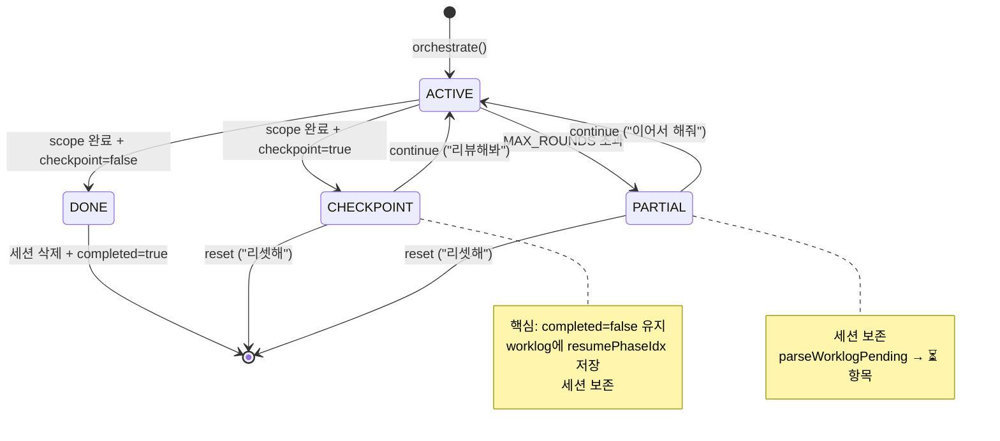

# Orchestration v3: Phase Range + Checkpoint + Reset

## 메타
- Date: 2026-02-26
- Status: Phase 2 (기획검증 — 직원 리뷰 5건 반영)
- 기반 커밋: `5abc172` (pipeline.ts 롤백 완료 상태)

---

## 0. 직원 리뷰 충돌 5건 + 해결

| # | 충돌 | 원인 | 해결 |
|---|------|------|------|
| 1 | checkpoint 후 continue 불가 | `allDone` → `completed=true` → worklog ✅ → `parseWorklogPending`가 ⏳만 탐색 | checkpoint 시 `completed` 마킹 **안 함**. 대신 worklog status=`checkpoint` + 현재 phaseIdx 저장 |
| 2 | `_skipClear`가 L244/L308 clear 누락 | clear 지점이 L228, L244, L308 총 3곳 | `_skipClear`를 3곳 모두 적용 |
| 3 | "리뷰해봐"가 continue 패턴 불일치 | `isContinueIntent`는 "이어서/계속/continue"만 매칭 | continue 패턴에 "리뷰해봐", "다음 해봐" 등 추가 |
| 4 | reset regex가 "리셋해줘"도 매칭 | `^리셋`은 prefix match → "리셋해줘"도 true | `^리셋해?$/i`로 변경. "리셋해줘"는 orchestrate로 가도 무방 |
| 5 | planner JSON에 end_phase/checkpoint 없음 | distribute.ts:221 스키마에 미반영 | distribute.ts 변경에 이미 포함 (§3.9) |

---

## 1. 상태 머신 (충돌 #1 해결 반영)



---

## 2. 핵심 알고리즘: checkpoint ≠ completed

### 문제 (충돌 #1)
```
allDone → completed=true → worklog ✅ → parseWorklogPending ⏳만 탐색 → 0건 → "이미 완료"
```

### 해결: checkpoint는 completed 마킹 안 함

```
라운드 루프:
  scopeDone = 모든 agent가 phaseProfile 끝까지 도달
  hasCheckpoint = any agent has checkpoint=true

  if scopeDone AND hasCheckpoint:
    # completed=true로 마킹하지 않음!
    # 대신 worklog에 "checkpoint at phase X" 기록
    updateWorklogStatus("checkpoint")
    # worklog matrix: ⏸ (새 기호) — 재개 가능
    broadcast("orchestrate_done", { checkpoint: true })
    return  # 세션 보존

  if scopeDone AND NOT hasCheckpoint:
    # 진짜 완료
    completed=true
    clearSessions
    ...
```

### worklog Matrix 표기

| 기호 | 의미 | parseWorklogPending |
|------|------|---------------------|
| ✅ | 완료 | 건너뜀 |
| ⏳ | 진행 중/실패 | 재개 대상 |
| ⏸ | **checkpoint 대기** [NEW] | 재개 대상 |

`parseWorklogPending` (worklog.ts:158) 수정:
```diff
-if (inMatrix && line.includes('⏳')) {
+if (inMatrix && (line.includes('⏳') || line.includes('⏸'))) {
```

`updateMatrix` (worklog.ts:115) 수정:
```diff
-`| ${ap.agent} | ${ap.role} | Phase ${ap.currentPhase}... | ${ap.completed ? '✅ 완료' : '⏳ 진행 중'} |`
+const gate = ap.completed ? '✅ 완료' : ap.checkpointed ? '⏸ checkpoint' : '⏳ 진행 중';
+`| ${ap.agent} | ... | ${gate} |`
```

---

## 3. 변경 상세 (충돌 해결 반영)

### 3.1 pipeline.ts `initAgentPhases` (L47-72)

```diff
 # L47-55: end_phase + sparse fallback
 const rawStart = Number(st.start_phase);
+const rawEnd = Number(st.end_phase);
 const startPhase = ...
+const endPhase = Number.isFinite(rawEnd)
+    ? Math.max(startPhase, Math.min(maxPhase, rawEnd))
+    : maxPhase;
-const profile = fullProfile.filter((p: number) => p >= startPhase);
+const profile = fullProfile.filter((p: number) => p >= startPhase && p <= endPhase);
+// sparse fallback
+const effectiveProfile = profile.length > 0
+    ? profile
+    : [fullProfile.find((p: number) => p >= startPhase) || fullProfile[fullProfile.length - 1]!];

 # L61-72: return 객체
 return {
     ...
+    checkpoint: st.checkpoint === true,
+    checkpointed: false,  // checkpoint 완료 여부 (resume cursor)
     ...
 };
```

### 3.2 pipeline.ts 라운드 루프 (L338-376) — 충돌 #1 핵심 수정

```diff
 # L338-348: verdict 실패 로깅
 if (verdicts?.verdicts) {
     ...
+} else {
+    console.warn(`[jaw:review] verdict parse failed (round ${round})`);
 }

 # L351-361: 완료 판정
-const allDone = agentPhases.every(ap => ap.completed);
+const scopeDone = agentPhases.every(ap => ap.completed)
+    || verdicts?.allDone === true;
+const hasCheckpoint = agentPhases.some(ap => ap.checkpoint && !ap.checkpointed);
+
-if (allDone) {
+if (scopeDone && !hasCheckpoint) {
+    // DONE: 진짜 완료
+    agentPhases.forEach(ap => { ap.completed = true; });
+    updateMatrix(worklog.path, agentPhases);
     const summary = ...
     clearAllEmployeeSessions.run();
     ...
     break;
+}
+
+if (scopeDone && hasCheckpoint) {
+    // CHECKPOINT: completed 마킹 안 함, 세션 보존
+    agentPhases.forEach(ap => {
+        if (ap.checkpoint) ap.checkpointed = true;
+    });
+    updateMatrix(worklog.path, agentPhases);
+    const summary = stripSubtaskJSON(rawText) || '요청된 scope 완료';
+    appendToWorklog(worklog.path, 'Final Summary', summary);
+    updateWorklogStatus(worklog.path, 'checkpoint', round);
+    insertMessage.run('assistant', summary + '\n\n다음: "리뷰해봐", "리셋해"', 'orchestrator', '');
+    broadcast('orchestrate_done', { text: summary, worklog: worklog.path, origin, checkpoint: true });
+    break;
 }

 # L365-376: partial — 세션 보존
 if (round === MAX_ROUNDS) {
     ...
     updateWorklogStatus(worklog.path, 'partial', round);
     // clearSessions 안 함 (의도적 보존)
     ...
 }
```

### 3.3 pipeline.ts `orchestrate` 진입 — 충돌 #2 해결

clear 지점 3곳 모두 `_skipClear` 적용:

```diff
 # L228
-clearAllEmployeeSessions.run();
+if (!meta._skipClear) clearAllEmployeeSessions.run();

 # L244 (late-subtask 분기)
-clearAllEmployeeSessions.run();
+if (!meta._skipClear) clearAllEmployeeSessions.run();

 # L308 (정규 orchestrate 진입)
-clearAllEmployeeSessions.run();
+if (!meta._skipClear) clearAllEmployeeSessions.run();
```

### 3.4 pipeline.ts `orchestrateContinue` (L382-407) — checkpoint 재개

```diff
 export async function orchestrateContinue(meta = {}) {
     const latest = readLatestWorklog();
-    if (!latest) { ... }
+    if (!latest || latest.content.includes('Status: done') || latest.content.includes('Status: reset')) {
+        broadcast('orchestrate_done', { text: '이어갈 worklog가 없습니다.' });
+        return;
+    }

     const pending = parseWorklogPending(latest.content);
     ...
-    return orchestrate(resumePrompt, meta);
+    return orchestrate(resumePrompt, { ...meta, _skipClear: true });
 }
```

### 3.5 parser.ts — 충돌 #3, #4 해결

```diff
 # 충돌 #3: continue 패턴 확장
 const CONTINUE_PATTERNS = [
     /^\/?continue$/i,
     /^이어서(?:\s*해줘)?$/i,
     /^계속(?:\s*해줘)?$/i,
+    /^다음(?:\s*해봐)?$/i,
+    /^리뷰(?:\s*해봐)?$/i,
 ];

+# 충돌 #4: reset 패턴 (정확 매칭)
+const RESET_PATTERNS = [
+    /^리셋해?$/i,
+    /^초기화해?$/i,
+    /^페이즈?\s*리셋해?$/i,
+    /^phase\s*reset$/i,
+    /^reset$/i,
+];
+
+export function isResetIntent(text: string) {
+    const t = String(text || '').trim();
+    if (!t) return false;
+    return RESET_PATTERNS.some(re => re.test(t));
+}
```

### 3.6 pipeline.ts `orchestrateReset` [NEW]

```typescript
export async function orchestrateReset(meta: Record<string, any> = {}) {
    const origin = meta.origin || 'web';
    clearAllEmployeeSessions.run();
    const latest = readLatestWorklog();
    if (!latest) {
        broadcast('orchestrate_done', { text: '리셋할 worklog가 없습니다.', origin });
        return;
    }
    updateWorklogStatus(latest.path, 'reset', 0);
    appendToWorklog(latest.path, 'Final Summary', '유저 요청으로 리셋됨.');
    broadcast('orchestrate_done', { text: '리셋 완료.', origin });
}
```

### 3.7 worklog.ts — ⏸ 기호 지원

```diff
 # updateMatrix (L115)
-`${ap.completed ? '✅ 완료' : '⏳ 진행 중'}`
+const gate = ap.completed ? '✅ 완료' : ap.checkpointed ? '⏸ checkpoint' : '⏳ 진행 중';

 # parseWorklogPending (L158)
-if (inMatrix && line.includes('⏳')) {
+if (inMatrix && (line.includes('⏳') || line.includes('⏸'))) {
```

### 3.8 distribute.ts `buildPlanPrompt` — 충돌 #5 해결

L157-160 가이드 + L221 JSON 스키마에 `end_phase`, `checkpoint` 추가. (이전 §3.9와 동일)

### 3.9 server.ts `/api/orchestrate/reset`

```typescript
app.post('/api/orchestrate/reset', (req, res) => {
    orchestrateReset({ origin: 'web' });
    res.json({ ok: true });
});
```

### 3.10 phaseReview prompt (L200-215) — allDone 조기완료 규칙

```diff
+### allDone 조기 완료 규칙
+- 커밋+테스트+푸시 완료 → 남은 phase 있어도 allDone: true 가능
+- 판단 기준: 사용자 요청이 충족되었는가?
```

---

## 4. 시퀀스 다이어그램 (충돌 해결 반영)

```mermaid
sequenceDiagram
    participant U as 유저
    participant O as Orchestrator
    participant A as Agent
    participant DB as Sessions
    participant W as Worklog

    rect rgb(40, 40, 60)
    Note over U,W: checkpoint → continue (충돌 #1 해결)
    U->>O: "개발만 하고 보고해"
    O->>DB: clearSessions (L228)
    O->>A: Phase 3 (start=3 end=3 checkpoint=true)
    A->>O: 커밋 완료
    Note over O: completed=false 유지!
    O->>W: status: checkpoint, matrix: ⏸
    O->>U: "Phase 3 완료. 다음?"
    U->>O: "리뷰해봐"
    Note over O: isContinueIntent → true (충돌 #3 해결)
    O->>O: orchestrateContinue(_skipClear=true)
    Note over DB: 세션 복원 (충돌 #2 해결)
    O->>W: parseWorklogPending → ⏸ 항목 발견
    O->>A: Phase 4부터 (같은 세션)
    A->>O: 리뷰 완료
    O->>W: status: done
    O->>DB: clearSessions
    O->>U: "전체 완료"
    end

    rect rgb(60, 40, 40)
    Note over U,W: checkpoint → reset
    U->>O: "리셋해"
    Note over O: isResetIntent → true (충돌 #4 해결)
    O->>O: orchestrateReset()
    O->>DB: clearSessions
    O->>W: status: reset
    O->>U: "리셋 완료"
    end
```



---

## 5. 테스트 계획

```
# Phase Range
EP-001: end_phase 생략 → maxPhase
EP-002: start=3 end=3 → profile [3]
EP-003: start > end → end 보정
EP-004: docs start=2 end=2 → sparse fallback [3]
EP-005: docs start=2 end=4 → [3]

# Checkpoint (충돌 #1 핵심)
CP-001: checkpoint=true → completed=false 유지
CP-002: checkpoint 시 worklog matrix에 ⏸ 표기
CP-003: parseWorklogPending이 ⏸ 항목 감지
CP-004: checkpoint 후 continue → 세션 복원 + 다음 phase
CP-005: checkpoint=false → 기존 done 동작

# Intent (충돌 #3, #4)
IN-001: "리뷰해봐" → isContinueIntent true
IN-002: "다음 해봐" → isContinueIntent true
IN-003: "이어서 해줘" → isContinueIntent true (기존)
IN-004: "리셋해" → isResetIntent true
IN-005: "리셋" → isResetIntent true
IN-006: "리셋해줘" → isResetIntent false (orchestrate로)
IN-007: "reset" → isResetIntent true

# Session (충돌 #2)
SL-001: _skipClear=true → L228 clear 안 함
SL-002: _skipClear=true → L244 clear 안 함
SL-003: _skipClear=true → L308 clear 안 함
SL-004: _skipClear 없음 → 3곳 모두 clear

# Reset
RS-001: reset → clearSessions + worklog reset
RS-002: reset 대상 없음 → 에러 메시지
RS-003: reset 후 continue → "이어갈 작업 없음"
```

---

## 6. 변경 요약

| 파일 | 위치 | 변경 | 라인 |
|------|------|------|------|
| pipeline.ts | L47-72 | end_phase + checkpoint + checkpointed | +15 |
| pipeline.ts | L228, L244, L308 | _skipClear 3곳 | +3 |
| pipeline.ts | L338-376 | checkpoint 분기 + verdict 로깅 | +20 |
| pipeline.ts | L200-215 | allDone 조기완료 prompt | +5 |
| pipeline.ts | L382-407 | continue 수정 (_skipClear) | +3 |
| pipeline.ts | after L407 | orchestrateReset [NEW] | +12 |
| parser.ts | L5-9 | continue 패턴 확장 | +2 |
| parser.ts | after L15 | isResetIntent [NEW] | +10 |
| worklog.ts | L115 | ⏸ 기호 지원 | +2 |
| worklog.ts | L158 | parseWorklogPending ⏸ 감지 | +1 |
| distribute.ts | L157, L221 | end_phase/checkpoint 가이드 | +12 |
| server.ts | L410+ | /api/orchestrate/reset | +4 |
| tests/ | [NEW] | orchestration-v3.test.ts | ~80 |

총: ~170줄. 기존 동작 하위호환 (end_phase/checkpoint 생략 = 기존 동작).
