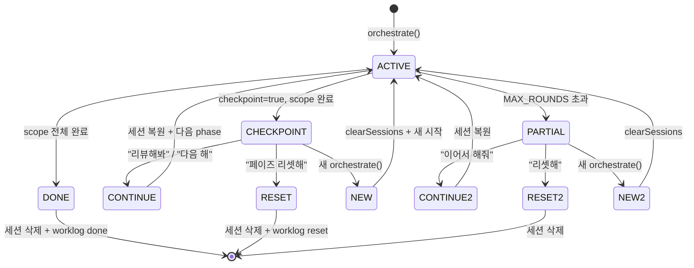
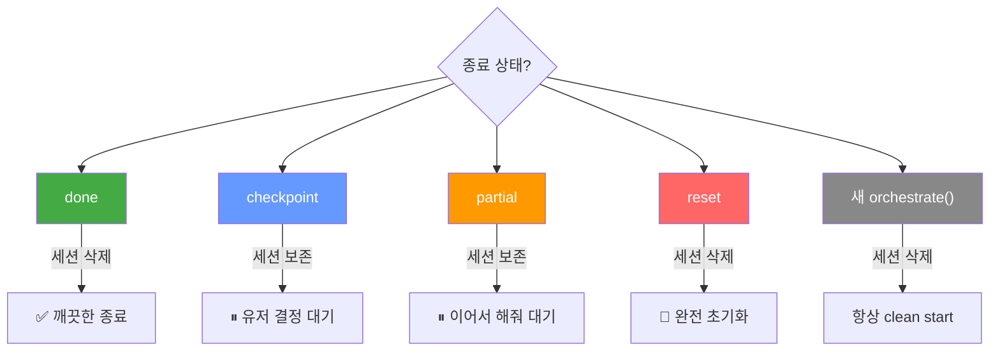
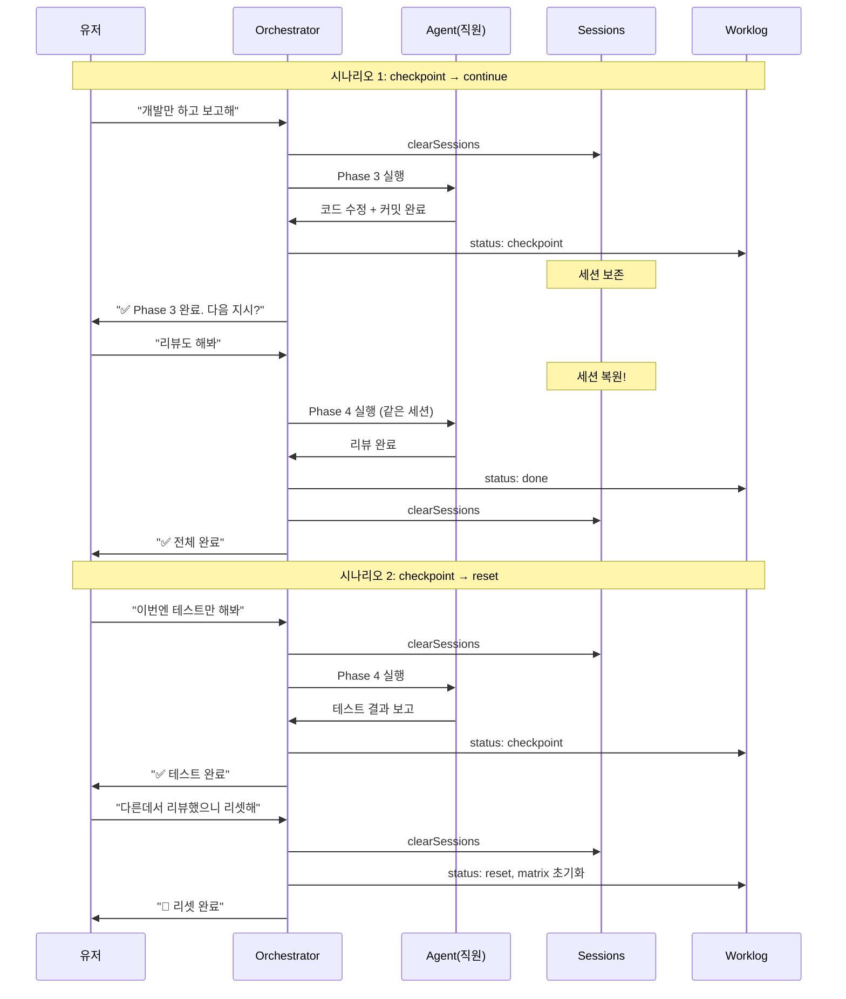

# Orchestration v3: Phase Range + Checkpoint + Reset 전체 설계

## Date: 2026-02-26
## Status: PLAN (코드 수정 전)

---

## 유저 시나리오

```
유저: "크로스플랫폼 대응해줘. 플랜은 있으니까 개발만 하고 보고해"
→ Planning: start=3, end=3, checkpoint=true
→ Phase 3 실행 → checkpoint 상태 → 유저에게 보고

유저: "좋아 리뷰도 해봐"
→ orchestrateContinue: phase 4부터, 세션 복원

유저: "아 잠깐 다른 데서 리뷰했으니까 페이즈 리셋해"
→ orchestrateReset: 모든 phase 초기화, 세션 삭제

유저: "처음부터 다시 개발해봐"
→ 새 orchestrate: 깨끗한 시작
```

---

## 1. 상태 머신 (전체)



---

## 2. 유저 명령어 매핑

| 유저 입력 | 함수 | 동작 |
|-----------|------|------|
| 일반 작업 요청 | `orchestrate()` | clearSessions → plan → execute |
| "이어서 해줘" / "다음 해" | `orchestrateContinue()` | worklog에서 pending 읽기 → 세션 복원 → 다음 phase |
| "리셋해" / "초기화" | `orchestrateReset()` | **[NEW]** 세션 삭제 + worklog 초기화 |
| checkpoint 결과 후 "리뷰해봐" | `orchestrateContinue()` | checkpoint에서 이어서 |

---

## 3. Phase Range (end_phase)

### initAgentPhases 로직

```
입력: start_phase, end_phase, checkpoint, role

1. startPhase = clamp(start_phase, min, max) || min
2. endPhase = clamp(end_phase, startPhase, max) || max
3. profile = fullProfile.filter(p >= startPhase AND p <= endPhase)
4. if profile.empty:
     nearest = fullProfile.find(p >= startPhase) || fullProfile.last
     profile = [nearest]
5. return { phaseProfile: profile, checkpoint: !!checkpoint }
```

### buildPlanPrompt subtask JSON 확장

```diff
 {
   "agent": "Backend",
   "role": "backend",
   "task": "...",
   "start_phase": 3,
+  "end_phase": 3,
+  "checkpoint": true,
   "parallel": false,
   "verification": { ... }
 }
```

---

## 4. 라운드 루프 알고리즘

```
function orchestrate(prompt):
  clearSessions()
  plan = phasePlan(prompt)
  if plan.directAnswer: return

  agentPhases = initAgentPhases(plan.subtasks)

  for round = 1 to MAX_ROUNDS:
    results = distributeByPhase(agentPhases)
    verdicts = phaseReview(results, agentPhases)

    # Phase Advance
    applyVerdicts(agentPhases, verdicts)

    # 완료 판정
    scopeDone = agentPhases.every(completed) OR verdicts.allDone
    hasCheckpoint = agentPhases.some(ap => ap.checkpoint)

    if scopeDone AND hasCheckpoint:
      # CHECKPOINT: scope 완료, 세션 보존
      updateWorklog("checkpoint")
      broadcast("orchestrate_checkpoint", results)  ← 유저에게 보고
      return                                         ← 세션 살아있음

    if scopeDone AND NOT hasCheckpoint:
      # DONE: 전체 완료
      updateWorklog("done")
      clearSessions()
      broadcast("orchestrate_done", summary)
      return

  # MAX_ROUNDS 소진
  updateWorklog("partial")
  # 세션 보존 (이어서 해줘 대비)
  broadcast("orchestrate_done", partial_report)
```

---

## 5. orchestrateContinue (이어서/다음 phase)

```
function orchestrateContinue():
  worklog = readLatestWorklog()
  if worklog.status == "done": return "이미 완료"
  if worklog.status not in ["partial", "checkpoint"]: return "이어갈 작업 없음"

  pending = parseWorklogPending(worklog)
  if pending.empty: return "모두 완료"

  # 핵심: 세션 clearSessions 안 함!
  # 기존 employee_sessions에서 session_id 복원

  # checkpoint에서 이어가면 → 다음 phase부터
  # partial에서 이어가면 → 같은 phase 재시도

  resumeSubtasks = pending.map(p => ({
    agent: p.agent,
    role: p.role,
    start_phase: p.currentPhase,  ← pending의 현재 phase
    end_phase: worklog.originalEndPhase || maxPhase,
    checkpoint: false              ← 이어가면 checkpoint 해제
  }))

  return orchestrateResume(resumeSubtasks, worklog)
```

---

## 6. orchestrateReset [NEW]

```
function orchestrateReset():
  worklog = readLatestWorklog()
  if !worklog: return "리셋할 worklog 없음"

  # 1. 세션 전부 삭제
  clearAllEmployeeSessions()

  # 2. worklog 상태 업데이트
  updateWorklogStatus(worklog.path, "reset", 0)

  # 3. Agent Matrix 초기화
  # 모든 agent를 ⏳ Phase 1로 리셋
  resetMatrix(worklog.path)

  broadcast("orchestrate_reset", { worklog: worklog.path })
  return "페이즈 리셋 완료. 새로 시작하려면 작업을 요청하세요."
```

### 리셋 트리거 감지 (parser.ts)

```
const RESET_PATTERNS = [
  /^리셋/i,
  /^초기화/i,
  /^페이즈?\s*리셋/i,
  /^phase\s*reset/i,
  /^reset/i,
];

function isResetIntent(text): boolean
```

---

## 7. 세션 정리 규칙 최종



---

## 8. 전체 시퀀스 예시



---

## 9. 변경 파일 목록

| 파일 | 변경 | 라인 |
|------|------|------|
| pipeline.ts `initAgentPhases` | end_phase + checkpoint 파싱, sparse fallback | ~15줄 |
| pipeline.ts round loop | checkpoint 분기, partial 세션 보존 | ~15줄 |
| pipeline.ts | `orchestrateReset()` [NEW] | ~20줄 |
| distribute.ts `buildPlanPrompt` | end_phase + checkpoint 가이드 | ~15줄 |
| parser.ts | `isResetIntent()` [NEW] | ~10줄 |
| server.ts or routes | `/api/orchestrate/reset` 엔드포인트 | ~5줄 |
| tests/unit/end-phase.test.ts | [NEW] 경계값 + reset 테스트 | ~100줄 |

총 ~180줄 변경/추가. 기존 동작 깨지지 않음.

---

## 10. 테스트 계획

```
# Phase Range
EP-001: end_phase 생략 → maxPhase (하위호환)
EP-002: start=3 end=3 → profile [3]
EP-003: start > end → end를 start로 보정
EP-004: docs start=2 end=2 → sparse fallback [3]
EP-005: end_phase=99 → clamp
EP-006: 기존 JSON (end_phase 없음) → 정상

# Checkpoint
CP-001: checkpoint=true → 완료 시 세션 보존
CP-002: checkpoint 후 continue → 다음 phase, 세션 복원
CP-003: checkpoint 후 새 작업 → 세션 삭제
CP-004: checkpoint=false → 기존 done 동작

# Reset
RS-001: isResetIntent 패턴 매칭
RS-002: reset → 세션 삭제 + worklog status=reset
RS-003: reset 후 새 작업 → 깨끗한 시작
RS-004: reset 대상 worklog 없을 때 → 에러 메시지

# Session Lifecycle
SL-001: done → 세션 삭제 확인
SL-002: partial → 세션 보존 확인
SL-003: 새 orchestrate() → 항상 세션 삭제
```
