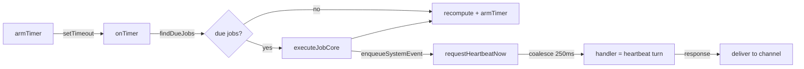

# Phase 8: Heartbeat 상세 구현 플랜

---

## 1. openclaw 분석 요약

### 아키텍처



### 핵심 컨셉

| 컴포넌트            | 역할                                                                   |
| ------------------- | ---------------------------------------------------------------------- |
| `CronService`       | 잡 스케줄러 facade (start/stop/list/add)                               |
| `armTimer()`        | 다음 due job까지 `setTimeout` 설정 (max 60s 클램프)                    |
| `onTimer()`         | 타이머 콜백 → `findDueJobs()` → 실행 → 결과 적용 → `armTimer()`        |
| `executeJobCore()`  | systemEvent를 enqueue하고 `runHeartbeatOnce()` 호출                    |
| `heartbeat-wake.ts` | `requestHeartbeatNow()` → 250ms coalesce → handler 실행 → busy면 retry |
| `[SILENT]`          | 에이전트가 할 일 없으면 반환하는 무응답 토큰                           |

### 핵심 패턴

1. **coalesce**: 여러 wake 요청이 250ms 안에 오면 하나로 합침
2. **retry**: handler가 busy(`requests-in-flight`)면 1초 후 재시도
3. **wake mode**: `now` = 즉시 실행, `next-heartbeat` = 다음 주기까지 대기
4. **system event**: 에이전트에게 전달할 메시지를 큐에 넣고 heartbeat 턴에서 소비

---

## 2. claw 경량 구현 설계

### 단순화 포인트

openclaw의 cron은 multiple jobs, isolated agents, delivery plans 등 복잡. claw는:
- **단일 타이머** (`setInterval`)
- **단일 에이전트** (planning agent)
- **system event 대신 프롬프트 직접 주입**
- **coalesce/retry 불필요** (1개 에이전트, 직렬 실행)

### 플로우

```
startHeartbeat()
  │
  ├── setInterval(heartbeatIntervalMs)
  │     │
  │     ▼
  │   isAgentBusy? ──yes──▶ skip (다음 주기까지 대기)
  │     │
  │     no
  │     │
  │     ▼
  │   orchestrate(heartbeatPrompt)
  │     │
  │     ▼
  │   response contains [SILENT]? ──yes──▶ log + skip
  │     │
  │     no
  │     │
  │     ▼
  │   broadcast to web UI + telegram
  │
  └── stopHeartbeat()
        clearInterval
```

### 코드 구조

```js
// ── Heartbeat ──────────────────────────

let heartbeatTimer = null;
let heartbeatBusy = false;

function startHeartbeat() {
    stopHeartbeat();
    if (!settings.heartbeat?.enabled) return;

    const intervalMs = (settings.heartbeat.intervalMinutes || 5) * 60_000;
    console.log(`[heartbeat] started — every ${intervalMs / 60000}min`);

    heartbeatTimer = setInterval(async () => {
        if (heartbeatBusy || agentRunning) {
            console.log('[heartbeat] skipped — agent busy');
            return;
        }
        heartbeatBusy = true;
        try {
            const prompt = buildHeartbeatPrompt();
            const result = await orchestrateAndCollect(prompt);

            if (result.includes('[SILENT]')) {
                console.log('[heartbeat] silent — nothing to do');
                return;
            }

            // 결과를 모든 채널에 전달
            broadcast('agent_done', { text: result });
            insertMessage.run('assistant', result, 'heartbeat', '');

            // Telegram에도 전달
            if (telegramBot && settings.telegram?.enabled) {
                for (const chatId of settings.telegram.allowedChatIds || []) {
                    const html = markdownToTelegramHtml(result);
                    const chunks = chunkTelegramMessage(html);
                    for (const chunk of chunks) {
                        try {
                            await telegramBot.api.sendMessage(chatId, chunk, { parse_mode: 'HTML' });
                        } catch {
                            await telegramBot.api.sendMessage(chatId, chunk.replace(/<[^>]+>/g, ''));
                        }
                    }
                }
            }
            console.log(`[heartbeat] response: ${result.slice(0, 80)}`);
        } catch (err) {
            console.error('[heartbeat] error:', err.message);
        } finally {
            heartbeatBusy = false;
        }
    }, intervalMs);
    heartbeatTimer.unref?.();
}
```

### heartbeat 프롬프트

```js
function buildHeartbeatPrompt() {
    const now = new Date().toLocaleString('ko-KR', { timeZone: 'Asia/Seoul' });
    const base = settings.heartbeat?.prompt ||
        '정기 점검입니다. 할 일이 있으면 실행하고, 없으면 [SILENT]로 응답하세요.';

    return `[heartbeat] 현재 시간: ${now}\n\n${base}`;
}
```

### 기존 시스템과 연동

| 기존 기능                       | heartbeat 활용                            |
| ------------------------------- | ----------------------------------------- |
| `orchestrateAndCollect()`       | heartbeat 프롬프트를 일반 메시지처럼 처리 |
| `broadcast()`                   | 결과를 Web UI에 실시간 전달               |
| `insertMessage`                 | `source: 'heartbeat'`로 DB 저장           |
| `telegramBot.api.sendMessage()` | 결과를 Telegram에 전달                    |

### Settings

```js
settings.heartbeat = {
    enabled: false,           // 기본 off
    intervalMinutes: 5,       // 5분 주기
    prompt: '정기 점검...',   // 커스텀 프롬프트
};
```

---

## 3. 구현 체크리스트

- [ ] 8.1 `startHeartbeat()` / `stopHeartbeat()` + `setInterval`
  - `heartbeatBusy` 플래그로 중복 실행 방지
  - `agentRunning` 체크로 다른 작업 중 skip
  - `timer.unref()` 로 프로세스 종료 안 막음
- [ ] 8.2 `buildHeartbeatPrompt()` + `[SILENT]` 토큰 처리
  - `[SILENT]` 포함 시 무시 (로그만)
  - 정상 응답 시 broadcast + DB + Telegram 전달
- [ ] 8.3 `settings.heartbeat` + PUT 핸들러 연동
  - 설정 변경 시 `startHeartbeat()` 재호출
- [ ] 8.4 Settings UI Heartbeat 섹션
  - enabled 토글, interval 입력, prompt textarea
- [ ] 8.5 커밋 + devlog

## 4. 수정 대상 파일

| 파일                | 변경                                                                               |
| ------------------- | ---------------------------------------------------------------------------------- |
| `server.js`         | `startHeartbeat()`, `stopHeartbeat()`, `buildHeartbeatPrompt()`, settings PUT 연동 |
| `public/index.html` | Settings에 Heartbeat UI 섹션, JS save/load 함수                                    |
