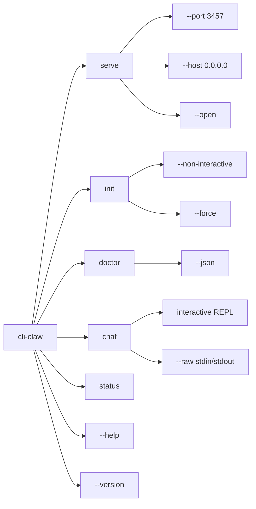
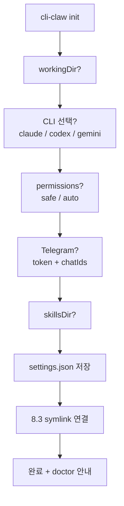
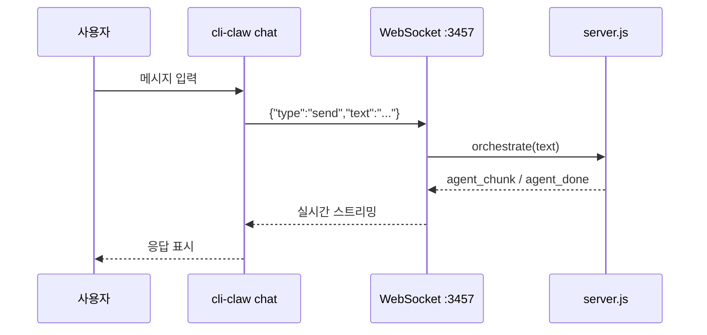
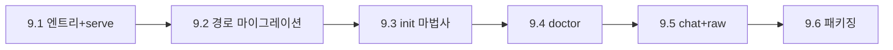

# Phase 9: CLI 구현 상세 플랜

claw를 `npx cli-claw serve`로 설치 없이 실행할 수 있는 **배포 가능한 CLI**를 만든다.
서버는 포그라운드에서 돌고, 별도 터미널에서 `cli-claw status`, `cli-claw chat` 등으로 조작한다.
openclaw과 동일한 패턴 — gateway(서버)는 포그라운드, 나머지 커맨드는 HTTP API 호출.

---

## 확정된 결정사항

| 항목          | 결정                                  |
| ------------- | ------------------------------------- |
| 바이너리 이름 | `cli-claw`                            |
| 명령 체계     | 서브커맨드형 (`cli-claw <command>`)   |
| 인자 파싱     | Node 내장 `util.parseArgs` (의존성 0) |
| 배포 대상     | public npm                            |
| 데이터 홈     | `~/.cli-claw/`                        |
| chat 모드     | Phase 9.5 (별도 서브페이즈)           |

---

## 서브커맨드 전체 표면



---

## Phase 9.1: 엔트리포인트 + serve

**목표**: `npx cli-claw serve` = 서버 포그라운드 실행

### 신규 파일: `bin/cli-claw.js`

```js
#!/usr/bin/env node
import { parseArgs } from 'node:util';
import { readFileSync } from 'node:fs';
import { join, dirname } from 'node:path';
import { fileURLToPath } from 'node:url';

const __dirname = dirname(fileURLToPath(import.meta.url));
const pkg = JSON.parse(readFileSync(join(__dirname, '..', 'package.json'), 'utf8'));

const command = process.argv[2];

switch (command) {
    case 'serve':   await import('./commands/serve.js'); break;
    case 'init':    await import('./commands/init.js'); break;
    case 'doctor':  await import('./commands/doctor.js'); break;
    case 'chat':    await import('./commands/chat.js'); break;
    case 'status':  await import('./commands/status.js'); break;
    case '--version': case '-v':
        console.log(`cli-claw v${pkg.version}`); break;
    default:
        printHelp(); break;
}
```

### `bin/commands/serve.js`

```js
import { spawn } from 'node:child_process';
import { parseArgs } from 'node:util';

const { values } = parseArgs({
    args: process.argv.slice(3),
    options: {
        port:  { type: 'string', default: '3457' },
        host:  { type: 'string', default: 'localhost' },
        open:  { type: 'boolean', default: false },
    },
});

const serverPath = join(__dirname, '..', '..', 'server.js');
const child = spawn(process.execPath,
    ['--dns-result-order=ipv4first', serverPath],
    { stdio: 'inherit', env: { ...process.env, PORT: values.port } }
);

// SIGINT/SIGTERM 전달
process.on('SIGINT',  () => child.kill('SIGINT'));
process.on('SIGTERM', () => child.kill('SIGTERM'));
child.on('exit', (code) => process.exit(code ?? 1));

// --open: 서버 시작 후 브라우저 오픈
if (values.open) {
    setTimeout(() => {
        import('node:child_process')
            .then(({ exec }) => exec(`open http://localhost:${values.port}`));
    }, 1500);
}
```

### 체크리스트

- [ ] 9.1.1 `bin/cli-claw.js` 엔트리포인트 + 라우터
- [ ] 9.1.2 `bin/commands/serve.js` — 포그라운드 서버
- [ ] 9.1.3 `package.json` bin 필드 + files 화이트리스트
- [ ] 9.1.4 `--version`, `--help` 출력

---

## Phase 9.2: 경로 정규화 + 마이그레이션

**목표**: `settings.json`, `claw.db`를 `__dirname`에서 `~/.cli-claw/`로 이전

### 마이그레이션 로직

```js
const MIGRATION_MARKER = join(CLAW_HOME, '.migrated-v1');

function migrateIfNeeded() {
    if (fs.existsSync(MIGRATION_MARKER)) return;

    const legacySettings = join(__dirname, 'settings.json');
    const legacyDb = join(__dirname, 'claw.db');

    if (fs.existsSync(legacySettings) && !fs.existsSync(SETTINGS_PATH)) {
        fs.copyFileSync(legacySettings, SETTINGS_PATH);
        console.log('[migrate] settings.json → ~/.cli-claw/');
    }
    if (fs.existsSync(legacyDb) && !fs.existsSync(DB_PATH)) {
        fs.copyFileSync(legacyDb, DB_PATH);
        // WAL/SHM도 복사
        for (const ext of ['-wal', '-shm']) {
            const src = legacyDb + ext;
            if (fs.existsSync(src)) fs.copyFileSync(src, DB_PATH + ext);
        }
        console.log('[migrate] claw.db → ~/.cli-claw/');
    }

    fs.writeFileSync(MIGRATION_MARKER, JSON.stringify({ migratedAt: new Date().toISOString() }));
}
```

### server.js 경로 변경

```diff
- const DB_PATH = join(__dirname, 'claw.db');
- const SETTINGS_PATH = join(__dirname, 'settings.json');
+ const DB_PATH = join(CLAW_HOME, 'claw.db');
+ const SETTINGS_PATH = join(CLAW_HOME, 'settings.json');
```

### 체크리스트

- [ ] 9.2.1 `server.js` 경로 상수를 `CLAW_HOME` 기반으로 전환
- [ ] 9.2.2 `migrateIfNeeded()` 함수 + marker 파일
- [ ] 9.2.3 서버 부팅 시 마이그레이션 자동 실행

---

## Phase 9.3: init 마법사

**목표**: `cli-claw init` = 대화형 초기 설정

### 설정 수집 항목



### 코드 스니펫

```js
import { createInterface } from 'node:readline';

const rl = createInterface({ input: process.stdin, output: process.stdout });
const ask = (q) => new Promise(r => rl.question(q, r));

const workingDir = await ask('Working directory [~]: ') || os.homedir();
const cli = await ask('CLI (claude/codex/gemini) [claude]: ') || 'claude';
const permissions = await ask('Permissions (safe/auto) [auto]: ') || 'auto';
const tgEnabled = (await ask('Telegram? (y/n) [n]: ')).toLowerCase() === 'y';

let tgToken = '', tgChatIds = [];
if (tgEnabled) {
    tgToken = await ask('Telegram bot token: ');
    tgChatIds = (await ask('Chat IDs (comma): ')).split(',').map(s => +s.trim()).filter(Boolean);
}

// merge + save
const settings = { ...loadSettings(), workingDir, cli, permissions,
    telegram: { enabled: tgEnabled, token: tgToken, allowedChatIds: tgChatIds } };
saveSettings(settings);
```

### 체크리스트

- [ ] 9.3.1 `bin/commands/init.js` — interactive readline
- [ ] 9.3.2 `--non-interactive` 플래그 모드
- [ ] 9.3.3 `--force`로 기존 값 덮어쓰기
- [ ] 9.3.4 init 완료 후 `postinstall.js` symlink 실행

---

## Phase 9.4: doctor 진단

**목표**: `cli-claw doctor` = 설치/설정 헬스체크

### 검사 항목

| 체크                 | OK             | WARN        | ERROR       |
| -------------------- | -------------- | ----------- | ----------- |
| ~/.cli-claw writable | ✅              |             | ❌ 권한 없음 |
| settings.json        | ✅ parse 성공   |             | ❌ 깨진 JSON |
| claw.db              | ✅ open 가능    |             | ❌ open 실패 |
| claude CLI           | ✅ which 성공   | ⚠️ 미설치    |             |
| codex CLI            | ✅              | ⚠️           |             |
| telegram token       | ✅ 형식 OK      | ⚠️ malformed |             |
| skills dir           | ✅ symlink 정상 | ⚠️ 없음      |             |

### 코드 스니펫

```js
function check(name, fn) {
    try {
        const result = fn();
        console.log(`  ✅ ${name}: ${result || 'OK'}`);
        return 'ok';
    } catch (e) {
        console.log(`  ❌ ${name}: ${e.message}`);
        return 'error';
    }
}

const results = [];
results.push(check('Home directory', () => { fs.accessSync(CLAW_HOME, fs.constants.W_OK); }));
results.push(check('settings.json', () => { JSON.parse(fs.readFileSync(SETTINGS_PATH, 'utf8')); }));
// ...
process.exit(results.includes('error') ? 1 : 0);
```

### 체크리스트

- [ ] 9.4.1 `bin/commands/doctor.js` — 체크 리스트 실행
- [ ] 9.4.2 `--json` 출력 모드
- [ ] 9.4.3 exit code: 0 (OK/WARN) / 1 (ERROR)

---

## Phase 9.5: chat + raw 모드

**목표**: `cli-claw chat` = 터미널 REPL, `--raw` = pipe-friendly

### 아키텍처



### 두 가지 모드

| 모드          | 입력               | 출력                | 용도                 |
| ------------- | ------------------ | ------------------- | -------------------- |
| `chat` (기본) | readline REPL      | formatted + 색상    | 사람이 직접 사용     |
| `chat --raw`  | stdin line-by-line | JSON lines (ndjson) | 스크립트/파이프 연동 |

### Interactive REPL 코드

```js
import WebSocket from 'ws';
import { createInterface } from 'node:readline';

const ws = new WebSocket(`ws://localhost:${port}`);
const rl = createInterface({ input: process.stdin, output: process.stdout, prompt: '🦞 > ' });

ws.on('open', () => rl.prompt());
ws.on('message', (data) => {
    const msg = JSON.parse(data);
    if (msg.type === 'agent_chunk') process.stdout.write(msg.text);
    if (msg.type === 'agent_done') {
        console.log('\n');
        rl.prompt();
    }
});

rl.on('line', (line) => {
    ws.send(JSON.stringify({ type: 'send', text: line }));
    console.log(); // 줄바꿈
});
```

### Raw 모드 (`--raw`)

```js
// stdin → server → stdout (ndjson)
process.stdin.setEncoding('utf8');
process.stdin.on('data', (chunk) => {
    const lines = chunk.split('\n').filter(Boolean);
    for (const line of lines) {
        ws.send(JSON.stringify({ type: 'send', text: line }));
    }
});

ws.on('message', (data) => {
    // ndjson 출력 — 파이프로 다른 도구에 전달 가능
    process.stdout.write(data.toString() + '\n');
});
```

### 서버 측 변경 필요

현재 WebSocket 핸들러가 `send` type을 지원하는지 확인 필요:

```js
// server.js WebSocket handler에 추가
ws.on('message', (raw) => {
    const msg = JSON.parse(raw);
    if (msg.type === 'send') {
        orchestrate(msg.text);  // 기존 로직 재사용
    }
});
```

### 체크리스트

- [ ] 9.5.1 서버 WebSocket에 `send` 메시지 타입 추가
- [ ] 9.5.2 `bin/commands/chat.js` — interactive REPL
- [ ] 9.5.3 `--raw` 모드 (ndjson stdin/stdout)
- [ ] 9.5.4 `--port` 옵션으로 커스텀 포트 연결

---

## Phase 9.6: 패키징 + README

- [ ] 9.6.1 `package.json` bin/files 완성
- [ ] 9.6.2 `README.md` Quick Start (`npx cli-claw init → serve`)
- [ ] 9.6.3 `npm pack --dry-run` 검증
- [ ] 9.6.4 로컬 `npm install -g .` smoke 테스트

---

## 구현 순서 (권장)



9.1~9.4는 **의존성 없이 Node 내장만** 사용. 9.5 chat은 `ws` 패키지가 이미 dependency에 있으므로 추가 설치 불요.

---

## 변경 기록

- 2026-02-23: 초안 작성 (openclaw gateway-cli 분석 기반)
