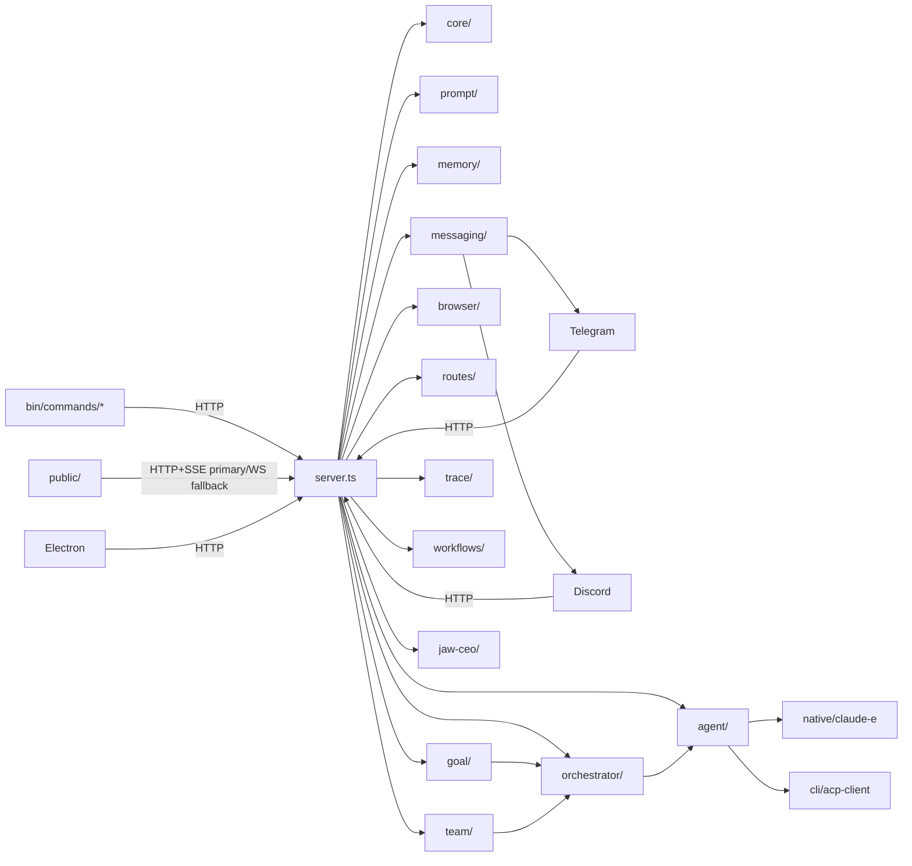

> 📚 [INDEX](INDEX.md) · [체크리스트 ↗](AGENTS.md) · **파일 트리 & 함수 레퍼런스**

# CLI-JAW — Source Structure & Function Reference

> 마지막 검증: 2026-07-10 (image inlay/channel relay SoT sync)
> `server.ts` 640L / `src/routes/` 36 TS files (238 route handlers including `/`; 237 API endpoints; `src/routes/` subtotal 199 handlers) / `src/cli/handlers*.ts` 460L + 507L + 103L + search 34L + project 73L + workflow 494L / `src/cli/api-auth.ts` 45L / `src/workflows/` 20 root files + 3 subdirs / `src/agent/` 48 TS files (spawn.ts 2544L + events/ submodules + cursor/claude-e/agy/jwc runtimes + AGY capability probe) / `src/goal/` 5 files (+`pause-gate.ts`) / `src/goal-run/` 5 files / `src/trace/` 3 files / `src/team/` 5 files / `src/jaw-ceo/` 16 files / `src/shared/` 6 files + reminders helper / `src/manager/` 94 TS/TSX files (+`telegram-hub/` 3 files) / `src/browser/web-ai/` 96 TS files / `adaptive-fetch/` 34 files / `src/telegram/` 9 files (+`hub-callback.ts`) / `src/messaging/` 13 files (+`thread-target.ts`, `extract-images.ts`) / `bin/commands/` 30 top-level + `hooks.ts` / `electron/` sidecar packaging / `native/claude-e/` canonical embedded crate
>
> 상세 모듈 문서는 [서브 문서](#서브-문서)를 참조하세요.

---

## File Tree

```text
cli-jaw/
├── server.ts                 ← Express 라우트 base + auth/CORS/rate-limit + WS bootstrap + `register*Routes()` glue + startup stale orc_state guard + graceful shutdown(closeDb) + employee migration + seed defaults + registerAvatarRoutes + async listen bootstrap (await initActiveMessagingRuntime) + orphaned jaw-emp-* cleanup + clearAllEmployeeSessions startup + no-store Vite index serving (677L)
├── lib/                      ← 외부 통합/공용 헬퍼 (5 root files + mcp/ 8 files)
│   ├── mcp-sync.ts           ← MCP 통합 + 스킬 복사 + softResetSkills + runSkillReset + trusted repair gate + clone cooldown (76L)
│   ├── mcp/                  ← MCP 모듈 분리 (8 files)
│   │   ├── mcp-registry.ts   ← MCP 레지스트리 관리 (112L)
│   │   ├── format-converters.ts ← CLI별 MCP 포맷 변환 (251L)
│   │   ├── skills-distribution.ts ← 스킬 배포/복사 로직 (329L)
│   │   ├── skills-reset.ts   ← 스킬 리셋 core (277L)
│   │   ├── skills-symlinks.ts ← 스킬 심링크 관리 (373L)
│   │   ├── skills-utils.ts   ← 스킬 유틸리티 (198L)
│   │   ├── unified-config.ts ← 통합 MCP 설정 (99L)
│   │   └── mcp-install.ts    ← MCP 설치 헬퍼 (108L)
│   ├── upload.ts             ← 파일 업로드 + Telegram 다운로드 guards(status/timeout/maxBytes) + 유니코드 파일명 (228L)
│   ├── media-kind.ts         ← 확장자→image/video/file 판정 단일 소스 (서버·웹 공용, 무의존) (29L)
│   ├── stt.ts                ← 음성인식 엔진 (Gemini REST → Whisper fallback, settings.json 연동, mimeType 파라미터) (231L)
│   ├── quota-copilot.ts      ← Copilot 할당량 조회 (env → file cache → gh auth token → keychain, execFileSync 보안, source 계정 바인딩) + refreshCopilotFromKeychain (328L)
│   └── mime-detect.ts        ← MIME 타입 감지 헬퍼 (67L)
├── src/
│   ├── core/                 ← 의존 0 인프라 계층 (31 files, 3847L)
│   │   ├── config.ts         ← JAW_HOME, settings, APP_VERSION + migrateSettings legacy Claude model normalization + avatar settings deep merge + default `settings.pi` + corrupt settings backup + CLI 탐지 re-export hub (1237L)
│   │   ├── cli-detection.ts  ← CLI 탐지 + `pi` npm-exec fallback + `kiro-code`(`kiro-cli` binary)/`claude-e`/`ai-e` helper `--idle-timeout-ms` compatibility probe + local package release/debug candidates (288L)
│   │   ├── compact.ts        ← compact 헬퍼 (COMPACT_MARKER_CONTENT, managed summary builder, cutoff logic, harvestGitGrep + harvestChatGrep 1KB/1KB budget split) (772L)
│   │   ├── instance.ts       ← 인스턴스 ID, node/jaw 경로, 유닛명 sanitize (61L)
│   │   ├── db.ts             ← SQLite 스키마 + prepared statements + trace + tool_log + working_dir migration + closeDb() WAL checkpoint + checkOrphanedWal + busy_timeout + clearMessagesScoped + queued_messages table + model-aware clearEmployeeSession + getRecentMessagesLite + searchMessages(days+recent scope) + getMessageContext(±N range) (714L)
│   │   ├── chat-sessions.ts  ← 채팅 세션 CRUD + 활성 세션 전환 (228L)
│   │   ├── rate-limit.ts     ← 클라이언트 클래스별(cli/manager/browser/lan/remote) 슬라이딩 윈도 리미터 + atomic peek/commit + Retry-After 미들웨어 팩토리 (213L)
│   │   ├── bus.ts            ← public SSE publish + 내부 리스너 fan-out (65L)
│   │   ├── logger.ts         ← 로거 유틸 (35L)
│   │   ├── i18n.ts           ← 서버사이드 번역 (90L)
│   │   ├── employees.ts      ← Employee 시드/CRUD 공용 로직 + 정적 직원 등록(Control: codex `gpt-5.6-luna` + `codex-imagegen`) + virtual synthetic row/preset helpers + DEFAULT_EMPLOYEES (437L)
│   │   ├── main-session.ts   ← 메인 세션 authoritative CLI/clear-state helper + clearBossSessionOnly (232L)
│   │   ├── message-summary.ts ← message preview/summary helper (55L)
│   │   ├── path-expand.ts    ← shell-style path expansion helper (12L)
│   │   ├── runtime-settings.ts ← settings side effects 통합 helper (439L)
│   │   ├── runtime-settings-gate.ts ← settings mutation in-flight gate (41L)
│   │   ├── codex-config.ts   ← Codex config.toml context window sync (96L)
│   │   ├── runtime-path.ts   ← buildServicePath() PATH 보강 (nvm/fnm/homebrew/volta/asdf/cargo/bun/yarn/pnpm 14+ dirs) (182L)
│   │   ├── cli-detect.ts     ← PATH 후보 spawnability 검사 + rejected candidate reason 수집 (445L)
│   │   ├── browser-open.ts   ← 브라우저 open 정책/명령 실행 helper (57L)
│   │   ├── browser-open-default.ts ← OS/headless 기본 open 여부 판별 (21L)
│   │   ├── strip-undefined.ts ← 설정/응답 객체 undefined 제거 helper (16L)
│   │   ├── boss-auth.ts      ← boss/employee scope 분리용 auth helper (42L)
│   │   ├── claude-install.ts ← Claude CLI 설치 상태 점검 helper (51L)
│   │   ├── launchd-cleanup.ts ← launchd stale plist / runtime cleanup (16L)
│   │   ├── launchd-plist.ts  ← launchd plist 생성 helper (61L)
│   │   ├── tcc.ts            ← macOS TCC / screen-recording 권한 점검 (55L)
│   │   ├── settings-merge.ts ← perCli/activeOverrides/pi deep merge (176L)
│   │   └── skill-cache.ts    ← 활성 스킬 슬래시 커맨드 캐시 (registerSkillLoader, getSkillCommandsCache, invalidateSkillCommandsCache) (44L)
│   ├── agent/                ← CLI 에이전트 런타임 (32 root files + events/ 12 files + spawn/ 3 files)
│   │   ├── spawn.ts          ← CLI spawn + ACP/Codex App/Pi RPC/AGY/Kiro plain text/log session capture/claude-e helper 분기 + v2 SQLite session resume + 큐 + 메모리 flush + 429 retry timer + isAgentBusy/isSteerInProgress + buildHistoryBlock compact cutoff + working_dir scoping + enqueue→processQueue race fix + QueueItem persistent DB queue + makeCleanEnv PATH augment (3180L)
│   │   ├── spawn/            ← spawn 서브모듈 (3 files)
│   │   │   ├── queue.ts      ← QueueItem persistent DB queue + processQueue race fix + enqueue/dequeue (577L)
│   │   │   ├── resume.ts     ← session resume logic + stale resume detection (117L)
│   │   │   └── process-kill.ts ← child process kill helper (50L)
│   │   ├── events/           ← NDJSON 이벤트 파서 모듈 분리 (12 files)
│   │   │   ├── index.ts      ← 이벤트 라우터 + logEventSummary + stepRef correlation + compact event parsing + duplicate suppression (373L)
│   │   │   ├── helpers.ts    ← summarizeToolInput(type-safe) + toolType/detail 필드 + flushClaudeBuffers (368L)
│   │   │   ├── claude.ts     ← Claude thinking_delta/input_json_delta 버퍼 + content_block_stop flush (324L)
│   │   │   ├── opencode.ts   ← OpenCode event adapter (202L)
│   │   │   ├── grok.ts       ← Grok throttled visible thinking + event adapter (369L)
│   │   │   ├── codex.ts      ← Codex item.started/completed + toolLog running→done dedup (97L)
│   │   │   ├── acp.ts        ← ACP session/update 이벤트 (219L)
│   │   │   ├── cursor.ts     ← Cursor event adapter (197L)
│   │   │   ├── gemini.ts     ← Gemini event adapter (117L)
│   │   │   ├── summary.ts    ← event summary formatters (118L)
│   │   │   ├── tool-labels.ts ← tool name→label mapping (315L)
│   │   │   └── types.ts      ← event type definitions (23L)
│   │   ├── spawn-env.ts      ← spawn용 child env 빌더 (AGY NO_COLOR, OpenCode/Gemini permissions config 주입 등, 148L)
│   │   ├── args.ts           ← CLI별 인자 빌더 + AGY print-mode/`--log-file`/`--conversation` resume args + `claude-e` helper run/resume args + Pi session bucket 분리 (455L)
│   │   ├── agy-bootstrap.ts  ← AGY bootstrap/context preparation helpers (237L)
│   │   ├── agy-capabilities.ts ← AGY `--help`/`--version` capability probe + cached optional flag support map + legacy emit-all fallback marker (126L)
│   │   ├── agy-transcript-watcher.ts ← AGY transcript/log watcher and session-id extraction support (291L)
│   │   ├── pi-runtime.ts     ← Pi profile 정규화 + isolated `PI_CODING_AGENT_DIR` models/settings 생성 + `pi --offline --list-models` discovery + `pi --mode rpc` JSONL parser/spawner (756L) ✨
│   │   ├── lifecycle-handler.ts ← child lifecycle + fallback/retry + queue resume orchestration + clearEmployeeSession on resume failure + stale resume fresh retry + kickGoalContinuation export + clearGoalTimers + goal continuation boundary row (1168L)
│   │   ├── jwc-runtime.ts    ← resident/in-process JWC runtime bridge and event handling (222L)
│   │   ├── kiro-auth.ts      ← Kiro CLI auth store reader (resolveKiroDataPath, readKiroAuthFromStore, resolveKiroProfileArn, regionFromProfileArn, listKiroConversationIdsForCwd, resolveKiroSessionIdAfterSpawn, extractKiroSessionIdFromV2Store) (253L)
│   │   ├── kiro-models.ts    ← Kiro live model inventory (KiroModelEntry, KiroModelInventory, parseKiroModelListJson, fetchKiroModelInventory) (98L)
│   │   ├── kiro-runtime.ts   ← Kiro plain-text stdout parser + session capture (isKiroPlainTextCli, processKiroStdoutChunk, flushKiroStdoutContext, appendKiroStdoutChunk, captureKiroSessionIdAfterExit, stripKiroAnsi, parseKiroAssistantText, isKiroStaleSessionOutput, isKiroResumeDegradedOutput, KiroStreamEvent, KiroStdoutContext) (460L)
│   │   ├── cursor-runtime.ts ← Cursor CLI event adapter + session management (263L) ✨
│   │   ├── agy-runtime.ts    ← AGY timeout stdout/close-text 판별 + 최종 planner 기준 timeout suffix 정규화 + stdout/log conversation id 추출 + quiet completion/replay/prompt-echo stripping helper (321L)
│   │   ├── claude-e-runtime.ts ← `jaw_runtime` helper event를 internal `agent:claude-e:*` broadcast로 변환 (46L)
│   │   ├── alert-escalation.ts ← alert escalation event helper (86L)
│   │   ├── cli-helpers.ts    ← Claude-like CLI 판별 helper (9L)
│   │   ├── codex-app-client.ts ← Codex App stdio server client (1404L)
│   │   ├── codex-host-pool.ts ← Codex App shared host generation + lane lease/FIFO/reaper/shutdown owner (494L)
│   │   ├── codex-app-events.ts ← Codex App turn/tool/message event adapter (405L)
│   │   ├── error-classifier.ts ← stderr/result 기반 에러 분류 헬퍼 (57L)
│   │   ├── grok-trace-backfill.ts ← Grok trace backfill helper (167L) ✨
│   │   ├── live-run-state.ts ← active run snapshot / hydrate helper (108L)
│   │   ├── memory-flush-controller.ts ← assistant 완료 후 메모리 flush lock + trigger 제어 (426L)
│   │   ├── mcp-passthrough.ts ← MCP passthrough boundary helpers for agent runtime integration (63L)
│   │   ├── opencode-diagnostics.ts ← OpenCode permissions/env audit + raw event 진단 헬퍼 (156L)
│   │   ├── session-persistence.ts ← main-session persistence policy + ownership generation (148L)
│   │   ├── resume-classifier.ts ← stale resume signature classifier (77L)
│   │   ├── smoke-detector.ts ← smoke response 감지 + auto-continue 판단 (148L)
│   │   ├── tool-timeout.ts   ← tool inactivity timeout helper (33L)
│   │   ├── watchdog.ts       ← idle/progress watchdog + 4h absolute hard cap with progress deadline extension (130L)
│   │   └── events.ts         ← legacy re-export stub → events/ 모듈 (15L)
│   ├── messaging/            ← 통합 메시징 런타임 (14 files)
│   │   ├── runtime.ts        ← 채널 lifecycle (init/shutdown/restart) + transport registry (148L)
│   │   ├── send.ts           ← 통합 아웃바운드 메시지 라우팅 (ChannelSendRequest, 다중 채널 send 지원) (275L)
│   │   ├── dedupe.ts         ← 배달 중복 제거 (TTL seen-set, 미만료 항목 보존) (118L) ✨
│   │   ├── retry.ts          ← 전송 실패 분류 (format/rate-limit/ambiguous) (110L) ✨
│   │   ├── fold.ts           ← 정규화 폴딩 엔진 (escape 디코드 + invisible 제거 + NFKC, 오프셋 맵 추적) (243L) ✨
│   │   ├── redact.ts         ← 채널 크리덴셜 마스킹 (Slack/TG/Discord 토큰 + URL 경로 capability) (600L) ✨
│   │   ├── chunk.ts          ← 공유 메시지 분할 (무손실 + 서로게이트 안전 + 펜스/언어태그 보존, 단 delimiter가 한도 이내일 때) (389L) ✨
│   │   ├── channel-health.ts ← 채널 헬스 체크 helper (110L) ✨
│   │   ├── channel-validate.ts ← 온보딩 마법사 라이브 크리덴셜 검증 (telegram getMe / discord users@me / slack auth.test+connections.open, 토큰 비로깅) (127L) ✨
│   │   ├── send-result.ts    ← send result type helper (14L) ✨
│   │   ├── session-key.ts    ← 세션 키 헬퍼 (49L)
│   │   ├── thread-target.ts  ← Telegram forum topic `message_thread_id` 정규화 helper (21L)
│   │   ├── types.ts          ← MessengerChannel, OutboundType, RemoteTarget 타입 (51L)
│   │   └── extract-images.ts ← Markdown AST 로컬 이미지 후보 추출 + 확장자 필터/중복 제거/4개 cap (36L)
│   ├── orchestrator/         ← 직원 오케스트레이션 + 인터페이스 통합 (19 files)
│   │   ├── state-machine.ts ← IPABCD 상태 머신 (I=Interview pre-plan) + broadcast(state,title) + worklog 타이틀 파싱 + employee terminology + OrcContext.workingDir + OrcContext.interview + Project root dispatch contract + Phase60 actor-aware canTransition(GateInput) form-only evidence gate + STATE_PROMPTS --attest instructions (790L)
│   │   ├── pipeline.ts       ← IPABCD orchestration (explicit entry only) + interview first-turn detection + plan context persistence + memorySnapshot injection + reset clears boss session + OrcContext workingDir init + Approved Plan Project root guard + remote-channel elicitation guard + bounded delayed worker replay notice + Phase60 phase_attestation strip/fallback + no-state narration warn (747L)
│   │   ├── distribute.ts     ← runSingleAgent + buildPlanPrompt + parallel helpers + tiered findEmployee + employee resume diagnostics + virtual employee session-skip (475L)
│   │   ├── parser.ts         ← triage + subtask JSON + verdict 파싱 + isResetIntent (176L)
│   │   ├── gateway.ts        ← submitMessage 통합 진입점 (WebUI+CLI+TG+Discord 공통) + working_dir scoped insertMessage (313L)
│   │   ├── collect.ts        ← orchestrateAndCollect + orchestrateAndCollectData (84L)
│   │   ├── session-work.ts   ← hasChatSessionWork — 세션 삭제 전 진행중 작업 관측 (활성 run·큐·replay는 정확 매칭, drain/retry/hold/worker/lane은 scope 단위 보수적 판정) (42L) ✨
│   │   ├── scope.ts          ← 현재 단일 'default' scope를 반환하는 stub (59L)
│   │   ├── worker-monitor.ts ← Worker stall detection — activity timestamps + stall/disconnect/timeout callbacks (58L)
│   │   ├── worker-progress.ts ← 직원 progress safe-summary sanitizer + runId-aware current/previous snapshot types
│   │   ├── worker-registry.ts ← Worker 프로세스 레지스트리 + runId progress current/previous memory retention + pending replay metadata + durable worker-run hook (431L)
│   │   ├── worker-replay-notice.ts ← delayed worker replay bounded notice builder + runId recovery command contract (61L)
│   │   ├── worker-run-store.ts ← Worker run safe metadata/events JSONL store + worker_run_* SSE broadcast bridge + shared status category projection (202L)
│   │   ├── worker-output-store.ts ← Worker raw output file store + bounded offset/limit read API (86L)
│   │   ├── workspace-context.ts ← Project root/path hint resolver for employee dispatch context (136L)
│   │   ├── friction.ts       ← Interview friction/stagnation detector (76L)
│   │   ├── seed.ts           ← Interview seed/ontology builder (107L)
│   │   ├── sanitize.ts       ← Interview tracker strip helper + stripPhaseAttestation re-export (79L)
│   │   └── attestation.ts    ← Phase60 PABCD evidence gate: parse/validate <phase_attestation> (tagged block + --attest object) + form-only checkAttestationGate (gates P→A/A→B/B→C/C→D; narrative did required, C→D needs checkOutput) + stripPhaseAttestation + warn-only no-state narration detector (217L)
│   ├── prompt/               ← 프롬프트 조립 (4 files + templates/ 10 files)
│   │   ├── builder.ts        ← A-1/A-2 + 스킬 + 직원 프롬프트 v2 + promptCache (4-segment key: emp:role:phase:workingDir) + on-demand dev skill path contract + advanced memory mode branch + bounded disk soul/instance context + task snapshot injection + dashboard-connector anchor preserve + Phase60 inline PABCD guide --attest evidence note (1145L)
│   │   ├── runtime-context.ts ← 런타임 컨텍스트 주입 (RuntimeContextEntry, loadEntries, getActiveEntries, addEntry, removeEntry, clearAll, buildInjectionBlock) (80L)
│   │   ├── soul-bootstrap-prompt.ts ← LLM 기반 soul.md 개인화 부트스트랩 프롬프트 빌더 (52L)
│   │   ├── template-loader.ts ← 프롬프트 템플릿 로더 (50L)
│   │   └── templates/        ← 프롬프트 템플릿 (a1-system.md, a2-default.md, employee.md, orchestration.md, control-system.md, worker-context.md, vision-click.md, skills.md, heartbeat-*.md)
│   │       └── control-system.md ← Control GUI/image-generation capability boundary + on-demand skill loading contract (75L)
│   ├── cli/                  ← 커맨드 시스템 (18 root files + tui/ 19 files)
│   │   ├── commands.ts       ← 슬래시 커맨드 레지스트리 + workflow metadata + 디스패처 + 파일경로 필터 + /commands alias /cmd + /settings fullscreen transition + /orchestrate alias /pabcd + /compact + /plan + /search + /gd force-done alias + artifact persistence (682L)
│   │   ├── handlers.ts       ← core command handlers + runtime/completion re-export hub + compact re-export + unknown command recovery payload (479L)
│   │   ├── handlers-runtime.ts ← memory/browser/prompt/quit/file/steer/forward/fallback/flush/ide/orchestrate 핸들러 + `LEGACY_MODEL_CLI_HINTS` (527L)
│   │   ├── handlers-completions.ts ← `/model` `/cli` `/skill` `/employee` `/browser` `/fallback` `/flush` 인자 자동완성 헬퍼 (121L)
│   │   ├── handlers-workflows.ts ← `/plan` PABCD P 안내 + `/interview` `/deliberate` `/planaudit` prompt handlers + `/review` project-dir workflow + `/goal` gated stub + `/goal run` preflight gate + `/gd` force-done alias (505L)
│   │   ├── handlers-search.ts ← `/search` search-skill routing handler + steer prompt submit/remote-safe result split (34L)
│   │   ├── handlers-skill-invoke.ts ← `/skill:<id>` handler — SKILL.md 전문을 steerPrompt로 주입, submitMessage 라우팅 (36L)
│   │   ├── handlers-project.ts ← `/project` 커맨드 핸들러 (projectDirs 관리) (73L) ✨
│   │   ├── api-auth.ts       ← CLI→server Bearer token bootstrap (`getCliAuthToken`, `authHeaders`, `cliFetch`) (45L)
│   │   ├── claude-models.ts  ← Claude 정규 모델셋 (CLAUDE_CANONICAL_MODELS, CLAUDE_LEGACY_VALUE_MAP) + migration/validation helpers (95L)
│   │   ├── compact.ts        ← /compact 슬래시 커맨드 핸들러 (Claude native + managed 경로 분기) + working_dir scoped (185L)
│   │   ├── registry.ts       ← 13개 CLI/모델 단일 소스 + canonical defaults + top-level `pi`/`agy`/`cursor`/`ai-e`/`claude-e`/`kiro-code` (290L)
│   │   ├── registry-live.ts  ← buildLiveCliRegistry — Kiro inventory + ocx 모델/모델별 effort 동적 병합 (effortsByModel/defaultEffortByModel) (136L)
│   │   ├── readiness.ts      ← CLI별 인증/설치 상태 점검 + Pi npm-exec readiness + AGY runtime auth hint + `claude-e` underlying Claude auth/readiness bridge (CliReadiness[]) (195L)
│   │   ├── acp-client.ts     ← Copilot ACP JSON-RPC 클라이언트 (382L)
│   │   ├── command-context.ts ← 공유 커맨드 컨텍스트 팩토리 + runSkillReset 위임 + regenerateB 유지 (160L)
│   │   ├── connector.ts      ← dashboard connector CLI API bridge (board/notes/reminders/audit) (73L)
│   │   ├── reminders.ts      ← local reminders CLI action helpers (35L)
│   │   ├── types.ts          ← CLI helper shared result/shape 타입 + workflow command/artifact/recovery metadata contract + command help detail key (210L)
│   │   └── tui/              ← TUI 모듈 (26 files)
│   │       ├── store.ts      ← TuiStore (transcript + overlay 상태 통합), OverlayState + SelectorState + settings screen state (78L)
│   │       ├── events.ts     ← TUI WS event normalizer (`agent_done.toolLog` bounded backfill 포함) (142L)
│   │       ├── transcript.ts ← TranscriptItem union (user/assistant/status) + TranscriptState + tool full-sweep/live-tool drain helpers (465L)
│   │       ├── composer.ts   ← Issue #66 pasted-text composer state + bracketed paste parser + slash gate + PasteCollapseConfig (374L)
│   │       ├── overlay.ts    ← help overlay + command palette + choice selector 렌더링 (705L)
│   │       ├── slash-surface.ts ← fullscreen slash command surface row composer (46L)
│   │       ├── settings-screen.ts ← fullscreen Appearance settings row builder + renderer + patch resolver (255L)
│   │       ├── keymap.ts     ← 키 입력 분류 + batched TTY chunk tokenization (ctrl-c/ctrl-d/ctrl-k/ctrl-o/enter/backspace/printable/escape) (117L)
│   │       ├── panes.ts      ← PaneState (openPanel, side, preferredWidth), PanelKind 6종 (53L)
│   │       ├── shell.ts      ← ShellLayout 계산 + scroll region setup/cleanup + ensureSpaceBelow (83L)
│   │       ├── renderers.ts  ← visualWidth (CJK/emoji cell width) + clipTextToCols/wrapTextToCols ANSI-safe terminal width helpers + cursorScreenPos (176L)
│   │       ├── mode.ts       ← TUI mode state (simple/fullscreen) (34L) ✨
│   │       ├── file-mention.ts ← file mention autocomplete helper (76L) ✨
│   │       ├── editor.ts     ← external editor launch helper (37L) ✨
│   │       ├── text-buffer.ts ← TextBuffer class (cursor/insert/delete/selection) (167L) ✨
│   │       ├── theme.ts      ← TUI color theme definitions (124L) ✨
│   │       ├── diffview.ts   ← TUI diff view renderer (37L) ✨
│   │       ├── stream.ts     ← streaming text accumulator (64L) ✨
│   │       ├── markdown.ts   ← TUI markdown renderer (168L) ✨
│   │       ├── highlight.ts  ← TUI syntax highlight helper (83L) ✨
│   │       └── render/       ← TUI render sub-modules (5 files: frame 211L, layout 68L, mouse 27L, scheduler 42L, viewport 160L) ✨
│   ├── search/               ← 통합 검색 계층 (5 files, 031-032) ✨
│   │   ├── contract.ts       ← SearchQuery/SearchHit/SearchResultEnvelope 정본 계약 (47L) ✨
│   │   ├── provider.ts       ← provider registry + off provider (중복 id 거부, 등록 순서 보존) (68L) ✨
│   │   ├── coordinator.ts    ← ready-only 예산 배분 + cursor 상태 기계 + 부분 실패 인벤토리 (160L) ✨
│   │   ├── providers/chat.ts ← chat 어댑터 (FTS/trigram/LIKE 폴백, 실제 session_id provenance) (124L) ✨
│   │   └── providers/memory.ts ← memory 어댑터 (고정 64-candidate universe, session provenance 표시, sessionFilter 미적용 경고) (55L) ✨
│   ├── memory/               ← 데이터 영속화 + advanced memory runtime (14 files)
│   │   ├── advanced.ts       ← Advanced Memory re-export stub (1L)
│   │   ├── bootstrap.ts      ← legacy memory/bootstrap import + structured root 초기화 (584L)
│   │   ├── heartbeat.ts      ← Heartbeat 잡 스케줄 + cron/every timer orchestration + minute-slot dedupe + fs.watch (311L)
│   │   ├── heartbeat-schedule.ts ← Heartbeat schedule normalize + cron validate/match + timezone validate + immediate cron loop helper (410L)
│   │   ├── identity.ts       ← `shared/soul.md` 관리 + soul runtime helper (87L)
│   │   ├── indexing.ts       ← FTS5/BM25 reindex + indexed file/chunk 상태 집계 (721L)
│   │   ├── injection.ts      ← memory injection policy + advanced/basic search routing (69L)
│   │   ├── keyword-expand.ts ← search keyword expansion + provider config normalize (98L)
│   │   ├── memory.ts         ← Persistent Memory grep 기반 (165L)
│   │   ├── reflect.ts        ← episode → shared/procedures reflection + promoted fact 정리 (380L)
│   │   ├── runtime.ts        ← Advanced Memory 런타임: bootstrap/import/FTS5 인덱스/BM25 검색/task snapshot/delta reindex (380L)
│   │   ├── shared.ts         ← file/meta/frontmatter 공용 헬퍼 (266L)
│   │   ├── synonyms.ts       ← keyword synonym expansion helper (60L) ✨
│   │   └── worklog.ts        ← Worklog CRUD + phase matrix (201L)
│   ├── telegram/             ← Telegram 인터페이스 (9 files)
│   │   ├── bot.ts            ← Telegram 봇 + forwarder lifecycle + origin 필터링 + channel-origin text/image reply + elicitation callback + voice 핸들러 등록 (893L)
│   │   ├── voice.ts          ← 음성 메시지 → guarded download → STT → tgOrchestrate 파이프라인 (43L)
│   │   ├── forwarder.ts      ← text 전송 뒤 guarded local-image photo relay + escape/chunk/createForwarder (245L)
│   │   ├── rich-message.ts   ← Bot API 10.1 rich-first send (sendTelegramMarkdown, 32k chunk, HTML/plaintext fallback) (315L)
│   │   ├── elicitation-buttons.ts ← single_select elicitation → inline keyboard + pending store + callback codec (110L)
│   │   ├── hub-callback.ts   ← hub-member callback URL SSRF guard (19L)
│   │   └── telegram-file.ts  ← Telegram 파일 전송 + 재시도 + 사이즈 검증 (182L)
│   ├── discord/              ← Discord 인터페이스 (7 files)
│   │   ├── bot.ts            ← Discord 봇 + transport 등록 + message/attachment 핸들러 + channel-origin image relay (435L)
│   │   ├── commands.ts       ← Discord slash command 등록 + 핸들러 (119L)
│   │   ├── send-only-client.ts ← Discord send-only client (webhook/DM fallback) (96L) ✨
│   │   ├── channel-types.ts  ← Discord channel type helpers (50L) ✨
│   │   ├── forwarder.ts      ← Discord text chunk 포워딩 + guarded local-image attachment relay (85L)
│   │   └── discord-file.ts   ← Discord 파일 전송 (67L)
│   ├── slack/                ← Slack 인터페이스 (17 files, Socket Mode + Web API, SDK 없음)
│   │   ├── socket.ts         ← Socket Mode client (apps.connections.open → wss, ack-before-work, envelope dedupe TTL, hello deadline, backoff 재연결) (372L)
│   │   ├── bot.ts            ← Slack 봇 lifecycle + envelope routing + orchestrate 경로 + queued-result waiter (437L)
│   │   ├── api.ts            ← Slack Web API fetch wrapper (HTTP 200 + ok:false를 실패로 처리, credential/URL redaction) (168L)
│   │   ├── format.ts         ← CommonMark → mrkdwn 변환 + code-fence 보존 chunking (62L)
│   │   ├── events.ts         ← inbound gating (self-echo/bot/subtype/allowlist/mention) + Block Kit 텍스트 추출 (216L)
│   │   ├── thread-tracker.ts ← 참여 스레드 영속 추적 (mention/봇응답 마킹, 캡드 셋, 무멘션 스레드 연속 대화 게이트 지원) (87L)
│   │   ├── history.ts        ← 동적 조회 (conversations.history/replies form-encoded 래퍼 + 재시도 + 에이전트용 포맷/redact) (164L)
│   │   ├── attachment-recovery.ts ← app_mention 봉투에 없는 첨부를 channel+ts 재조회로 복구 (oldest+inclusive+limit=1) (53L)
│   │   ├── commands.ts       ← slash command → 공유 parseCommand/executeCommand 파이프라인 (148L)
│   │   ├── slack-file.ts     ← files.getUploadURLExternal → upload → completeUploadExternal 3단계 업로드 (97L)
│   │   ├── ingress.ts        ← 세션별 ingress lane + admitSlackRun 동기 실행 예약(sessionLanes) + 전역 다운로드 세마포어 + shutdown abort/drain (198L) ✨
│   │   ├── inbound-file.ts   ← 인바운드 첨부 단일 IO owner (files.info → 인증 스트리밍 다운로드 → saveUpload, 파일/메시지 바이트 예산, 고정 error code) (280L) ✨
│   │   ├── inbound-url.ts    ← 인바운드 다운로드 URL 검증 (Slack host allowlist + https-only hop + 사설망 거부) (44L) ✨
│   │   ├── send-only-client.ts ← bot-token 전용 outbound + conversations.open DM 해석 (69L)
│   │   ├── forwarder.ts      ← agent_done 포워딩 + guarded local-image relay (69L)
│   │   ├── send-handler.ts   ← ChannelSendRequest → Slack Web API 어댑터 (44L)
│   │   ├── manifest.ts       ← Slack 앱 표시명 검증 + bot 표시명 결정적 파생을 포함한 매니페스트 single source (`jaw slack manifest`/`setup`이 사용) (129L)
│   │   ├── hot-notify.ts     ← CLI 설정 변경 후 실행 중 서버 hot-reload 통지 (loopback PUT /api/settings → transport 재시작, version skew 감지) (35L)
│   │   ├── progress.ts       ← 실행 중 진행상황 릴레이 ("정보 수집 중…" placeholder → agent_tool 이벤트로 chat.update rate-limited 편집 → 답변 시 chat.delete) (120L) ✨
│   │   └── register.ts       ← lazy transport 등록 (inbound + send) (16L)
│   ├── browser/              ← Chrome CDP 제어 + web-ai 자동화 + adaptive-fetch
│   │   ├── connection.ts     ← Chrome 탐지/launch/CDP 연결 + readiness polling + retry + headless + runtime diagnostics/orphan cleanup + activePort/active-tab 상태 관리 (820L)
│   │   ├── launch-policy.ts  ← browser start mode 정규화 + agent/debug/manual launch policy (51L)
│   │   ├── actions.ts        ← snapshot/click/type/navigate/screenshot + browser primitive actions (516L)
│   │   ├── primitives.ts     ← low-level CDP primitives (294L)
│   │   ├── vision.ts         ← vision-click 파이프라인 + Codex provider + guardrail options (207L)
│   │   ├── runtime-diagnostics.ts ← runtime diagnostics helper (121L)
│   │   ├── runtime-owner.ts  ← browser runtime owner management (135L)
│   │   ├── runtime-owner-store.ts ← runtime owner store (55L)
│   │   ├── runtime-orphans.ts ← orphan process cleanup (150L)
│   │   ├── tab-lifecycle.ts  ← tab lifecycle management (212L)
│   │   ├── index.ts          ← re-export hub (34L)
│   │   ├── adaptive-fetch/   ← Adaptive web fetch 서브모듈 (34 files; scheduler/stage-types P0 + browser pool/proxy/BM25/Camoufox/yt-dlp) ✨
│   │   │   ├── index.ts      ← adaptive fetch orchestrator (152L)
│   │   │   ├── safety.ts     ← URL/content safety checks (276L)
│   │   │   ├── endpoint-resolvers.ts ← reader API endpoint resolution (364L)
│   │   │   ├── browser-escalation.ts ← fallback to browser fetch (314L)
│   │   │   └── ... (14 more: fetcher, content-scorer, validators, metadata, transforms, trace, waf-profiles, browser-session, human-loop, output, browser-runtime, third-party-readers, reader-adapters, challenge-detector)
│   │   └── web-ai/           ← Web AI 브라우저 자동화 (96 TS files; ChatGPT/Gemini/Grok + session-artifacts/capability-probe/tier-timeout/watcher-lock)
│   ├── ide/                   ← IDE 연동 (jaw chat TUI 전용)
│   │   └── diff.ts            ← git diff 감지 + IDE diff 뷰 + 서브모듈 재귀 + fingerprint 비교 (238L)
│   ├── project-git-summary.ts ← Web UI header용 read-only primary project git summary helper (`projectDirs[0]`, branch/hash, modified/untracked counts, home path guard, 115L) ✨
│   ├── routes/               ← Express 라우트 추출 (36 TS files: registrar + helper modules + extracted base-route modules, 199 direct app route registrations incl. `/`)
│   │   ├── _http-error.ts    ← route-level HTTP error helper (16L)
│   │   ├── types.ts          ← `AuthMiddleware` shared type (3L)
│   │   ├── static.ts         ← root/uploads/widgets + guarded local image/video `/api/image` 서빙 (160L)
│   │   ├── employees.ts      ← employee CRUD 라우트 (123L)
│   │   ├── heartbeat.ts      ← heartbeat read/write 라우트 (87L)
│   │   ├── skills.ts         ← skill list/enable/disable/reset 라우트 (89L)
│   │   ├── jaw-memory.ts     ← jaw memory search/read/list/save/init/reflect/flush/soul/soul-activate/bootstrap 라우트 (352L)
│   │   ├── jaw-ceo.ts        ← Jaw CEO channel/session support routes (321L) ✨
│   │   ├── i18n.ts           ← locale bundle 라우트 (35L)
│   │   ├── orchestrate.ts    ← IPABCD reset/state/workers/worker-runs/snapshot/queue cancel/queue steer async accept/dispatch/virtual dispatch/batch safe summary/worker result/state PUT 라우트 + Phase60 boss-token actor distinction + --attest body gate + single-use pendingAttestation null-clear (1105L)
│   │   ├── memory.ts         ← memory status/KV/files/settings 라우트 (191L)
│   │   ├── settings.ts       ← settings/prompt/project pick/git summary/heartbeat-md/MCP/registry/status/quota/copilot + Pi profile register/model discovery 라우트 + CLI_KEYS 기반 quota parity/status-only metadata (635L)
│   │   ├── messaging.ts      ← upload/file-open/voice/telegram/channel/discord send 라우트 (431L)
│   │   ├── avatar.ts         ← Agent/User 아바타 이미지 업로드/서빙/삭제 + settings.json 메타 저장 + safeResolveUnder 경로 보호 (147L)
│   │   ├── quota.ts          ← Copilot/Claude/Codex/Grok/OpenCode quota helper readers + Grok weekly credits + Claude 429 cache (545L)
│   │   ├── quota-kiro-reverse.ts ← Kiro/CodeWhisperer quota reader (239L)
│   │   ├── quota-agy-reverse.ts ← AGY reverse quota reader (153L)
│   │   ├── quota-cursor-dashboard.ts ← Cursor dashboard quota reader (203L)
│   │   ├── goal.ts           ← goal CRUD + kickGoalContinuation route (registerGoalRoutes) (183L)
│   │   ├── goal-run.ts       ← goal-run execution routes (83L)
│   │   ├── runtime-context.ts ← runtime context route helpers (46L)
│   │   ├── security-audit.ts ← security audit route registrar (18L)
│   │   ├── traces.ts         ← public trace summary/events read routes (80L)
│   │   └── browser.ts        ← 브라우저 API 라우트 + `cdpPort(req)` 포트 우선순위 + primitive/tab/debug/doctor/cleanup/web-ai routes (489L)
│   ├── security/             ← 보안 입력 검증 (4 files)
│   │   ├── path-guards.ts    ← assertSkillId, assertFilename, assertMemoryRelPath, assertSendFilePath, safeResolveUnder (126L)
│   │   ├── decode.ts         ← decodeFilenameSafe (21L)
│   │   ├── network-acl.ts    ← isPrivateIP, isAllowedHost, isAllowedOrigin, originMatchesHost, extractHost (131L)
│   │   └── security-audit-log.ts ← SQLite-backed security audit event log (162L) ✨
│   ├── http/                 ← 응답 계약 (3 files)
│   │   ├── response.ts       ← ok(), fail() 표준 응답 (25L)
│   │   ├── async-handler.ts  ← asyncHandler 래퍼 (14L)
│   │   └── error-middleware.ts ← notFoundHandler, errorHandler (26L)
│   ├── types/                ← 공유 타입 정의 (3 files, 329L)
│   │   ├── agent.ts          ← ToolEntry, SpawnContext, SpawnResult 인터페이스 (168L)
│   │   ├── cli-engine.ts     ← CliEngine union + registry key tuple + `agy`/`ai-e`/`claude-e`/`kiro-code` discriminators (58L)
│   │   └── cli-events.ts     ← CLI event record/discriminator helpers (154L)
│   ├── command-contract/     ← 커맨드 인터페이스 통합 (3 files)
│   │   ├── catalog.ts        ← COMMANDS → capability map 확장 (71L)
│   │   ├── policy.ts         ← getVisibleCommands, getTelegramMenuCommands (39L)
│   │   └── help-renderer.ts  ← renderHelp list/detail mode (44L)
│   ├── goal/                 ← Goal autonomy 시스템 (5 files, 559L)
│   │   ├── heartbeat.ts      ← buildGoalContinuation (autonomy override) + shouldHeartbeatContinueGoal + getGoalContinuationPrompt + goal pause audit enforcement + Phase60 evidence-gate --attest self-advance instructions (202L)
│   │   ├── pause-gate.ts     ← active + agentPauseCount 기반 derived pauseGate 상태 helper (26L)
│   │   ├── runtime.ts        ← WorkflowRuntimeSnapshot + buildRuntimeSnapshot (goal + PABCD + worker registry 통합 스냅샷) (55L)
│   │   ├── store.ts          ← GoalState CRUD (getActiveGoal, setGoal, updateGoal, completeGoal, cancelGoal, pauseGoal, resumeGoal, clearGoal, resetGoalStore, goalHasCompletionEvidence, getGoalHistory) (222L)
│   │   └── types.ts          ← GoalStatus, GoalBudget, GoalCheckpoint, GoalState, GoalHistory, GoalEvent 타입 (62L)
│   ├── goal-run/             ← Goal-run 실행 제어 (5 files, 337L)
│   │   ├── controller.ts     ← goal-run execution controller (170L)
│   │   ├── events.ts         ← goal-run workflow event builders (38L)
│   │   ├── failure-matrix.ts ← goal-run failure classification (37L)
│   │   ├── policy.ts         ← goal-run preflight gates + budget check (56L)
│   │   └── types.ts          ← GoalRunMode, GoalRunBudget, GoalRunSafetyGate, GoalRunState 타입 (36L)
│   ├── trace/                ← Trace 이벤트 영속화 (3 files, 279L)
│   │   ├── store.ts          ← startTraceRun + appendTraceEvent + stampTraceTool + finalizeTraceRun + pruneTraceEvents (336L)
│   │   ├── types.ts          ← TraceRunInput, TraceEventInput, TracePointer, TraceRunRow 타입 (36L)
│   │   └── redact.ts         ← trace event redaction helpers (48L)
│   ├── shared/               ← 공유 유틸리티 (6 files + reminders helper) ✨
│   │   ├── elicitation-spec.ts ← structured elicitation schema + validation helper (167L)
│   │   ├── runtime-observability.ts ← worker-run/background-task shared runtime status category vocabulary (40L)
│   │   ├── shell-command-display.ts ← shell command display sanitization helper (48L)
│   │   ├── structured-fence.ts ← structured renderer fence scanner/parser helper (80L)
│   │   ├── tool-log-sanitize.ts ← tool log sanitization helpers (247L)
│   │   └── reminders/tray-triage.ts ← tray reminder badge/count triage helper (30L)
│   │   └── shell-command-display.ts ← shell command display formatter (48L)
│   ├── manager/              ← Multi-instance 대시보드 매니저 (94 TS/TSX files; +telegram-hub/ forum topic routing; design workspace routes; embedded-browser routes; project pick; git scm-snapshot/scm-operation)
│   ├── team/                 ← Team dispatch planner (5 files, 323L) ✨
│   │   ├── planner.ts        ← team task planning logic (75L)
│   │   ├── collector.ts      ← team result collector (66L)
│   │   ├── dispatcher.ts     ← team dispatch executor (49L)
│   │   ├── preflight.ts      ← team dispatch preflight checks (58L)
│   │   └── types.ts          ← team dispatch types (75L)
│   ├── jaw-ceo/              ← Jaw CEO OpenAI Realtime channel (16 files, 2614L) ✨
│   │   ├── realtime-sideband.ts ← OpenAI Realtime API sideband connection (392L)
│   │   ├── coordinator.ts    ← CEO session coordinator (222L)
│   │   ├── coordinator-admin.ts ← admin commands for CEO channel (340L)
│   │   ├── coordinator-workers.ts ← CEO worker management (266L)
│   │   ├── coordinator-completions.ts ← CEO completion handling (207L)
│   │   ├── coordinator-realtime-tools.ts ← realtime tool definitions (107L)
│   │   ├── coordinator-types.ts ← coordinator type definitions (52L)
│   │   ├── coordinator-utils.ts ← coordinator utilities (103L)
│   │   ├── store.ts          ← CEO session store (243L)
│   │   ├── types.ts          ← CEO channel types (179L)
│   │   ├── docs-edit.ts      ← document editing via CEO (156L)
│   │   ├── completion.ts     ← completion helpers (131L)
│   │   ├── policy.ts         ← CEO access policy (109L)
│   │   ├── confirmations.ts  ← user confirmation flow (50L)
│   │   ├── openai-key.ts     ← OpenAI key resolver (32L)
│   │   └── transcript-persistence.ts ← transcript save/load (39L)
│   ├── reminders/            ← Reminders bridge (2 files) ✨
│   │   ├── jaw-reminders-bridge.ts ← jaw↔dashboard reminders bridge (363L)
│   │   └── types.ts          ← reminder types (69L)
│   └── workflows/            ← workflow helper + employee boundary/handoff/scope-sandbox + deliberate/planaudit/review/search/runtime/guards (20 root files + 3 subdirs)
│       ├── artifacts.ts      ← JAW_HOME workflow artifact cache + project key/path safety + unknown command recovery artifact (172L)
│       ├── plan.ts           ← `/plan` compatibility artifact/text builder (91L)
│       ├── scope-sandbox.ts  ← normalizeScope + isProtectedPath + postDispatchDiffCheck (72L)
│       ├── employee-boundary.ts ← assertBossOnlyDispatch + assertNoImplementationDelegation + assertReadOnlyAudit (42L)
│       ├── handoff.ts        ← buildHandoff (mutable option) + hasImplementationDelegation (64L)
│       ├── deliberate.ts     ← `/deliberate` workflow handler (85L)
│       ├── planaudit.ts      ← `/planaudit` workflow handler (83L)
│       ├── review.ts         ← `/review` projectDirs/recent-context scope resolution + Markdown report path + fix/dispatch steer prompt (195L)
│       ├── search.ts         ← `/search` steer prompt builder + search-skill/browser verification policy text (25L)
│       ├── competitive-gap.ts ← competitive gap analysis workflow (113L)
│       ├── runtime.ts / runtime-guards.ts / guards.ts / events.ts / status.ts / context.ts / index.ts / types.ts / browser-web-ai.ts / web-ai-guards.ts
│       ├── checkpoint/       ← checkpoint store + types (2 files, 59L) ✨
│       ├── permissions/      ← permission policy + types (2 files, 80L) ✨
│       └── context-map/      ← context map builder (1 file, 71L) ✨
├── public/                   ← Web UI (Vite 8 + ES Modules, 560 files source/assets, ~98968L; generated `public/dist` and `public/public/dist` excluded)
│   ├── index.html            ← 뼈대 + header project/git status anchor (1223L)
│   ├── manifest.json         ← PWA 매니페스트
│   ├── sw.js                 ← Service Worker 오프라인 캐시
│   ├── css/                  ← 12 files (variables/layout/markdown/chat/diagram/orc-state/sidebar/modals/tool-ui/trace-drawer/workflow-cockpit/chat-search)
│   │   └── chat.css          ← chat/message/virtual-scroll + inline image min-height/object-fit/error fallback (2509L)
│   ├── locales/              ← i18n (ko/en/ja/zh .json)
│   └── js/                   ← 97 .ts files (root 19 + features/ 55 + diagram/ 3 + render/ 20, 전 파일 TypeScript; `features/project-git-status.ts` 73L)
│       └── render/
│           ├── markdown.ts   ← marked/sanitize pipeline + `/media`/guarded `/api/image` inline media rewrite (193L)
│           └── delegations.ts ← one-time document capture image-error delegation + render delegation registry (41L)
├── electron/                 ← Electron tray background app (27 TS/TSX files, 3096L) ✨
│   ├── package.json / electron-builder.yml / electron.vite.config.ts
│   └── src/
│       ├── main/index.ts     ← Electron main process — BrowserWindow + tray + jaw server spawn + deep-link + IPC (1322L)
│       ├── main/lib/         ← 24 helper modules (jaw-spawn 207L, install-cli 91L, tray-manager 168L, terminal/ 185L, navigation-policy 113L, app-metrics 93L, health-check 78L, deep-link 78L, permissions, path-security, quit-progress, etc.)
│       └── preload/          ← preload scripts (index 126L + metrics 68L)
├── native/
│   └── claude-e/             ← Claude E native helper source (Rust, builds `jaw-claude-i` compatibility binary; 11 src files, 1934L)
│       ├── Cargo.toml        ← Rust package/dependency/test profile
│       └── src/              ← main.rs(467L) + args/child/hook/protocol/transcript/config/terminal/cleanup/normalize/sanitize
├── bin/
│   ├── cli-jaw.ts            ← 28개 root dynamic import branch + grouped user-facing 서브커맨드 라우팅 + --home flag (348L)
│   ├── _http-client.ts       ← shared HTTP client helper (35L) ✨
│   ├── star-prompt.ts        ← `gh` 기반 GitHub star 1회 프롬프트 (169L)
│   ├── interactive-confirm.ts ← 방향키/`y`/`n`/Enter 인라인 Yes-No 선택기, raw mode 없으면 타이핑 폴백 (128L)
│   ├── agent-driven.ts       ← 에이전트·CI 실행 감지, 동의 프롬프트를 유저에게 넘기는 판단 (34L)
│   ├── postinstall.ts        ← npm install 후 CLI 런타임/MCP/스킬 safe 가드; OfficeCLI는 postinstall 자동설치가 아니라 `scripts/install-officecli.sh` 온디맨드 설치 (1103L)
│   ├── helpers/help.ts       ← CLI help text helper (9L)
│   └── commands/             ← 34 top-level ts files + `tui/` 11 helper 모듈
│       ├── serve.ts          ← 서버 시작 (--port/--host/--open) + SIGINT child.kill('SIGINT') orphan fix (123L)
│       ├── dispatch.ts       ← 직원 호출 (pipe mode 호환) + default safe live progress follow + `--quiet`/`--json` quiet paths + virtual employee dispatch + batch dispatch safe summary + stale/non-JSON route diagnostics + worker result polling + ECONNREFUSED retry (650L)
│       ├── chat.ts           ← 터미널 채팅 TUI (3모드, locale bootstrap, refreshInfo, active model 표시, no-arg `/model`·`/cli` selector intercept, transcript 축적, overlay wiring, batched key tokenization, settings snapshot, 362L)
│       ├── chat-search.ts    ← 채팅 메시지 히스토리 검색 (--days/--recent/--context/--limit, 70L)
│       ├── goal.ts           ← goal autonomy CLI (start/status/pause/resume/stop) (197L) ✨
│       ├── project.ts        ← project directory management CLI (169L) ✨
│       ├── lock.ts           ← instance lock/unlock for process protection (96L)
│       ├── history.ts        ← 채팅 히스토리 검색 CLI (65L)
│       ├── init.ts           ← 초기화 마법사 + --safe/--dry-run + --help (435L)
│       ├── slack.ts          ← `jaw slack manifest|setup` — 앱 매니페스트 출력 + 가이드 설정 (토큰 prefix 가드 + auth.test/apps.connections.open 라이브 검증 + settings 병합, channel 미변경) (373L)
│       ├── doctor.ts         ← 진단 (다중 체크 + claude-i helper/underlying claude + headless 감지, --json) (865L)
│       ├── jwc.ts            ← optional external-only JWC runtime install/clean/doctor helper (234L)
│       ├── status.ts         ← 서버 상태 (--json) (86L)
│       ├── mcp.ts            ← MCP 관리 (install/sync/list/reset) (230L)
│       ├── skill.ts          ← 스킬 관리 (install/remove/info/list/reset soft·hard) (327L)
│       ├── employee.ts       ← 직원 관리 (list/reset, REST API 호출, JSON/table 출력, 82L)
│       ├── worker.ts         ← 직원 progress status/watch CLI + explicit raw `read <runId>` output reader + employee name/id/runId resolver + safe-summary printer (399L)
│       ├── reset.ts          ← 전체 초기화 (MCP/스킬/직원/세션) (104L)
│       ├── clone.ts          ← 인스턴스 복제 (--from, --with-memory, regenerateB) (180L)
│       ├── memory.ts         ← 메모리 CLI (search/read/save/list/init, --chat 통합검색) (199L)
│       ├── launchd.ts        ← macOS LaunchAgent 관리 (243L)
│       ├── service.ts        ← 크로스 플랫폼 서비스 관리 (systemd/launchd/docker, 289L)
│       ├── orchestrate.ts    ← IPABCD 상태 제어 CLI (jaw orchestrate [I|P|A|B|C|D|reset]) + Phase60 --attest evidence arg + x-jaw-boss-token header attach (185L)
│       ├── browser.ts        ← 브라우저 CLI (primitive + tab/debug + web-ai delegator, 876L)
│       ├── browser-web-ai.ts ← `jaw browser web-ai` ChatGPT/Gemini/Grok 자동화 helper (452L)
│       ├── dashboard.ts      ← `jaw dashboard serve` + dashboard memory delegation (274L)
│       ├── dashboard-memory.ts ← `jaw dashboard memory` L2 federation CLI helper (210L)
│       ├── dashboard-chat.ts ← `jaw dashboard chat search` L2 federation CLI helper (106L)
│       ├── bgtask.ts         ← server-owned background task CLI add/list/show/cancel + native/shared status display (152L)
│       ├── connector.ts      ← dashboard connector board/notes/reminders/audit CLI (216L)
│       ├── reminders.ts      ← local reminders list/add/done CLI (100L)
│       ├── dispatch-helpers.ts ← dispatch output unwrap helper (60L)
│       ├── dispatch-batch-summary.ts ← batch dispatch safe summary printer + recovery command fallback (41L)
│       └── tui/              ← chat 터미널 TUI 분리 (11 files: api 89L, channel 115L, fullscreen-mode 500L, input-handler 470L, overlays 526L, raw-pipe-mode 115L, renderer 135L, simple-mode 101L, tui-io 12L, types 145L, ws-handler 317L)
├── tests/                    ← 회귀 방지 테스트 (588 files: root/unit/integration/browser/fixtures/smoke)
├── scripts/                  ← 도구 스크립트 (TypeScript + Shell + CJS; atomic build, sidecar bundle, release gates, install-risk evidence)
├── officecli/                ← OfficeCLI 포크 서브모듈 (lidge-jun/OfficeCLI, Apache 2.0)
├── skills_ref/               ← 레퍼런스 스킬 (244 top-level dirs)
│   ├── registry.json         ← public reference skill registry + `codex-imagegen` metadata (3324L)
│   └── codex-imagegen/
│       └── SKILL.md          ← Codex native image generation, uploads 저장, web/channel 중복 방지 계약 (93L)
├── docs/                     ← 프로젝트 문서
├── README.md / README.ko.md / README.zh-CN.md / README.ja.md ← 다국어 README
├── tsconfig.json / tsconfig.frontend.json / tsconfig.build.json
├── types/
│   ├── frontend.d.ts         ← CDN 글로벌 타입 선언 (marked, hljs, katex, mermaid, DOMPurify)
│   └── global.d.ts           ← Node + Express 글로벌 타입
├── vite.config.ts            ← Vite 8 빌드 설정
├── package.json / pnpm-workspace.yaml
└── devlog/                   ← MVP 12 Phase + Post-MVP devlogs
```

### 런타임 데이터 (`~/.cli-jaw/`)

| 경로               | 설명                                      |
| ------------------ | ----------------------------------------- |
| `jaw.db`           | SQLite DB                                 |
| `settings.json`    | 사용자 설정                               |
| `mcp.json`         | 통합 MCP 설정 (source of truth)           |
| `prompts/`         | A-1, A-2, HEARTBEAT 프롬프트              |
| `memory/`          | Persistent memory (`MEMORY.md`, `daily/`) |
| `skills/`          | Active 스킬 (시스템 프롬프트 주입)        |
| `skills_ref/`      | Reference 스킬 (AI 참조용)                |
| `browser-profile/` | Chrome 사용자 프로필                      |
| `backups/`         | symlink 충돌 시 백업 디렉토리             |

npm 의존성: 라이브 버전은 `package.json`의 `dependencies`를 source of truth로 본다. 주요 축은 Express/WS/SQLite, Telegram/Discord, browser automation, React Manager, markdown/math/diagram rendering stack이다.

dev 의존성: 라이브 버전은 `package.json`의 `devDependencies`를 source of truth로 본다. TypeScript/tsx/Vite/React plugin/jsdom/concurrently/types packages are tracked there.

---

## 코드 구조 개요



### 디렉토리 의존 규칙

| 디렉토리 | 의존 대상 | 비고 |
|---|---|---|
| `core/` `security/` `http/` `shared/` | — | 의존 0 계층 |
| `browser/` | — | 독립 (CDP + adaptive-fetch + web-ai) |
| `messaging/` `cli/` `prompt/` `memory/` | core | 중간 계층 |
| `agent/` | core, prompt, orc, cli/acp, native | 핵심 허브 (Pi RPC/AGY/ACP/Codex/Kiro/Cursor) |
| `goal/` `goal-run/` `trace/` | core, orc, agent | 자율 실행 + 추적 |
| `team/` `jaw-ceo/` `reminders/` | core, orc, agent | 확장 모듈 |
| `workflows/` | orc, agent, core | Employee boundary + checkpoint |
| `orchestrator/` | core, prompt, agent | IPABCD + interview + worker |
| `telegram/` `discord/` | core, orc, agent, messaging | 외부 인터페이스 |
| `routes/` | core, browser, http, security, goal | Express 라우트 |
| `electron/` | server.ts (HTTP) | Electron tray app |
| `server.ts` | 전체 | 글루 레이어 |

---

## 핵심 주의 포인트

1.  **큐**: busy 시 queue → agent 종료 후 자동 처리 (persistent DB queue)
2.  **세션 무효화**: CLI 변경 시 session_id 제거
3.  **직원 dispatch**: `cli-jaw dispatch --agent ... --task ...` shell surface가 현재 실행 경로이며, one-off 전문 검토는 `cli-jaw dispatch --virtual ... --task ...`로 ephemeral synthetic employee를 사용한다. 직원 task body에는 `Project root: <absolute path>`를 명시한다. Human dispatch output은 bounded safe progress를 기본 follow하며, `--quiet`/`--json`은 live progress line을 끈다. Batch dispatch와 delayed replay는 full employee stdout을 boss context/stdout에 자동 주입하지 않고 bounded summary + runId recovery command만 출력한다. Worker progress는 `agentId` compatibility와 per-run `runId`를 함께 노출한다.
4.  **메모리 flush**: `forceNew` spawn → 메인 세션 분리, threshold개 메시지만 요약
5.  **메모리 주입**: MEMORY.md = 매번, session memory = `injectEvery` cycle마다
6.  **에러 처리**: 429/auth 커스텀 메시지 + smart retry + fallback chain
7.  **IPv4 강제**: `--dns-result-order=ipv4first` + Telegram
8.  **MCP 동기화**: mcp.json → 지원되는 MCP-aware CLI 포맷 자동 변환 (lib/mcp/ 모듈)
9.  **이벤트 dedupe**: src/agent/events/ 모듈별 분리 — Claude/Codex/Grok/ACP/Cursor/Gemini/OpenCode
10. **Telegram/Discord origin**: `origin` 메타 기반으로 포워딩 판단
11. **Messaging runtime**: `src/messaging/` — 채널 추상화 (transport registry + unified send + session key + channel-health)
12. **CLI registry**: `src/cli/registry.ts` — 13개 CLI 런타임 정의. `pi`는 top-level RPC runtime, `kiro-code`는 `kiro-cli` binary; `registry-live.ts`가 동적 모델 목록 병합
13. **Copilot ACP**: JSON-RPC 2.0 over stdio, `session/update` 실시간 스트리밍
14. **Goal autonomy**: `src/goal/` — heartbeat continuation + store + runtime snapshot; `src/goal-run/` — execution controller + policy gates
15. **Kiro provider**: `kiro-auth.ts` (auth store reader) + `kiro-models.ts` (live inventory) + `kiro-runtime.ts` (stdout parser) + `registry-live.ts` (dynamic merge)
16. **Pi runtime**: `pi-runtime.ts` + `settings.pi` + `/api/pi/profiles/register` — first-class RPC runtime with isolated profile config and model discovery
17. **Interview enhancement**: `orchestrator/friction.ts` (5-level clarity + oscillation detection) + `seed.ts` (evidence-ref ontology) + `sanitize.ts` (tracker strip) + pipeline.ts budget gate
18. **TUI**: `src/cli/tui/` 26 files — event normalizer + transcript model + composer (paste collapse) + overlay (help/palette/selector) + slash-surface + settings-screen + text-buffer + theme + render/ sub-modules; `bin/commands/tui/` 11 files — SSE-first `channel.ts`, fullscreen/simple mode + `raw-pipe-mode` (piped `--raw` NDJSON protocol) + input-handler + ws-handler
19. **Electron tray**: `electron/` — sidecar-first packaged server spawn, tray CLI install flow, deep-link, terminal IPC, folder/drop path IPC, navigation policy, permission diagnostics
20. **Adaptive fetch**: `src/browser/adaptive-fetch/` 19 files — multi-strategy web fetch (direct → reader API → browser escalation) with WAF detection + content scoring
21. **Team dispatch**: `src/team/` — planner/collector/dispatcher/preflight for structured multi-employee coordination
22. **Jaw CEO**: `src/jaw-ceo/` — OpenAI Realtime API sideband channel + coordinator (admin/workers/completions/realtime-tools)
23. **SSE event channel**: `src/core/event-bus.ts` + `src/routes/events.ts` + `public/js/event-channel.ts` provide `GET /api/events` with replay; worker-run lifecycle publishes safe `worker_run_*` events through the same topic/replay path and bgtask/worker-run payloads share additive `statusCategory` vocabulary; `public/js/ws.ts` remains the legacy browser fallback dispatcher and `bin/commands/tui/channel.ts` provides the SSE-first terminal chat transport.

---

## 서브 문서

| 문서                                               | 범위                                                                          |
| -------------------------------------------------- | ----------------------------------------------------------------------------- |
| [🔧 infra.md](infra.md)                             | core/ (config·db·bus·logger·i18n·settings-merge) + security/ + http/          |
| [🌐 server_api.md](server_api.md)                   | server.ts · routes/ · REST API · WebSocket                                    |
| [⚡ commands.md](commands.md)                       | cli/ (commands·handlers·registry) + command-contract/                         |
| [🤖 agent_spawn.md](agent_spawn.md)                 | agent/ (spawn·args·events) + orchestrator/ (pipeline·parser) + cli/acp-client |
| [📱 telegram.md](telegram.md)                       | telegram/ (bot·forwarder·telegram-file) + memory/heartbeat                    |
| [🎨 frontend.md](frontend.md)                       | public/ 전체                                                                  |
| [🧠 prompt_flow.md](prompt_flow.md)                 | prompt/builder.ts · 직원 프롬프트 · promptCache                               |
| [💾 memory_architecture.md](memory_architecture.md) | 3계층 메모리 시스템                                                           |

---

> 프로젝트 전체 파일 검증 완전 레퍼런스. 상세는 서브 문서 참조.
